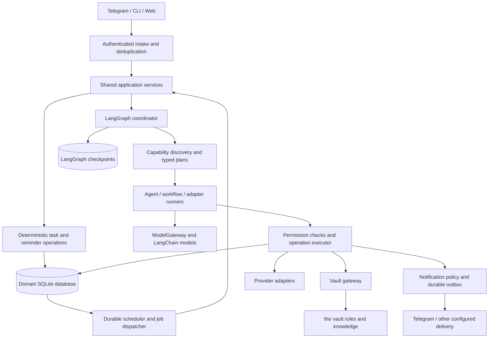
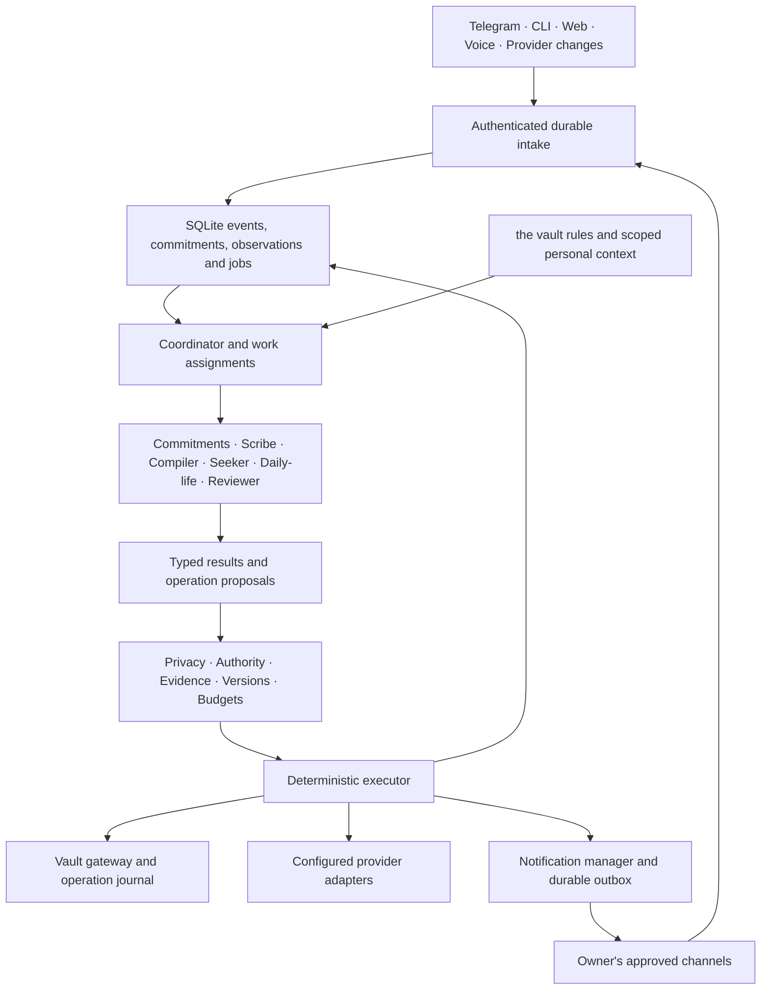

# Claude implementation plan — complete Loop

**Approved architecture:** consolidated review accepted by the owner on 2026-09-06.
**Authority:** this is the single active implementation brief, architecture reference,
remaining-work plan and progress ledger for Claude. It consolidates specification 1.3
and the approved implementation review. Other technical files are supporting copies.
Archived instructions and completion claims MUST NOT control the next task.

## Start here

Implement the remaining Loop system described in this document. Continue from the
existing working tree through implementation, migrations, integration and verification.
Do not stop at planning, scaffolding or completing only the first milestone. Preserve
working components and the user's staged/uncommitted changes. Do not commit, publish,
deploy or activate live external actions unless separately requested.

Read sections 1–6, the architecture review, and the embedded contracts below. This file
contains the required specification text; you do not need to reconstruct instructions
from old plans or conversation history. Use the actual source tree and the template
assets when implementing. On context reset, resume from this document's progress ledger.

## 1. Starting point and definition of success

The reviewed working tree has substantial tested components, but incomplete application
integration. The last review ran 1,608 passing tests with 16 skipped; Ruff passed for
loop/tests and mypy passed for 80 loop source files. These are dated baseline evidence,
not proof of a complete product. Packaging checks were skipped in that normal suite.

The old matrix's 196/196 verified claim measures its existing test mapping. It does not
prove complete user-facing behavior. Audit scenario assertions and their actual code
paths; retain valuable tests but do not inherit blanket completion labels.

Confirmed gaps at the review checkpoint:
- Role definitions are not dispatched through coordinator discovery/instructions.
- Natural-language planning needs a connected typed plan producer.
- Result validation is a step-count check, not a Reviewer with bounded repair.
- Agent runners parse final-message JSON instead of the required structured output.
- AsyncSqliteSaver production wiring, durable child run identities and worker integration
  are incomplete.
- Routines, preferences, trip state, generic objects, registry state, spend reservations,
  notification counters and export mapping still need durable service storage where
  currently in memory. A schema alone is not persistence.
- New-stack CLI/API/Telegram composition and shipped capability manifests are missing.
- Knowledge extraction/capture-to-wiki reasoning is not fully connected.
- Weather has real forecast adapters, but routine integration and official warning
  feeds are incomplete. Travel has domain logic but no live research providers.

Verify whether subsequent user work has already closed any gap. Reuse it instead of
reimplementing it. The goal is one working, persistent application with the required
capabilities and truthful configured/unconfigured status.

## 2. Architecture decisions that govern all work

Use LangChain chat adapters and create_agent, LangGraph orchestration and workflow
graphs, a shared ModelGateway, typed capability contracts, durable domain services,
and the existing the knowledge vault. Do not introduce a competing agent loop, orchestration
framework, per-domain coordinator branches or independent agent memories.

Domain SQLite owns commitments, jobs, permissions, operations and outcomes.
LangGraph checkpoints own execution position. the vault owns sources, knowledge and
owner conventions. Operation keys and ledger reconciliation bridge checkpoint/domain
commit boundaries; no cross-database atomicity may be assumed.

Role scope is a runtime permission ceiling, while vault documents supply applicable
domain conventions. Retrieved content cannot grant authority. Edward is a visualization
critic consulted for presentation critique, not the Coordinator or general Reviewer.
This corrects the earlier Edward mapping. Preserve the vault's existing agent documents.

Deterministic reminders work without a model. Every model call and repair inherits
privacy and root budgets. Private local failure never reaches cloud. Effects need
current authority and evidence. Waiting for approval releases workers. Unknown sends
remain unknown. Long-lived state, spending reservations and notification caps survive
restart. No idle model polling.

## 3. Execute these milestones in dependency order

The order is concrete but permits prerequisite work inside an earlier milestone.
Update this ledger after each verified slice. All rows start pending review/implementation;
that does not negate the existing component tests.

| Milestone | Deliverable and intended seams | Required exit evidence | State |
|---|---|---|---|
| M0 | Reconcile current worktree and acceptance evidence | Identify already closed gaps; preserve user work; record baseline failures separately | **done 2026-09-06** |
| M1 | Complete role-scoped coordinator, typed plan producer, structured output and Reviewer repair; loop/agents and loop/capabilities/runners.py | Real graph/model-interface tests; denied scopes stay undisclosed; bad output repairs within the original budget; no invented success | **done 2026-09-06** |
| M2 | Complete async graph lifecycle, secure checkpoint factory, child run mapping and durable worker dispatch | Actual process restart and approval resume; pinned versions; cancellation; isolated children; both commit-order crash cases | **done 2026-09-07** |
| M3 | Replace long-lived in-memory stores with repositories and versioned migrations | Fresh service/process reads retained routines, preferences, trips, registry, objects, spend and counters; concurrency and rollback tests | **done 2026-09-07** |
| M4 | Assemble shared application services and wire shipped CLI, HTTP and Telegram; ship validated packs and capability management | Installed command, API and bot handler traverse the same real services; two unrelated packs work without coordinator/channel/schema edits | **done 2026-09-07** |
| M5 | Connect complete the vault and weather workflows | Natural-language capture → exact raw/ledger → sourced wiki → cited answer; activated routine → weather comparison → advice → outbox after restart | **done 2026-09-07** |
| M6 | Complete travel research/monitoring, warning adapters, learning and remaining contract interfaces | Real adapter implementations with recorded/fake transports; scoped monitoring; durable preference feedback; unavailable sources explicitly reported | **done 2026-09-07** |
| M7 | Re-audit all acceptance scenarios and release operation | Installed-package, Docker, real process restart and paired backup/restore checks; reproducible demos; no mandatory behavior falsely marked complete | **done 2026-09-07** — Docker skipped, see below |

Preserve legacy interfaces until their replacements have matching behavior. The CLI
currently points to cli.main:main; changing imports in a test does not connect the shipped
command. Use one composition root with injected provider/model/clock/storage dependencies.
A due-job dispatcher must actually invoke the graph; a tick that only fires triggers
and dispatches an outbox is not the complete service.

Choose travel and warning providers with appropriate geographic coverage and documented
access. Implement transport separately from normalization. Missing credentials must not
block adapter implementation and hermetic verification, but unavailable configuration
must remain visible. Do not claim a configured or live-verified provider based on fixtures.

Shopping and pizza ordering remain extension examples, not a requirement to invent a new
commerce integration in this pass. Implement the generic authority/approval/effect contract
that lets a separately installed purchasing adapter operate safely.

## 4. Verification and evidence rules

Tests must exercise the application's production path. Use real LangChain/LangGraph
with fake models, temporary databases/checkpoints and fake or recorded transports.
Do not replace the whole coordinator with a mock and call that graph conformance.
Unit tests remain useful but cannot alone verify a scenario requiring an interface,
restart, provider or delivery path.

For the final task/reminder demonstration, send the request through an actual shipped
entry point, persist it, terminate a real subprocess, restart it, advance the injected
clock and deliver through a fake transport. Complete/snooze through the same public
service and verify no stale delivery. Reconstructing Python objects is useful but
does not replace a required process-boundary test.

Verify:
- Role/tool isolation, typed output, evidence validation and bounded repair.
- Private input plus local failure yields zero cloud calls, including summaries/children.
- Concurrent children and retries consume one budget; no hidden retry multiplication.
- Approval actor/payload/version/expiry/cancellation checks after restart.
- Operation replay before/after domain and checkpoint commits without duplicate effects.
- Unknown remote outcomes without blind resend.
- Durable registry/version pinning, state retention and notification/spending counters.
- Consistent domain/checkpoint/vault backup and restore, retention and forgetting.
- Capability scaffolding, validation, offline tests, enable/disable and invocation from
  shipped interfaces, using two unrelated packs with no coordinator changes.

Use Python >=3.12 and uv with the lockfile. In this workspace prefix shell commands
with rtk where that workspace convention applies. Run relevant tests, Ruff and mypy after changes;
run the full suite and packaging checks at integration/release milestones. Inspect the
packaging suite's prerequisites and LOOP_PACKAGING_TESTS switch; a skipped build is
not a verified build. Shell edits require shellcheck.

Synthetic vaults only during development. Do not use live .env/credentials, send real
messages, purchase, book or write the owner's the knowledge vault as an automatic test.
Separately authorized live tests have their own evidence. Keep unconfigured optional
providers distinct from missing mandatory implementation.

## 5. One progress and acceptance ledger

Maintain progress here. Do not recreate IMPLEMENTATION_PLAN.md, IMPLEMENTATION_STATUS.md,
IMPLEMENTATION_HANDOFF.md or CLAUDE_EXECUTION.md. Do not follow their archived next steps.

For every milestone, record date, actual files, migration revisions, commands/results,
remaining failures, acceptance IDs and exact next step. Preserve earlier evidence as
dated history. Do not report baseline tests as freshly executed.

The supporting docs/ACCEPTANCE_MATRIX.md stays at its existing path for the report script.
It is an evidence index, not another execution plan. Its inherited verified labels
require re-audit. For each scenario assessed, record here whether coverage is component,
integration or application-level and whether its required result is actually proven.
Update the supporting matrix only to match that evidence. A missing behavior is incomplete,
even if its old named test is green. Keep all 196 IDs from the acceptance appendix.

### Current continuation checkpoint

- State: **M0–M7 done**, plus three post-M7 bundles of acceptance work
  (interface parity, reminder interaction, condition routines). Docker checks
  remain explicitly unverified on this machine (see below).
- Next action: nothing is blocked. What remains splits in two, and the split is
  the point:
  - **Blocked without an account, not by effort** — calendar providers (A01,
    P09–P11) and travel fares, availability and monitoring (TR15–TR19). The
    contract forbids shipping an adapter that incurs charges before configured
    budget authority exists, so these cannot be closed by writing code.
  - **Finishable** — the ops-hardening rows (O10–O13, D14: index rebuild after
    corruption, retention, 500-source load, halted service, SIGTERM then forced
    stop). No credentials needed.
- Fresh checks this session: `scripts/acceptance_run.sh` passes end to end —
  lint, types, 2,046 passed / 17 skipped, matrix totals, matrix audit,
  packaging and wheel, restart durability, and a 30-check demo through the
  installed `loop-next`. Ruff and mypy clean across 226 files. Re-run, not
  inherited.
- **Docker: skipped, not verified.** The six image checks in
  `tests/vnext/test_packaging.py` skip because the daemon is not running on
  this machine. They are not claimed as passing anywhere. To run them:
  `open -a Docker && LOOP_PACKAGING_TESTS=1 .venv/bin/python -m pytest
  tests/vnext/test_packaging.py -k o03`.
- The acceptance matrix reads **179 verified / 17 implemented**. It arrived
  claiming 196/196; the re-audit took it to 165, and the three bundles since
  earned the rest back with evidence at the level each row demands.
- Decisions: approved review governs readiness; Edward is presentation advice only.

#### Note: a pre-existing, unrelated test flake observed this session

`tests/test_review.py` (legacy `specialists/review.py`) failed 4 assertions today because the
system date advanced past a week boundary; the module computes its window from
`date.today()`. Confirmed via `git diff` that neither file was touched this session. Not
fixed, since it is outside every current milestone's scope and is a legacy-code date
dependency, not a regression.

#### Post-M7: three bundles of acceptance work

Chosen by the owner from a triaged list, with the blocked rows named rather
than attempted. Committed one bundle at a time, so an interrupted session loses
nothing in flight.

**Interface parity (T15, O07, O08, EX07, TR24, WF24).** Every other test in the
suite exercises one surface at a time and therefore cannot see two surfaces
drifting apart. `tests/vnext/test_interface_parity.py` performs the same
operation three ways and compares the outcomes *against each other* — a parity
test asserting three hardcoded strings passes happily while all three surfaces
are wrong together. It found two real defects on its first run:

1. **Telegram's `/do` bypassed the coordinator**, calling the invoker directly
   and so skipping role scope, plan authority and the operation ledger. The
   same capability call carried different authority depending on which surface
   it arrived on.
2. **An unknown operation was 422 over HTTP** and `unavailable` on the other
   two. A well-formed request for a capability nobody enabled is not a
   validation failure.

Durable idempotency on the API: `Idempotency-Key` replays the stored response
for the same body and returns 409 for a different one. Durable rather than
in-process because a client retries precisely when it saw no response, which
includes the server dying between committing and replying — the one case an
in-memory record would have forgotten. An empty key is treated as no key, since
storing under the empty string would make unrelated requests share one record.

A new `NotFound` error type (404). There was no not-found code at all, so a
missing id was reported as a malformed request; the distinction is what a
client acts on. An HTML surface at `/ui/tasks` completes O07 with CSRF-bound
forms and a 303 after a successful POST — the cookie says who, the token says
the form came from a page we served, and listening on localhost is not
authentication.

**Reminder interaction (T04–T07, T09, T10).** `interpret.py` shipped complete
and connected to nothing, so every interface understood only explicit commands.
`loop/services/messages.py` calls it, reached from Telegram (any non-command
text), `loop-next say`, and `POST /api/v1/messages`. Its responsibilities
beyond routing: never claim a reminder that was not set; complete the *waiting*
task rather than creating a second one; keep pending clarifications durable,
because the gap between "later" and the answer outlives a deploy; and never
guess a missing half — a wall time with no day stays a question.

One design bug found while testing: an open question swallowed the next message
whatever it was, so "remember that production takes six weeks" was read as an
answer to "when?", losing the fact and resolving the question with nonsense.

`loop/services/actions.py` gives a delivered reminder its buttons. Callback data
is client-controllable, so the button carries **an opaque id and nothing else**;
which task, which occurrence, who may press it and until when are stored and
looked up. Four checks per press — unknown, wrong actor, expired, already
consumed — and consuming is a conditional UPDATE, because two taps arriving
together would both pass a read-then-check. Snooze creates a *replacement
occurrence* (a delivered message cannot be un-sent); dismiss suppresses the
message and pointedly does not complete the errand; acknowledgement follows the
effect, since it stops Telegram's spinner and must not precede the work.

A real bug: issuing buttons opened its own session inside the trigger-firing
transaction and deadlocked SQLite. They now commit with the notification, which
is also the correct semantics — a button committed without its message would be
pressable while referring to a reminder nobody received.

**Condition routines (P05, WF09).** `observations.py` shipped complete and
unreachable: a routine with `trigger.kind: condition` could be written,
validated and activated while never running.
`loop/runtime/condition_dispatch.py` evaluates them and queues work on a
transition into true — **with the edge stored**. `EdgeState` is an in-memory
dataclass; held only in memory, a restart forgets the condition was already
announced, sees `unknown → true`, and tells the owner again. P05's condition
"remains true through repeated sensor updates", and a deploy is just another
update from where the owner sits. That failure repeats forever and is invisible
to any test that never restarts.

Two latent bugs surfaced there: `ObservationStore.current` ordered only by
`valid_from`, so two observations written in the same microsecond came back in
arbitrary order and the older value could win — a sensor update silently
failing to take effect; and the occurrence identity was derived from the clock,
so two genuine edges inside one tick collapsed into a single job.

WF09 needed a product that did not exist: every shipped weather source was an
hourly model, so "fresh observations but no forecast" could not occur.
`OpenMeteoCurrentAdapter` reads the `current` block as a `ProductType.OBSERVATION`,
kept separate from the forecast adapter because product type, freshness rule and
horizon all differ. `WeatherService` now selects the observation tier
separately at horizon zero — an observation cannot answer a three-hour question
and is rightly excluded from the forecast selection, but every briefing also
implicitly asks what it is doing *now*, and selecting one tier only is what made
a 503 from every model read as "no data" while a good measurement sat unused.
The brief now states that these are present conditions and that nothing in it
describes later.

Mutation totals across the three bundles: 43 run, 38 killed, 5 recorded as
redundancies (documented in comments) rather than papered over with a test.

#### M7: the re-audit, and what it actually found

The matrix arrived claiming 196/196 verified. The brief is explicit that those
labels are inherited and that *"a green test count is not coverage"*, so the
question was never whether the suite passes — it does — but whether each row's
evidence supports its own required result.

**`scripts/audit_acceptance.py` makes two thirds of that checkable, and runs
in the release gate.** Not a one-off audit whose conclusion decays the moment
someone renames a test:

1. *Does the named test exist and get collected?* Asked of pytest itself,
   never inferred from names. Several rows pointed at tests that had been
   renamed or never written; those are now re-pointed or downgraded.
2. *Does it run at the level the required result demands?* A row whose result
   needs a restart, a delivered message or a shipped command cannot rest on a
   unit test (plan §4).

The third — whether a test at the right level asserts the required *substance*
— stays a reading task. The script narrows what must be read; it does not
pretend to replace it, and says so.

**The negation rule is what made the second check usable.** Many required
results mention delivery only to forbid it: "never silently assigned to owner
or messaged externally", "no send without that scope's authority". A component
test proving nothing was sent is exactly right for those. Counting them as
shortfalls flagged 13 rows, mostly noise; discounting a negated demand left 3
real ones. A checker that cries wolf is one nobody runs.

**Result: 165 verified, 31 implemented.** Rows re-pointed to evidence that now
exists at the right level: T02 (Telegram redelivery), D04 (a separate OS
process completes queued work), D06, D11, P07, TR14, WF20, WF21, EX02 (two
packs invoked through unchanged CLI and bot handlers). Rows downgraded with
their reason recorded in the matrix: T15 (no HTTP surface exposes intake's
idempotency conflict, so "HTTP 409" is not provable), P05 (`observations.py`
is not wired into the application, so nothing activates a condition routine),
WF09 (no observation or nowcast adapter ships, so "fresh observations but no
forecast" cannot be exercised end to end).

**Two real gaps the audit exposed, now closed by tests:** an uncertain send is
never blindly resent (D06) and a reminder the owner timed themselves is
delivered during quiet hours (P07) — the complement of the discretionary
quiet-hours case. Both mutation-verified.

**A defect in the image.** The container's default command was `loop`, the
legacy CLI, which has no `run daemon` subcommand at all — so the entry point
could not have started. It is now `loop-next`, whose daemon sweeps, drains
routine and coordinator jobs, handles SIGTERM and releases the leader lease.
The packaging test caught this; nothing else would have, because no test ran
the image's own command.

**`scripts/demo.sh` — the reproducible demo.** Thirty checks driving the
installed `loop-next` against a throwaway vault and database: status with
nothing configured, a task, exact capture with its pipe and trailing
whitespace intact, an uncompiled answer labelled as such, a knowledge gap
stated rather than filled, two packs discovered and enabled, a routine that is
saved without being activated and scheduled only on explicit authority,
learning that proposes below-threshold and refuses to double-count an event,
a deterministic sweep, and a backup whose manifest is checked for the vault
before a verify-only restore that leaves its target untouched.

It runs inside `acceptance_run.sh`, so it fails when a shipped command drifts
from what the walkthrough claims — which a transcript in a document cannot do.
Steps needing a network or an account are *named and skipped* rather than
omitted, because an unconfigured provider is a fact about the machine, not a
gap in the demo.

**Docker is skipped, not verified.** The six image checks need a running
daemon and this machine has none. They are not counted as passing anywhere.

#### M6: warning adapters, travel research, and the learning loop closed

Three separate gaps with the same shape as M5's: complete, tested domain logic
with nothing feeding it. `warnings.py` knew CAP lifecycle rules and had no feed;
`evidence.py` knew freshness ceilings and authority and had nothing that
fetched; `learning.py` knew every threshold in vault §9 and no user action was
ever recorded as `Feedback`.

**`loop/capabilities/weather/adapters/cap.py` — official warnings.** Normalises
CAP 1.2, the format MeteoAlarm, DWD and the NWS all publish, rather than a
bespoke parser per country: the feed *index* differs per provider and is a few
lines, while the alert payload is the same standard everywhere, and one parser
means one place where official wording can be lost. MeteoAlarm is the shipped
feed — EUMETNET, documented, no credentials, per-country.

Four decisions worth recording:

1. **A CAP `status` of Test, Exercise, System or Draft is not a warning.**
   Treating a monthly test broadcast as a severe-weather alert is the loudest
   possible false positive and is undetectable downstream.
2. **A bbox is a superset of the true polygon.** `OfficialWarning` carries a
   bounding box; CAP areas are polygons and circles. The enclosing box can
   include a point the polygon excludes — the safe direction for an alert.
   Trimming to fit would silently drop one that genuinely applies.
3. **An alert in an unrequested language is still an alert.** `_select_info`
   falls back to the first published block, because dropping it is missing data
   masquerading as no warnings.
4. **A failed or truncated read is unusable, not empty.** `warning_state` reads
   an empty *usable* feed as "none in this checked feed" — an all-clear. So a
   fetch failure returns `ok=False`, and a feed whose alert documents could not
   all be read returns a `partial_reason`.

Untrusted XML is bounded before parsing: `xml.etree` is not hardened against
entity expansion and the project has no XML-security dependency, so a document
declaring a `DOCTYPE` is refused outright. No legitimate CAP alert carries one,
which makes the guard exact rather than heuristic.

**`loop/capabilities/travel/research.py` — the fetching half of the evidence
model.** Two real credential-free providers with transport injected: Nominatim
for place resolution and Overpass for venue hours and accessibility. Three
properties the contract asks for:

- **Documented access is honoured, including its limits.** Nominatim's policy
  requires ≤1 request/second and an identifying User-Agent with a contact, so
  the contact is *required configuration* and the rate limiter is part of the
  adapter. Ignoring that is not "free use", it is misuse.
- **Community data is not authority.** An OSM venue record is
  `OFFICIAL_PAGE` only when it carries its own `website`; otherwise
  `EDITORIAL`. `SourceKind.is_authoritative` decides whether a claim may be
  stated as fact, and OSM asserting a museum's hours is a good lead.
- **A venue name is matched, never executed.** Overpass QL is a query language
  and a venue name is user input; characters outside a safe set are stripped
  rather than escaped, because a name is not code and stripping cannot be got
  subtly wrong the way escaping can.

Fares, availability and transport schedules ship **no provider at all**, by
decision. Every trustworthy source needs an account, and travel §4 requires
configured account and budget authority first. `unavailable_claims` names all
three with the reason on every pass, so the gap is reported rather than looking
like a search that found nothing.

**`loop/services/feedback.py` — the learning loop, closed.** Snooze → durable
feedback → the learner's own thresholds → a proposal asked as a question →
confirmation that *moves the routine's trigger*. The shape follows from one
line of vault §9, "propose moving by that median, never auto-apply":

- Feedback is durable, because the learner's window is "five snoozes on
  distinct days within 28 days" — a span that crosses restarts by definition.
  In-memory feedback would reset the count every deploy and never fire.
- Feedback is deduplicated by event id: a redelivered update would otherwise
  be a second, false sample of a threshold that counts.
- Confirmation moves the schedule through `RoutineScheduler.shift_schedule`,
  which disables the old trigger and creates a new one rather than rewriting
  the time in place — `trigger_firings` is keyed by trigger and revision, and
  an in-place edit would leave today's already-fired occurrence looking unfired
  at the new time.
- Records are mirrored into the vault where the owner can read and delete them,
  with hypotheses in `_mem/loop/hypotheses` kept *separate* from preferences in
  `_mem/loop/preferences`: a hypothesis filed among stated preferences reads as
  something the owner said, and no later correction can tell them apart again.
- Forgetting removes the record, its vault document **and the feedback rows**.
  Leaving the snoozes would let the very next review re-derive the belief the
  owner just asked to forget.
- Nonresponse is never agreement: no elapsed time turns an unanswered proposal
  into a confirmed one, and a test asserts that at ninety days.

**`loop/runtime/trip_monitor.py` — scoped monitoring, the milestone's fourth
exit criterion.** `plan_monitoring` produced a bounded checkpoint set and
nothing scheduled it. *Scoped* is the operative word, and it turned out to mean
four separate properties, each now tested:

1. **Scoped to the approved checks.** The resolved check set is stored with the
   activation and travels on the job payload. A worker that re-derived it could
   widen it; carrying it cannot.
2. **Scoped to what can actually be done.** A plan naming an unsupported check
   is refused outright rather than activated for the subset — the owner asked
   to be told about something, and monitoring that silently drops one of them
   looks identical to monitoring that found nothing (TR23).
3. **Scoped in time.** Only future checkpoints become triggers, and each is
   one-shot, so monitoring ends by running out rather than by anyone
   remembering to stop it. Checkpoints that passed between *planning* and
   *approval* are counted and reported, not fired.
4. **Scoped by cancellation.** Deactivating disables the remaining triggers and
   clears the notice ledger, so a cancelled trip cannot still report a delayed
   train (TR19).

`Trip.monitoring_routine_id` is deliberately not written: `trip_monitoring` is
the authority on what is watched and with what scope, and a second copy could
disagree with it.

`LoopService` takes one trigger callback and there are now two kinds of
scheduled subject, so `CompositeTriggerDispatcher` offers a fired trigger to
each dispatcher in turn — keeping the routing rule inside the dispatchers
rather than duplicating a subject-type table in the composition root.

**A defect this found:** keying the trip job on `trip_id` alone would have
collapsed the seven-day and one-day checks into a single job, with the second
simply never running. Trigger-firing dedup does *not* catch it — each
checkpoint is its own one-shot trigger, so they never collide there. Caught by
mutation, then covered by firing two checkpoints and asserting two jobs.

**Interfaces.** Telegram gained `/remember`, `/find`, `/ask`, `/weather`,
`/capabilities`, `/do`, `/routines`, `/pause`, `/resume`, `/snooze`, `/review`
and `/why`; `/help` now *names* the commands that are still unavailable rather
than omitting them, so the owner does not learn by trial which are real.
`/snooze` does both halves of interfaces §2: it moves the queued occurrence
(new `NotificationOutbox.defer_for_subject`, which touches only `pending` and
`retry_wait` rows — a `sending` row may be in flight and a `delivered` one is
history) and records the snooze as evidence towards a timing proposal. The CLI
gained `learning review/confirm/forget/snooze`.

**One real defect, found by the tests as they were written.**
`PreferenceStore.confirm` and `.reject` mutate the record in place and hand
back the same object, so `journal.path_for(record)` *after* the call returned
the new state's directory — and the hypothesis document survived alongside the
new preference document as a second, stale copy of the same belief. The path is
now captured before the state changes.

**Two mutation survivors that were right to survive**, both removed rather than
papered over with a test: a duplicated freshness ceiling stamped onto every
evidence item (`EvidenceItem.freshness` already applies it, and duplicating it
meant a later change would apply to new evidence and not old), and a
`since=` query bound in `FeedbackService.review` that restated the learner's
28-day window as a second constant — now derived from `learner.window_days`,
and documented as a bounded read rather than a rule, since the rule itself is
tested where it lives.

Mutation totals for M6: 53 run — 12 on the CAP adapter, 12 on the research
layer, 14 on the learning loop and its scheduler, 12 on scoped monitoring, and
13 on the interfaces and outbox deferral. All killed except one, recorded here
rather than papered over: `TripCheckDispatcher`'s subject-type guard is
redundant for correctness with its own `state_for` lookup (a routine's subject
id has no monitoring row either way) and is kept for cost, since it runs on
every fired trigger of every sweep. Two further survivors were *redundancies*
and were deleted rather than tested — a duplicated freshness ceiling and a
restated learner window.

#### M5: the vault and weather workflows, connected

Both halves of M5 had the same shape of gap. Every component existed and was
tested; nothing ran them in order. The composition root's trigger callback was
literally `del trigger, decision`, so a routine could be activated, its trigger
could fire on time, and no work was ever produced by any of it — and no module
anywhere turned a capture into a compiled, citable page.

**Weather: `loop/runtime/routine_dispatch.py`.** Three deliberately separate
seams. `RoutineScheduler` writes the trigger row when a routine is activated
(activation is authority, P01 — a schedule that lived only in memory would
leave a restarted process with an approved routine that never runs), and
`reconcile()` at startup finds routines that were activated by a process which
died before writing the trigger, which is otherwise a silent nothing-happens
with no error anywhere. `RoutineDispatcher` is the `on_trigger` callback and is
strictly deterministic: it enqueues a durable job and returns, because the
sweep runs on a timer whether or not anything is due and a model call there
would break D16/D17 on every tick of every day. `RoutineJobWorker` claims that
job and runs the routine's steps through the *same* `CapabilityInvoker`
everything else uses, then applies notification policy before anything is
queued for delivery.

`LoopService`'s callback signature gained the claimed occurrence key. It is
passed rather than recomputed because it is the exactly-once identity the sweep
already committed to `trigger_firings`; a callback deriving its own is free to
derive a different one, which is how one occurrence becomes two jobs.

`loop/capabilities/weather/ports.py` registers `weather.forecast` and
`weather.prepare` as trusted ports, so a routine step naming
`capability: weather.prepare` resolves — previously it resolved to nothing.
Advice rendering stays deterministic: weather §6 permits a local model to
*phrase* advice, never to decide it, and a 07:00 briefing must work on a
machine with no model configured. Named locations load from the vault manifest,
not from `Settings`: a home coordinate is personal behaviour the owner edits
without a deploy, and it is personal data that belongs where they already back
things up.

Named locations are read from the vault manifest (`_ctx/loop/manifest.yaml`,
the path `Settings.loop_policy_path` already names). An entry missing either
coordinate is skipped with a warning rather than half-loaded, so it surfaces
immediately as the honest "which location?" question instead of much later as
a type error inside an adapter:

```yaml
locations:
  home:
    latitude: 52.52
    longitude: 13.405
    timezone: Europe/Berlin
    elevation_m: 34
```

**The restart is a real operating-system process.**
`test_a_separate_operating_system_process_completes_the_routine` fires the
trigger in the test process, releases the leader lease as a departing process
would, and then runs a genuinely separate Python interpreter that finds the row
in `jobs`, builds its own object graph, fetches three Open-Meteo models through
a fake transport, compares them, and delivers the briefing. Nothing in memory
bridges the two.

**Vault: `loop/services/knowledge.py`.** `capture` → `compile_source` →
`answer`, with one load-bearing decision: **a proposed claim's quote is located
in the source's actual bytes, and the byte range is built from what was found.**
A claim whose quote is not in the source is dropped and named. Taking the span
on the model's word would produce pages that look sourced and are not — a model
that paraphrases its own evidence passes every schema check downstream, and
`ReceiptStore.validate` would happily confirm a span that the model invented
inside a region that *was* read. This is the difference between provenance and
a citation-shaped string.

Two further honest positions: **no model configured is not a compile failure** —
the capture stays preserved, the ledger row stays `pending`, and the report says
so, rather than writing an empty page so that something happened; and
**local-only content with no local model is not a cloud opportunity** —
`_can_extract` refuses rather than escalating (a test asserts zero cloud calls
with a fully configured cloud backend and no local model).

`reindex()` was added when a test failed for the right reason: a vault that
existed before Loop did was invisible to search, because only captures made by
this process were ever indexed. It walks raw/wiki/journal/output only — `_ctx`
rules, `_mem` personal state and `_archive` are policy, relationship state and
retired material, not answers — and drops rows for files that no longer exist,
so a deleted note stops being citable. Underscore-prefixed control files are
excluded after noticing `0-raw/_ledger.md` was indexed and could come back as
the answer to a question about the note it merely lists.

**Reachable from shipped entry points**, not only from Python: `loop-next
routine add/list/activate/pause`, `loop-next vault capture/compile/ask/reindex`,
`loop-next run once` (now sweep → run queued work → sweep, with `--sweep-only`
for the strictly deterministic half), and HTTP `POST /api/v1/captures`,
`POST /api/v1/compile`, `GET /api/v1/questions`, `GET /api/v1/routines`,
`POST /api/v1/routines/{slug}/activate|pause`.

**Three defects found by mutation testing, in the tests rather than the code.**
The first round of mutations reported all sixteen caught — because the harness
passed pytest a `--timeout` flag that is not installed, so *every* run failed
with a usage error and every mutation looked killed. After fixing the harness,
four genuinely survived and each named a real hole:

1. A constant occurrence key would have made every day after the first collide
   on `(subject_ref, occurrence_key)` in the outbox — the owner's morning
   briefing would simply stop arriving, with no error anywhere. Now covered by
   firing two consecutive days and asserting two distinct deliveries.
2. Nothing reached a policy `SUPPRESS`, because the destination and paused
   checks returned earlier. Now covered by the contract's own "working from
   home today suppresses the commute-scoped routine" case.
3. `for_subject` ignoring its subject filter was invisible with one routine in
   every test.
4. `test_a_bare_link_is_recorded_as_unfetched_not_invented` was passing for the
   wrong reason: the fixture's bare-link source is already `unfetched`, so the
   test exercised the "row is not pending" branch while appearing to test
   bare-link classification. Rewritten to capture a bare link first.

**Live verification beyond pytest, and the two defects it found.** Both were
invisible to a hermetic suite because both are about what happens when a real
dependency behaves in a way no fixture was written to imitate.

Run through the installed `loop-next` against a scratch vault, with the real
local model (`llama3.1:8b`) and the real Open-Meteo API:

1. `vault capture` → the exact note, pipe intact, at `0-raw/inbox/<date>-<slug>.md`
   with a `pending` ledger row.
2. `vault compile` → on one run, rule 8 correctly refused: a single isolated
   claim with no existing page to link to stayed `pending` with no concept
   invented. After adding a `lead-time` page to link to, a later run wrote a
   real page with `sources:` pointing at the capture and a genuine
   `[[Lead time]]` link — with the model's quote verified against the source
   bytes.
3. `vault ask` → cited the compiled page and carried its raw source chain.
4. `routine add` → `activate` → `run once` → the trigger fired, the routine ran
   against the live API, and policy returned `send`.

**Defect 1 — a model that is configured but not capable aborted the batch.**
An 8B model returns prose instead of the schema perhaps half the time.
`invoke_structured` raises `ValidationFailed`, `compile_source` propagated it,
and `compile_pending` therefore died on the first bad source — silently
skipping every source after it, and exiting non-zero from the CLI. Now a failed
extraction defers *that* source with its reason, keeps the capture, leaves the
row `pending` so it is retried when the model situation changes, and the batch
continues. (This also revealed that the `result.value is None` branch in
`_extract` was unreachable — `invoke_structured` raises rather than returning
`None` — so it was removed rather than left as a check that reads like it does
something.)

**Defect 2 — an undeliverable briefing was indistinguishable from an idle
service.** The live sweep printed "0 notification(s) sent", which is exactly
what a sweep with nothing due prints — while a briefing had in fact been
produced, queued, and then refused at the transport because no channel is
configured. `TickReport` gained `notifications_failed`, and `run once` reports
it.

**Acceptance evidence level.** The supporting matrix is left untouched: its
inherited labels need the scenario-level re-audit M7 owns, and appending test
names to rows without that audit would be the same overstatement the brief
warns about. What M5 changes is the *level* at which some of them are provable.
These now have application-level coverage — the whole path through
`build_application()`, and for several of them through a shipped entry point —
in addition to their existing component tests:

| ID | Now also proven at | By |
|---|---|---|
| P01 | application + CLI + HTTP | activation writes the schedule and reports the next run; the routine actually runs |
| P02 | application + CLI | a missing location produces the question, and no forecast for a guessed city |
| V02 | application + CLI + HTTP | trailing whitespace and a body pipe survive; the ledger keeps six columns |
| V06 | application | a claim whose quote is not in the source bytes is dropped before any wiki write |
| V09 | application | an isolated unverifiable source stays `pending` with no page invented |
| V11 | application | a human-owned page is appended to, never rewritten |
| V14 | application + CLI | a bare link becomes `unfetched`; no content invented |
| WF16 | application | an unresolvable location asks instead of guessing from the timezone |
| WF20 | application | a discretionary routine in quiet hours defers to the digest and arrives at it |

Mutation totals for M5: 44 mutations run — 17 on the routine/weather path, 19
on the knowledge service and its index, 8 on the CLI and HTTP surfaces — all
killed after the four test gaps above (and one more, an HTTP capture that
always reported "saved") were closed.

#### M4: composition root, CLI, HTTP API and Telegram bot

Agent-stack §1: *"CLI, bot and web share application services."* Every prior milestone
built a service in isolation with its own tests; M4 is the point where an actual
process — installed command, HTTP request, or Telegram update — reaches them, and where
two independent packs (`packs/plantcare/1.0.0`, `packs/bikeservice/2.1.0`) prove the
registry needs no coordinator/channel/schema edit to add a new capability (agent-stack §2).

**`loop/app.py` — the composition root.** One `build_application(settings=None, *,
clock=None, apply_migrations=True) -> Application` function every interface calls.
It runs migrations, builds one `sessionmaker`, and constructs every service against it
in dependency order (tasks → triggers → jobs → outbox → intake → operations → runs →
the eight M3 stores → registry [`discover()` then `register_all()` then
`reapply_enablement()`, in that order since enablement needs entries to already exist]
→ artifacts/invoker → roles → coordinator → `LoopService` → `CoordinatorJobWorker`).
`tests/vnext/test_app.py`, 12 tests, 3 mutations verified (a redundant manual
`reapply_enablement()` call in one test was itself masking a real gap — removed once
found, strengthening the test rather than leaving a false pass).

Two duplicate helper functions (`_capability_roots`, a hand-rolled `_vault_root`) were
written first and then deleted in favour of the pre-existing `Settings.capability_roots`/
`Settings.vault_root` properties, which already resolved paths correctly — a case of
almost reintroducing logic that was one property access away. A nonsensical
`allow_local_only=not context.privacy.is_local_only or True` expression (always `True`
regardless of the left side, from an `or True` typo) in the trusted `vault.search`
handler was caught and fixed to a plain `True` with a comment explaining why the handler
cannot honestly derive the value from context yet.

**Shipped packs.** `packs/plantcare/1.0.0/` (agent-mode) and `packs/bikeservice/2.1.0/`
(workflow-mode) are real on-disk manifests, not fixtures — built by invoking the existing
`tests/vnext/pack_fixtures.py` builders directly against the repo's `packs/` directory.
`Settings.capability_paths` now defaults to `["packs", "capabilities",
"data/capabilities"]` so a fresh install discovers them without configuration.

**`loop/interfaces/cli.py` — `loop-next`.** A new Typer app, not a replacement for the
legacy `loop` entry point: the legacy CLI's autonomy/sync/voice/metrics commands have no
vNext equivalent yet, and the brief is explicit that legacy interfaces stay until their
replacements have matching behaviour. `status`, `task add/list/complete`,
`capability list/enable/disable`, `run once`, and a generic `do OPERATION ARGS_JSON` that
proves agent-stack §2's "no new command per pack" — the same route serves
`plantcare.advise` and any future pack. `tests/vnext/test_cli.py`, 13 tests via real
`CliRunner` invocations against a real temp database, 3 mutations verified (one initially
survived: an error-code collision made a JSON-decode test pass for the wrong reason —
`ValidationFailed` also maps to exit code 2, so the mutated JSON check going missing was
masked by the *next* check failing instead; fixed by asserting on the literal error
message, not just the exit code). Defect found and fixed: Typer treats a parameter with a
default value as an `--option`, not a positional argument, unless wrapped in
`typer.Argument(default)` — `do(operation, arguments: str = "{}")` silently broke
`loop-next do plantcare.advise '{"query":"fern"}'` until wrapped.

**`loop/interfaces/http.py` — the vNext HTTP API.** Envelope, versioning and auth exactly
as interfaces §4 specifies: success `{data, request_id, warnings}`, error
`{error:{code,message,details},request_id}` (produced by `LoopError.to_envelope`, so the
API and CLI's exit-code mapping cannot drift on what a failure means — reused rather than
reimplemented once `LoopError.http_status`/`.to_envelope` were found already carrying this
exact contract). A bearer token is required on every `/api/v1/*` route, even from
localhost; `Settings.api_bearer_token` ships blank so a fresh install fails closed (401 on
everything) rather than opening itself — new `HTTP_BIND`/`HTTP_PORT`/`API_BEARER_TOKEN`
settings, documented in `config/.env.example`. `/health/live` and `/health/ready` stay
open, since a health probe cannot be expected to hold the API's own secret.

*Scope, stated plainly*: interfaces §4 names a much larger surface (messages, reminders,
captures, search, questions, research, compile, weather, trips, routines, approvals,
feedback, memory, activity, why, policy). This pass wires the subset backed by services
that already exist end-to-end — tasks (list/create/complete), capabilities
(list/get/enable/disable/invoke), status, health — using the exact envelope and auth
contract every later route must also follow. The remaining routes are not stubbed; a
route returning a canned 200 would be a worse kind of incomplete than a 404.

`tests/vnext/test_http.py`, 17 tests via FastAPI's real `TestClient` (a genuine ASGI
dispatch, not a call to the route function) against a real temp database, 2 mutations
verified: disabling the bearer-token comparison is caught by the auth tests; forcing the
`LoopError` handler to always return HTTP 200 is caught by both the conflict test (a stale
`expected_version` must be 409) and the error-envelope-shape test. Also fixed while
building: `CapabilityRegistry.get(pack_key)` keys on `id@version`, not the bare `pack_id`
`enable`/`disable` accept — `GET /api/v1/capabilities/{pack_id}` resolves this by matching
`manifest.id` across entries and preferring the enabled version.

**`loop/interfaces/telegram.py` — the vNext Telegram bot.** Every update is authenticated
and durably recorded through the *same* `EventIntake` the runtime cycle already uses
(`loop/runtime/intake.py`) before any command runs, so pairing and dedup are not
reimplemented — an unpaired instance refuses every sender identically regardless of which
interface it arrived through (interfaces §2: "an unbound instance MUST NOT accept the
first arbitrary /start as its owner"), and a redelivered update is absorbed as a duplicate
rather than executed twice.

Deliberately **not** built on `telegram.ext.Application`/`Updater`: that polling loop
advances its own update offset as part of *fetching* the next batch, before any handler
has run — backwards from interfaces §2's explicit requirement to "persist inbound update
before advancing the polling acknowledgement/checkpoint." This module calls
`Bot.get_updates(offset=...)` directly and only advances its own (in-memory) offset after
`EventIntake.accept` has durably committed the update. On a restart the offset resets to
whatever Telegram itself still holds unacknowledged; `EventIntake`'s own idempotency key
(`telegram:<update_id>`) absorbs the resulting replay, so no separate durable offset store
is needed. `Bot.initialize()`/`Bot.shutdown()` are the pinned library's own lifecycle
methods, called by a caller-driven `run_forever()`/`request_stop()` pair rather than the
module calling `asyncio.run` itself — "one async bot lifecycle under the service's event
loop," not a fire-and-forget task.

*Scope, stated plainly*: `/start`, `/help`, `/status`, `/task`, `/tasks`, `/done` are real
and tested. The rest of interfaces §2's command table (`/remind`, `/snooze`, `/remember`,
`/find`, `/ask`, `/travel`, `/weather`, `/capabilities`, `/do`, `/briefing`, `/routine*`,
`/review`, `/why`, `/cancel`, voice notes, inline buttons, and the short-lived local
pairing flow as an alternative to static `TELEGRAM_CHAT_ID`/`TELEGRAM_USER_ID`) is not
wired yet, for the same reason as the HTTP gap above.

`tests/vnext/test_telegram.py`, 11 tests against real `telegram.Update`/`Message`/`Chat`/
`User` model construction and a real `build_application()`, with only the network calls
(`get_updates`/`send_message`/`initialize`/`shutdown`) faked. 2 mutations verified:
dropping the sender-ID check in `EventIntake._verify_identity` is caught by the
different-sender test; skipping the `result.created` dedup check is caught by the
redelivery test (a second identical update would otherwise create a second task and send
a second reply).

**Incidental cleanup found while running `mypy .` repo-wide for the first time this
session** (prior "mypy clean" checkpoints scoped to `loop/` only, not `tests/`): five
existing test fixture helpers (`test_app.py:_context`, `test_weather.py:_warning`,
`test_travel.py:_museum`, `travel_fixtures.py:brief`, `test_routines_notify.py:_candidate`)
built a `**kw: Any`-shaped defaults dict that mypy widened to `dict[str, object]`, making
every downstream `**defaults` call a type error. Annotated `defaults: dict[str, Any]` at
each site — a test-only typing fix, no behaviour change, all still pass. Repo-wide `ruff
check .` and `mypy .` are both clean (202 source files) as of this checkpoint.

**Live verification beyond pytest.** `loop-next-api` installed via `uv sync` and run as a
real Uvicorn server against a fresh temp directory: `/health/live` (no token) returned
200, `/api/v1/tasks` with no `Authorization` header returned 401, a task created via
`POST /api/v1/tasks` with a bearer token was returned by a subsequent `GET
/api/v1/tasks` — the installed command, not a test client, exercising the real services.

#### M2 part 3: durable child run identities

Agent-stack §2: *"Dynamic graphs called through tools are not necessarily visible to static
graph inspection, so record explicit child run IDs and checkpoint references for status and
cancellation."* An agent-mode capability call is exactly that case — a `create_agent` loop
running inside a tool the parent coordinator invoked, with no edge in the parent's compiled
graph naming it.

`RunMapping` gained `parent_run_id`. The column is added with an `ALTER TABLE` guard inside
`RunStore._ensure_table` (the same pattern the vNext migrations use for the SQLAlchemy-mapped
tables) since `run_mappings` is created with `IF NOT EXISTS` and an existing database would
otherwise keep its original columns forever. `RunStore.children_of(parent_run_id)` is the
lookup that makes a child findable — the whole point, since nothing else names it.

`CapabilityInvoker` gained an optional `runs: RunStore | None`. When both it and a
`parent_run_id` are supplied to `invoke()`, an agent-mode call records a child mapping
before executing and finalises it to `succeeded` or `failed` afterward — a crash marks the
child failed rather than leaving it stuck reporting `running` forever. Tracking is strictly
additive: a bare `CapabilityInvoker` with no `RunStore` (most existing tests) behaves exactly
as before, and `Coordinator` threads its own `run_id` as `parent_run_id` into every step it
invokes without needing a `RunStore` at all when it does not have one.

Mutation-verified: leaving a failed child's status untouched (would report `running`
indefinitely) is caught; `children_of` ignoring its parent filter is caught; and dropping the
`parent_run_id` value at the write site (silently `NULL`) is caught.

#### M2 part 1: async graph lifecycle and the secure checkpoint factory

`loop/runtime/checkpointer.py` opens `AsyncSqliteSaver` at the documented
`data/graph-checkpoints.sqlite` and secures its permissions immediately (agent-stack §4).
`Coordinator` gained `ainvoke`/`aresume`, parallel to the existing sync `invoke`/`resume`,
sharing the request-building and finish logic through new `_start`/`_prepare_resume`/`_finish`
helpers so the two paths cannot silently diverge.

**Why both paths are needed, not just async everywhere:** `AsyncSqliteSaver` refuses a
synchronous call from the same thread/loop it was opened on — confirmed directly, and it is
a *louder* failure than documented (`asyncio.InvalidStateError`, not `NotImplementedError`).
The existing sync `SqliteSaver`-based tests in `test_coordinator_durability.py` remain valid
for that backend; production requires the async path, so it needed its own real proof, not
an assumption that the sync mechanism generalises.

**The restart is real, not simulated.** `test_an_approval_pause_survives_reopening_the_checkpoint_file`
opens the checkpointer, pauses on an approval, and exits the `async with` block — closing the
saver — before opening an entirely new `AsyncSqliteSaver` instance against the same file and
resuming through it. Nothing is shared between the two except the file on disk, which is the
closest a single test process gets to "the coordinator was killed and a new one started
against the same data directory."

Mutation-verified: stubbing async interrupt detection to always report clean is caught (3
tests fail). Removing the resume-time cancellation check inside `_prepare_resume` is *not*
caught by either path's tests — confirmed this is redundant with `RunStore.require_resumable`'s
own cancellation check a few lines later, the same defense-in-depth pattern already documented
elsewhere in this codebase, not a gap.

#### Defects found while writing M1's own tests (not caught by inherited tests)

1. **Structured output double-reserved the root budget.** `gateway_chat_model` builds a
   model whose `_generate` calls `ModelGateway.invoke_messages`, which reserves the call
   itself (that is what lets a `create_agent` tool loop share one budget across every
   internal turn, LG05). `invoke_structured` *also* reserved before every attempt. Every
   planning call and every agent-runner structured-output call was being charged twice.
   Fixed with `_self_reserving()`, an identity check (`model.root_budget is budget`) that
   skips the redundant reservation only when the model itself already reserves against the
   *same* budget object — a model bound to a different budget still reserves normally.
2. **`_validate_results` repaired once and never re-checked the repair.** The stage called
   the Reviewer, repaired on a finding, and then unconditionally returned as if the repair
   had fixed it — composing a response from a result nobody re-validated. That is exactly
   the "invented success" the exit criteria name. Rewritten as a bounded loop: repair, then
   re-run both the deterministic check and the Reviewer on the *new* result, and only stop
   when clean or the repair budget is exhausted.
3. Found while writing tests, not by them: `_repair`'s summaries parameter was implicit
   (read from `state`, which is the pre-repair snapshot on every iteration). Made explicit
   so the loop's current value is what gets repaired, not the original.

All three were caught by writing tests *for* M1 specifically — none were visible from the
coordinator/runner tests written during M1's initial implementation, which exercised
single-pass success paths only.

#### M1 code changes

- `loop/ai/structured.py` — structured output with bounded repair. Every attempt, repairs
  included, reserves against the **root** budget: a repair loop with its own allowance is a
  second budget, and two budgets are not a limit (agent-stack §3). Unsupported structured
  output is reported as a configuration limitation, never a reason to switch backends.
- `loop/capabilities/runners.py` — the agent runner now validates against the operation's
  declared output schema and repairs, instead of parsing the last message and hoping.
- `loop/agents/planner_agent.py` — a typed plan producer. The catalogue it is shown is an
  allow-list, already role-filtered; a plan naming anything else is rejected and names the
  planner as the source. An empty plan is a valid answer.
- `loop/agents/coordinator.py` — discovery filters by role scope **before** disclosure; the
  Reviewer stage runs deterministic checks first and always, then optional judgement, and
  returns bounded repair work rather than raising.

Two defects found while wiring this:

1. **`email.send` resolved to a `read` scope.** No verb class covered outward effects, so
   sending an email needed the same permission as reading one. Added an outward-effect
   class (`send`, `publish`, `book`, `pay`, …).
2. **Adapter handlers had no owner role**, so every adapter operation defaulted to one role
   and the scope check stopped discriminating for exactly the operations with outward
   effects. `RegisteredHandler` now declares `owner_role`.

And one design correction: requiring a built-in role entry for a pack's own namespace would
have meant every new pack edits `ROLE_DEFINITIONS` — which LG02 forbids. A validated
manifest's `owner_role`/`support_roles` now grants its own namespace; the role scope table
governs shared trusted ports (`vault.*`, `task.*`, `email.*`), which is where the ceiling
actually needs to bite.

#### Open-source preparation

The project may be released publicly, so the private vault must not be referenced and its
structure must be adjustable.

- **No private references remain** in `loop/`, `tests/`, `scripts/` or any active doc:
  absolute paths, the owner's name, and the personal product name are gone. Files under
  `docs/archive/` keep their historical text deliberately.
- **The layout is now data, not constants.** `loop/vault/layout.py` ships an opinionated
  default — numbered source → wiki → output stages, because the stages carry rules that a
  structureless system cannot enforce — and loads per-vault overrides from the vault
  manifest. Three invariants are enforced: paths stay inside the root; `raw`, `wiki`,
  `outputs` and `archive` stay distinct; an unrecognised key is an error rather than a
  silently ignored line.
- **The layout identifier is `loop-vault-v2`**, with the previous personal identifier
  accepted as the same layout so an existing vault is not reported unrecognised.
- `origin` on a capture defaults to `owner`, not a person's name.

#### M3 delivered — all eight in-memory stores now persist

Pattern used throughout: constructor accepts optional `sessions:
sessionmaker[Session] | None`. Given, it ensures its table(s) and hydrates from them at
construction (read-through); every mutation writes through immediately. Omitted, the
class is exactly the in-memory object every pre-existing test already constructs — so
none of the ~1,700 tests that predate this milestone needed to change.

| Store | Table(s) | What must survive, and why |
|---|---|---|
| `DailySpendLedger` | `spend_reservations` | An unremembered reservation lets the daily cloud budget be spent twice (A20) |
| `NotificationManager` | `notification_deliveries` | A forgotten count reopens the discretionary cap at every restart |
| `RoutineService` | `routines` | Activation is authority; unrecorded, a routine is either silently inactive or silently running with no record of who approved it (P01) |
| `PreferenceStore` | `preferences`, `preference_rejections`, `forgotten_preferences` | A forgotten rejection un-suppresses a proposal (P14); forgetting itself must not un-forget (P17) |
| `CapabilityObjectStore` | `capability_schemas`, `capability_objects` | `expected_version` is a concurrency control; a schema's `is_latest` pointer and a breaking-change migration record are both authority decisions (EX11, EX13) |
| `CapabilityRegistry` | `capability_pack_enablement` | Which pack the owner turned on is a decision, not derivable from the filesystem the way discovery is |
| `TripStore` | `trips` | Which option the owner selected must survive a restart (TR13) — see the scoping note below |
| `ExportMap` | `remote_links`, `export_scopes` | A scope is authority to push to a shared destination; losing it either reopens access that was scoped shut or silently stops updating an object Loop already owns remotely (A18) |

**`PreferenceStore._queued_proposals` is the one piece of state left in-memory-only on
purpose** even when persistent: it is same-session bookkeeping for "which shift is
currently on offer", rebuilt the next time the timing learner runs — not a decision
whose loss would let anything double-fire.

**`TripStore` persists trip pointers and the full `TripBrief`, not `Revision`/
`PlanResult`.** `TripBrief` and its nested types (`PlaceRef`, `DateWindow`, `Travelers`,
`Budget`, `Assumption`) gained `to_json`/`from_json` and round-trip cleanly — no
datetimes, no deeply nested option/segment graphs. `PlanResult` does have exactly that
(a per-option list of `Segment`s carrying raw `datetime` fields, `CostTotal`,
`ScheduleFinding`s, enums), with no existing serializer, and inventing a partial or
lossy one would be worse than the honest gap: a `Revision.option()` read back missing
fields other code expects is a silent wrong-shape bug, not a missing feature. This
mirrors the coordinator's own M2 decision not to checkpoint its parsed plan object —
persist the pointer that must not be forgotten (which option was selected), leave the
rich object to be recomputed or, in a future pass, read back from a proper artifact
store the way travel §6 actually specifies ("persist bundles/evidence as labelled
versioned artifacts").

**Two real defects found while wiring this**, beyond the ones already logged for M1/M2:
none this time — all eight stores' mutation tests passed on the first implementation,
which is itself informative: the pattern (hydrate at construction, write through per
mutation, no sessions means no behaviour change) is simple enough not to have hidden a
bug the way the coordinator's cross-cutting repair loop and budget accounting did.

Every store's persistence was mutation-verified: the mutation that skips a write, skips
a delete, skips a flag flip, or lets a load skip a table's filter was run and killed for
all eight — 30 mutations total across this milestone, all caught.

#### M0 reconciliation result

Already closed by staged user work, reused rather than reimplemented:

- `loop/agents/roles.py` — the seven roles now have briefs and deny-by-default scopes;
  vault agent documents consulted as attributed guidance; Edward bound to
  `presentation.critique` for the Reviewer only. One role list, imported by the planner
  and capability registry rather than restated in three places.
- `loop/agents/coordinator.py` — checkpointer wiring, `interrupt()`/`Command(resume=...)`,
  run mapping, version pinning and per-effect cancellation rechecks.
- `loop/capabilities/weather/adapters/` — real Open-Meteo adapters (ICON/IFS/GFS) with
  transport separated from parsing; verified against the live API once.
- Migration `0003_extension_state` — 12 tables for the M3 stores, plus a
  `legacy_preferences` rename for the Phase 4 collision. Schema only; **not** persistence.

Confirmed still open at M0, by inspection of the actual source:

| Gap | Evidence |
|---|---|
| Roles not dispatched | `coordinator.py` has 0 references to `RoleRegistry` |
| No typed plan producer | `plan_factory` is an injection point with no implementation |
| No structured output | `runners.py` has 0 references to `with_structured_output` |
| No Reviewer / bounded repair | `coordinator.py` has 0 references to repair |
| No repositories | revision 0003 creates tables; no service reads or writes them |

### Milestone evidence

| Date | Milestone / acceptance IDs | Files and commands | Result and evidence level | Remaining / next |
|---|---|---|---|---|
| 2026-09-07 | Post-M7 bundle 3: condition routines (P05, WF09) | `loop/runtime/condition_dispatch.py` (new), `loop/capabilities/weather/adapters/open_meteo.py` (`OpenMeteoCurrentAdapter`), `loop/capabilities/weather/service.py` (observation tier), `bundle.py` (present-vs-future), `loop/services/observations.py` (tie-break); `tests/vnext/test_condition_routines_e2e.py` (11), weather e2e (+2); 14 mutations run, 12 killed | 2,046 passed / 17 skipped; Ruff + mypy clean (226 files); full gate green. Edge state durable across restart; two latent bugs fixed (same-microsecond observation ordering, clock-derived occurrence identity). | Ops hardening (O10–O13, D14) |
| 2026-09-07 | Post-M7 bundle 2: reminder interaction (T04–T07, T09, T10) | `loop/services/messages.py` (new), `loop/services/actions.py` (new), `loop/services/reminders.py` (`attach`), `loop/interfaces/telegram.py` (callbacks, free text), `cli.py` (`say`), `http.py` (`/messages`); `tests/vnext/test_messages_e2e.py` (16), `test_callback_actions_e2e.py` (14); 20 mutations verified | Natural language reaches the same services as commands; buttons carry opaque ids and are validated four ways. Two real bugs fixed: an open question swallowed unrelated messages; issuing buttons deadlocked SQLite. | Condition routines |
| 2026-09-07 | Post-M7 bundle 1: interface parity (T15, O07, O08, EX07, TR24, WF24) | `tests/vnext/test_interface_parity.py` (new, 15), `loop/api/service.py` (`DurableIdempotencyStore`), `loop/interfaces/http.py` (idempotency, `/ui/tasks`), `telegram.py` (coordinator routing), `loop/core/errors.py` (`NotFound`); 12 mutations verified | Found two real defects no single-surface test could see: Telegram's `/do` bypassed the coordinator's authority checks, and unknown operations disagreed across surfaces. | Reminder interaction |
| 2026-09-07 | M7: acceptance re-audit and release operation | `scripts/audit_acceptance.py` (new), `scripts/demo.sh` (new), `scripts/acceptance_run.sh` (audit + demo added to the gate), `Dockerfile` (entry point), `docs/ACCEPTANCE_MATRIX.md` (statuses and test references); `tests/vnext/test_routine_weather_e2e.py` (+2, mutation-verified) | `scripts/acceptance_run.sh` green end to end: lint, types, 1,981 passed / 17 skipped, matrix totals, matrix audit, packaging + wheel, restart durability, 30-check installed-command demo. Matrix re-audited from an inherited 196/196 to **165 verified / 31 implemented**. **Docker: 6 image checks skipped, daemon not running — not verified.** | Named gaps only; no milestone criterion outstanding |
| 2026-09-07 | M6 part 5: scoped trip monitoring | `loop/runtime/trip_monitor.py` (new: `TripMonitorScheduler`, `TripCheckDispatcher`, `CompositeTriggerDispatcher`), `loop/app.py`; `tests/vnext/test_trip_monitor_e2e.py` (18 tests); 12 mutations run, 11 killed, 1 documented redundancy; 1 real defect found (per-trip dedupe key collapsing every checkpoint into one job) | 1,973 passed / 16 skipped in declared **and** randomised order; Ruff + mypy clean (215 files). Checkpoints become durable one-shot triggers carrying the approved check scope; cancellation stops both the checks and the notices. | M7 |
| 2026-09-07 | M6 part 4: remaining interfaces | `loop/interfaces/telegram.py` (12 new commands, honest `/help`), `loop/runtime/outbox.py` (`defer_for_subject`), `loop/interfaces/cli.py` (`learning`); `tests/vnext/test_telegram.py` (+18), `test_outbox.py` (+4), `test_cli.py` (+5); 14 mutations verified | 1,955 passed / 16 skipped in declared **and** randomised order; Ruff + mypy clean (213 files). `/snooze` moves the queued occurrence *and* records the timing signal; `/why` explains only from what was recorded. | M7 |
| 2026-09-07 | M6 part 3: the learning loop closed | `loop/services/feedback.py` (new), `loop/runtime/routine_dispatch.py` (`shift_schedule`), `loop/app.py`; `tests/vnext/test_learning_loop_e2e.py` (21 tests); 14 mutations verified; 1 real defect fixed (path taken after in-place state change) | Snooze → durable feedback → proposal → confirmation → the routine's trigger actually moves, surviving a restart. Hypotheses and preferences written to separate vault directories; forgetting removes record, document and evidence. | Interfaces |
| 2026-09-07 | M6 part 2: travel research providers | `loop/capabilities/travel/research.py` (new: Nominatim, Overpass, rate limiter, `TravelResearch`); `tests/vnext/test_travel_research.py` (22 tests); 12 mutations verified, 1 redundancy deleted | Real adapters against recorded payloads, no network. Fare/availability/schedule explicitly unavailable with reasons, never faked. Documented rate limits enforced, not assumed. | Learning |
| 2026-09-07 | M6 part 1: official warning adapters | `loop/capabilities/weather/adapters/cap.py` (new: CAP 1.2 + MeteoAlarm), `loop/capabilities/weather/ports.py` (`load_warning_feeds`), `loop/app.py`; `tests/vnext/test_warning_adapters.py` (29 tests), `test_routine_weather_e2e.py` (+3); 12 mutations verified | An official warning now reaches the delivered briefing with the publisher's own wording and link. A feed outage stays `unknown`, never an all-clear; an unconfigured feed is a distinct, stated state. | Travel research |
| 2026-09-07 | M5 part 2: the vault workflow | `loop/services/knowledge.py` (new), `loop/vault/search.py` (`indexed_paths`), `loop/ai/model_gateway.py` (`has_local_model`/`has_cloud_model`), `loop/interfaces/cli.py` (`vault capture/compile/ask/reindex`), `loop/interfaces/http.py` (captures, compile, questions); `tests/vnext/test_knowledge_e2e.py` (26 tests), plus CLI and HTTP coverage; 19 mutations verified on the service, 8 on the interfaces | 1,853 passed / 16 skipped in declared **and** randomised order; Ruff + mypy clean (207 files). Capture → exact raw + ledger row → compiled wiki page whose every claim's quote was located in the source bytes → cited answer carrying the source chain. Application-level, through `build_application()` and through the shipped CLI/HTTP. | M6 |
| 2026-09-07 | M5 part 1: the weather routine workflow | `loop/runtime/routine_dispatch.py` (new), `loop/capabilities/weather/ports.py` (new), `loop/runtime/triggers.py` (`for_subject`, `disable`), `loop/runtime/service.py` (occurrence key passed to `on_trigger`), `loop/app.py` (weather/transport/model injection, startup reconcile), `loop/interfaces/cli.py` (`routine`, `run once`), `loop/interfaces/http.py` (routines); `tests/vnext/test_routine_weather_e2e.py` (22 tests); 17 mutations verified | Activated routine → trigger → durable job → three compared Open-Meteo models → advice → outbox → delivered once, with a **genuinely separate OS process** doing everything after the trigger fired. Quiet hours, scope suppression, provider outage, missing destination and an undeliverable channel all covered. Live: `loop-next routine add/activate/run once` against the real Open-Meteo API. | M5 part 2 |
| 2026-09-07 | M4 part 4: Telegram bot | `loop/interfaces/telegram.py` (new, `Bot.get_updates` polled directly rather than PTB's `Application`, so the offset advances only after `EventIntake.accept` commits); `tests/vnext/test_telegram.py`, 11 tests, 2 mutations verified | 1,765 passed / 16 skipped (repo-wide, tests included); Ruff + mypy clean (202 files). `/start /help /status /task /tasks /done` real and tested; the rest of interfaces §2's command table deferred (see M4 section). | M5 |
| 2026-09-07 | M4 part 3: HTTP API | `loop/interfaces/http.py` (new), `Settings.api_bearer_token`/`http_bind`/`http_port` (new); `tests/vnext/test_http.py`, 17 tests via real FastAPI `TestClient`, 2 mutations verified; live Uvicorn smoke test against a fresh temp dir | Same suite totals as above. Envelope/auth/versioning per interfaces §4 on tasks, capabilities, status, health; the larger §4 route surface deferred (see M4 section). | Telegram |
| 2026-09-07 | M4 parts 1–2: composition root, CLI, shipped packs | `loop/app.py` (new), `loop/interfaces/cli.py` (new, `loop-next`), `packs/plantcare/1.0.0`, `packs/bikeservice/2.1.0`; `tests/vnext/test_app.py` (12 tests, 3 mutations verified), `tests/vnext/test_cli.py` (13 tests, 3 mutations verified) | Every interface now calls one `build_application()`; two independent packs discovered with no coordinator/channel/schema edit. | HTTP, Telegram |
| 2026-09-06 | Preparation | Consolidated document and preserved archives | Documentation only | Begin M0 |
| 2026-09-07 | M3 part 4: trips + export map persisted | `loop/capabilities/travel/brief.py` (to_json/from_json on `TripBrief` and nested types), `loop/capabilities/travel/trip.py` (`TripStore`, pointers only), `loop/services/export_map.py` (`ExportMap`), migration `0004_trips`; 11 new tests, 6 mutations verified | 1,712 passed / 16 skipped; Ruff + mypy clean. **All 8 M3 stores now persist.** Trips deliberately persist pointers + brief only, not the full `PlanResult`/`Option`/`Segment` graph — documented rationale below. | M4 |
| 2026-09-07 | M3 part 3: registry enablement persisted | `loop/capabilities/registry.py` (`CapabilityRegistry`, new `capability_pack_enablement` table, `reapply_enablement()`); 5 new tests, 2 mutations verified | 1,701 passed / 16 skipped; Ruff + mypy clean. Discovery itself stays filesystem-driven and unpersisted (already durable, already idempotent); only the owner's enable/disable decision is stored, and a fresh registry needs `discover()` + `register_all()` + `reapply_enablement()` in that order since entries must exist before enablement can attach to them. | Trips, export map |
| 2026-09-07 | M3 part 2: preferences + capability objects persisted | `loop/services/learning.py` (`PreferenceStore`), `loop/capabilities/objects.py` (`CapabilityObjectStore`); 14 new tests, 9 mutations verified | 1,696 passed / 16 skipped; Ruff + mypy clean. `PreferenceStore._queued_proposals` deliberately stays in-memory-only (rebuilt by the timing learner, not a decision whose loss double-fires anything); everything else — records, rejections, forgotten keys, schemas, objects, the `is_latest` pointer — is write-through. | Trips, registry, export map (need new tables) |
| 2026-09-07 | M3 part 1: spend, notifications, routines persisted | `loop/ai/spend.py`, `loop/runtime/notify_policy.py`, `loop/runtime/routines.py` (all gained optional `sessions=` write-through/read-through, in that priority order per the migration's own docstring); 12 new tests, 7 mutations verified | 1,682 passed / 16 skipped; Ruff + mypy clean. Pattern: constructor accepts optional `sessions`, hydrates at construction when given, writes through on every mutation; omitted, behaves exactly as the in-memory object every existing test already constructs. | Preferences, capability objects, trips, registry, export map |
| 2026-09-07 | M2 part 3: durable child run identities | `loop/runtime/runs.py` (`parent_run_id` column + migration guard, `children_of`), `loop/capabilities/runners.py` (`_run_agent_tracked`), `loop/agents/coordinator.py` (threads `parent_run_id`); `tests/vnext/test_child_run_mapping.py` (10 tests, 3 mutations verified) | 1,669 passed / 16 skipped; Ruff + mypy clean. An agent-mode capability call now records a findable child run mapping when a RunStore and parent id are present; untracked use (most existing tests) is unaffected. | M3 |
| 2026-09-07 | M2 part 2: durable worker dispatch | `loop/runtime/coordinator_worker.py` (new: `CoordinatorJobWorker`, JSON-serialisable start/resume payloads); `tests/vnext/test_coordinator_worker.py` (9 tests, 3 mutations verified) | 1,659 passed / 16 skipped; Ruff + mypy clean. A claimed job now actually invokes the graph end to end, including a real restart between the start job (pauses) and the resume job (completes), through two separate checkpointer instances against the same file. `LoopService.tick()` is untouched and stays model-free. | M2 part 3 |
| 2026-09-07 | M2 part 1: async graph lifecycle + secure checkpoint factory | `loop/runtime/checkpointer.py` (new), `loop/agents/coordinator.py` (`ainvoke`/`aresume`/`_apending_interrupts`), `tests/vnext/test_coordinator_async_restart.py` (7 tests, 2 mutations verified) | 1,650 passed / 16 skipped (excluding a pre-existing date-boundary flake in legacy `tests/test_review.py`, unrelated — see note); Ruff + mypy clean. A genuine restart is exercised: two separate `AsyncSqliteSaver` instances opened against the same file, the first fully closed before the second opens. | Durable worker dispatch, then child run identities |
| 2026-09-06 | M1 tests + 3 real defects fixed | `tests/vnext/test_structured_output.py` (21), `tests/vnext/test_planner_agent.py` (12), `tests/vnext/test_coordinator_roles_review.py` (10); 8 mutations verified in `loop/ai/structured.py`, 3 in `loop/agents/coordinator.py`, all killed | 1,659 passed / 16 skipped; Ruff + mypy clean. M1 now has application-level tests exercising the real coordinator, planner and runner, not only component tests. | M2 |
| 2026-09-06 | M1 code | `loop/ai/structured.py`, `loop/agents/planner_agent.py`, `loop/agents/roles.py`, `loop/agents/coordinator.py`, `loop/capabilities/runners.py` | 1,616 passed / 16 skipped; Ruff + mypy clean. Existing tests only — **M1 has no dedicated tests yet**, so this is code-complete, not verified. | Write M1 tests, then M2 |
| 2026-09-06 | Open-source preparation | `loop/vault/layout.py` (new), `loop/vault/onboarding.py`, `loop/vault/capture.py`, all active docs | Private vault paths, personal names and the personal product name removed from `loop/`, `tests/`, `scripts/` and every active doc. Layout now configurable with enforced invariants. 1,616 passed. | Archive copies still contain historical references by design |
| 2026-09-06 | M0 reconciliation | `rtk proxy .venv/bin/python -m pytest tests/`; `ruff check loop tests`; `mypy loop` | 1,608 passed / 16 skipped; Ruff clean; mypy clean (80 files). Re-run this session, not inherited. Component-level only — no application path exercised. | Four M1 gaps confirmed open by source inspection; begin M1 |

## 6. Completion and autonomy

Continue through all remaining milestones while meaningful authorized work is possible.
A session/context limit is a checkpoint, not completion. Ordinary implementation
choices do not need another architecture approval. Record consequential decisions;
surface real contradictions without silently reducing scope. Ask only for information
or authority genuinely needed, and continue independent implementation meanwhile.

Completion means the shipped application implements the mandatory contracts, all 196
scenarios have trustworthy evidence for their full required outcomes, migrations and
setup work from a fresh checkout, and release checks are reproducible. Report test
coverage, configuration and live verification separately. Provide exact run commands,
supported capabilities, known limitations and outstanding mandatory work if any.

## Approved architecture and current-code review

The following review was approved by the owner. Its assessment is a dated baseline.
It defines the remaining-work priorities; its inventory is not a claim about code
changed after the review. The execution sections above supersede its old navigation
and proposed review-approval wording.

# Loop — consolidated architecture and realistic implementation status

**Review date: 2026-09-06.** Based on the current working tree, including staged,
uncommitted work. This document consolidates specification 1.3 for human review.
It describes the intended whole system and separately reports what the code proves.
The complete detailed contracts are embedded below; this review does not declare a release.
No application code was changed for this review.

## 1. The honest conclusion

Loop has a substantial, tested foundation and several useful feature implementations.
It is **not yet the fully connected, persistent personal assistant described by the
specification**. The largest remaining work is connecting the components, persisting
all long-lived state, completing the agent execution path, and exposing it through
the actual CLI, Telegram bot and web application.

The acceptance matrix marks all 196 scenarios verified. That is a record of its
test mapping, **not proof that all 196 user-facing behaviors work end to end**.
The latest implementation audit itself lists missing production wiring. The source
inspection below confirms important examples. No credible overall completion
percentage can be derived from that matrix today.

Fresh checks during this review:

| Check | Result | What it establishes |
|---|---|---|
| `rtk proxy uv run --locked pytest tests/ -q` | Passed: 1,608 tests; 16 skipped | Existing automated assertions pass in this environment |
| Collection check | 1,624 tests collected | Confirms suite size; distinct from 196 acceptance scenarios |
| `rtk proxy uv run --locked ruff check loop tests` | Passed | Lint checks for the inspected new stack and tests |
| `rtk proxy uv run --locked mypy loop` | Passed, 80 source files | Type checks for the new package |

The run emitted one Starlette/AnyIO deprecation warning. Packaging tests are gated
behind `LOOP_PACKAGING_TESTS=1`; the normal run does not establish a fresh Docker
build or installation outside the source tree. No live messages, bookings, paid
model calls or vault writes were performed. Previously reported live weather
verification is historical evidence, not a live check repeated here.

## 2. What the finished product should do

Loop is one owner's support system, available continuously. The user talks naturally
through Telegram, CLI or web; Loop decides whether the request is a task, knowledge
capture, research question, routine, or combination. It preserves the request even
when the execution capability is unavailable.

- “Remind me tomorrow at nine” creates a persisted commitment and wake-up before
  confirming the time. Restarting the service must not lose it.
- “Remember this fact” saves the exact capture, then compiles supported knowledge
  into the vault according to its rules, with sources and links.
- “Research this and save the useful findings” produces a cited answer and saves
  selected claims with their original evidence. A model's answer is not a new source.
- “Tell me what to wear before I leave” becomes an explicitly activated routine
  using location, departure context, forecast uncertainty and notification policy.
- “Find a good itinerary” produces comparable, feasible alternatives. Selection,
  monitoring and booking are separate actions with separate authority.
- “Order a pizza” can use an installed purchasing capability. If none is installed,
  Loop retains the task and explains the limitation rather than claiming success.

The service runs continuously; the models do not think continuously. Messages,
due jobs, relevant observations and activated routines cause bounded work. Idle
time should produce zero model calls.

## 3. Final architecture in one view

The diagram describes the **target**, not the current application wiring.



| Layer | Owns | Does not decide |
|---|---|---|
| Intake and application services | Authentication, request identity, shared user operations | Provider-specific reasoning |
| Coordinator | Intent, decomposition, assignment dependencies and grounded final response | Whether an unapproved effect is permitted |
| Capability system | Discoverable operations, schemas, versions and execution mode | Global policy or its own unlimited budget |
| ModelGateway | Which model may receive context; model call limits and audit | Business authority to purchase or send |
| Domain runtime | Durable tasks, permissions, jobs, operation outcomes and delivery state | Free-form reasoning in place of known rules |
| Vault gateway | Confined reads/writes, source receipts, journaling and recovery | Invented facts or arbitrary restructuring |
| Adapters | Provider transport and normalization | Their own unsupervised background loops |

Use Python and uv, LangChain chat adapters and create_agent, LangGraph orchestration,
Pydantic contracts, SQLAlchemy/SQLite domain storage, local files for the vault, and
FastAPI/CLI/bot application surfaces. Local Ollama is the default model path;
Anthropic is optional and policy-controlled. A distributed swarm platform, broker,
graph database or hosted orchestration service is not required for one owner.

## 4. The team: roles, capabilities and tools

A role is responsibility plus instructions and tool scope. A capability is an
installable unit of behavior. A tool is a concrete operation available to that
capability. These concepts must remain distinct: adding travel should not require
adding another permanent agent process.

| Role | Responsibility |
|---|---|
| Coordinator | Understand requests, produce plans and combine evidenced outcomes |
| Commitments | Tasks, reminders, follow-ups and waiting states |
| Scribe | Exact raw captures and source registration |
| Compiler | Source-backed concepts, entities, links and wiki maintenance |
| Seeker | Retrieval, research, citations and knowledge gaps |
| Daily-life planner | Weather, daily preparation, travel and other personal services |
| Reviewer | Validate proposed outcomes and request bounded repairs |

One model may serve several roles. They share governed knowledge and domain state,
not independent private memories. Child work inherits privacy, authority, cancellation
and the remaining root budget. Roles cannot grant each other new authority.

**Current state:** role definitions and scope helpers exist, but the inspected
coordinator does not dispatch through those role instructions or use their scopes
to filter its shortlist. Its result validation checks the number of completed
steps; it is not yet a Reviewer that checks quality and runs bounded repairs.

**Correction to an earlier specification assumption:** the actual the vault
`_ctx/agents/edward.md` describes a data-visualization critic, not a general review
agent. Treat Edward as optional expertise for presentation critique. The new role
module models that advisory relationship; older runtime prose still needs eventual
alignment. the vault Claude Code agents are instruction documents, not already-running
Loop workers. Reading their conventions must not import their tool permissions.

## 5. How extension should work

Every pack supplies an ID/version, description, owner role, operations, input/output
schemas, dependencies, permitted tools/effects and offline examples. It is validated
and enabled explicitly. Discovery loads metadata first, then the instructions for
relevant operations. A model cannot invent an available capability.

| Mode | Suitable for | Execution |
|---|---|---|
| Agent | Research or decisions requiring iterative tools | LangChain create_agent with shared policy and typed tools |
| Workflow | Repeatable compositions of existing operations | Declarative dependency graph compiled to LangGraph |
| Adapter | New provider access or specialized implementation | Trusted handler, optionally an encapsulated subgraph |

For an agent or workflow pack built from existing tools, adding the pack should
require no coordinator branches, channel endpoints or new core tables. A new
provider may require real integration code, credentials and testing. “Easy to add”
does not mean arbitrary shopping sites automatically become supported.

Most outputs use typed artifacts and existing tasks/observations/routines. New
domain objects use the generic capability-object contract where suitable. Versions
and hashes are pinned for active runs; upgrades apply to new work and cannot silently
change paused plans. Unavailable old versions cause a visible pause.

**Current state:** the registry and all three generic runners exist; the agent
runner genuinely calls create_agent. Workflow and extension behavior have tests.
However, the only checked-in capability.yaml found is the documentation template.
There are no shipped weather/travel pack manifests for default discovery, and the
new stack has no connected capability CLI. Registry entries are held in memory.
End-user installation and restart-safe enablement are not yet a complete feature.

## 6. Knowledge, PARA and Zettelkasten in the existing vault

Use the vault's existing structure. Do not create parallel PARA folders just because
the user mentions PARA. Projects, areas of responsibility and resources are
represented through the existing project, profile, topic and entity structures;
linked atomic concepts provide the Zettelkasten behavior.

| Location | Purpose |
|---|---|
| `0-raw/` and `0-raw/_ledger.md` | Immutable captures, source identity and processing state |
| `1-wiki/concepts/` | Reusable atomic ideas |
| `1-wiki/entities/` | People, organizations, tools and other entities |
| `1-wiki/topics/` | Topic maps linking relevant knowledge |
| `2-projects/<slug>/CLAUDE.md` | Scoped project goals, status and instructions |
| `3-output/` | Deliverables grounded in compiled wiki knowledge |
| `4-journal/` | Daily and meeting notes, reviews and designated briefs |
| `_ctx/rules/`, `_ctx/prompts/`, `_ctx/agents/` | Governing procedures and scoped guidance |
| `_mem/profile.md`, `_mem/goals.md`, `_mem/people/` | Personal context, goals and relationship memory |
| `_archive/` | Retired content with preserved history |

For “remember this,” preserve the exact raw words and register them first. Read
the source fully, record its identity/hash and read coverage, identify supported
claims, find existing concepts/entities, and propose additions or links. Validate
the proposed changes before writing through the journaled gateway. Record resulting
pages in the ledger; report saved and compiled separately.

Required knowledge rules: immutable raw content; actual source reads; provenance
for compiled claims; preserved contradictions; append-only treatment of human-owned
page bodies; outputs derived from the wiki; archival rather than silent deletion;
meaningful concepts and links without fabrication; provenance-preserving merges.
A tiny isolated fact can remain pending with needs_context. The system must not
invent additional concepts to satisfy a linking rule.

Vault rules define the owner's conventions within runtime invariants. Authenticated
requests and approved scoped policy outrank templates. Retrieved text cannot grant
permissions. Conflicts preserve the last valid scoped policy, or leave that scope
inactive; unrelated reminders and capture remain available.

**Current state:** capture/ledger, confined gateway, recovery, read receipts, policy
loading, lexical retrieval and compiler validation code have substantial tests.
The Compiler accepts supplied claims; tested proposal logic does not by itself
prove a connected model can extract arbitrary facts, classify them correctly and
complete the entire conversational capture-to-wiki workflow. That integration is
still required. No live vault compilation was validated in this review.

## 7. Proactivity and learning

Proactivity combines durable commitments, explicitly activated routines, expiring
observations and relevant events. A routine document is a proposal until activated;
its presence in the vault must never start a timer implicitly.

The morning-weather flow should be: durable wake-up → resolve approved location and
departure context → fetch appropriate sources → compare freshness and disagreement
→ produce practical clothing/rain advice → apply notification policy → deliver
through the outbox. Missing location or departure time is a clarification, not a
license to assume a personal habit.

Use local meteorological products when suitable for the location, horizon and
variable. Distinguish an upstream forecast model from the service transporting it.
Two copies of one forecast are not two independent opinions. Unknown issue times,
stale data and unavailable warning feeds must remain visible.

Learning starts with explicit preferences and feedback. Observed patterns become
evidenced, expiring hypotheses. Confirm consequential changes; support rejection,
forgetting and reversible preferences. Learning cannot silently authorize purchases
or loosen privacy. This is a governed preference system, not autonomous model training.

Default notifications: quiet hours 22:00–07:00; requested reminders/routines honor
their approved times; ordinary suggestions use 08:00/18:00 digests, at most three
standalone discretionary messages per day and one per subject per six hours.
These are defaults to configure, not discovered facts about the user.

**Current state:** observations have database-backed storage. Routine parsing,
activation rules, preference/hypothesis logic and notification policy exist, but
several associated stores and counters are in memory. They cannot yet reliably
maintain a personal routine or learned history across restarts.

## 8. Persistence, safety and recovery

Three stores have different jobs:

| Store | Authoritative for | Restart requirement |
|---|---|---|
| Domain SQLite | Events, tasks, plans/work, jobs, approvals, operations, outbox, observations, preferences and capability state | Committed promises and permissions survive |
| the vault files | Original sources, knowledge, project context and owner rules | Journaled writes recover without duplicate captures or destructive overwrite |
| LangGraph checkpoints | Execution position and minimal run context | Resume the same pinned run without repeating committed effects |

Target checkpoint storage is local `data/graph-checkpoints.sqlite` with
AsyncSqliteSaver. There is no atomic transaction across that database and domain
SQLite. Stable operation keys and the operation ledger reconcile both commit
orders. A checkpoint cannot establish that Telegram accepted a message.

Approvals bind an actor to a specific payload, version and expiry. Waiting consumes
no inference and releases workers. Resume rechecks current authority, cancellation
and versions. Unknown remote outcomes remain unknown; retries must not cause a
second purchase or duplicate send. One leased worker advances a graph thread.

All model paths use the ModelGateway, including child calls and repairs. Merged
private context stays local even when the caller asks for cloud. Local failure
cannot trigger a privacy downgrade. Cloud remains optional, with a configured
budget and permitted destinations. Paid-call reservations must survive restart.
Remote content tracing is disabled by default; checkpoints are private data too.

| Root work budget | Time | Model calls | Tokens | Tool calls |
|---|---:|---:|---:|---:|
| Interactive | 120 seconds | 12 | 32,000 | 30 |
| Background routine | 90 seconds | 4 | 16,000 | 12 |
| Explicit research/compile batch | 600 seconds | 24 | 96,000 | 80 |

Children and repairs share those limits. Longer work needs explicit bounded
continuation, not a fresh hidden budget. Backup/restore covers both databases and
the relevant vault state consistently. Retention and forgetting also cover derived
checkpoint content, cached results and learned preferences.

## 9. Implementation inventory: what is real today

“Implemented component” means inspected code plus passing automated tests. It does
not mean connected to a live user interface or independently verified in production.

| Area | Assessment | Evidence and remaining limitation |
|---|---|---|
| Task state and persistence | Implemented component | [Task service](../loop/services/tasks.py), migrations and task tests; user entry points remain legacy |
| Triggers, leases and outbox | Implemented components; application integration incomplete | [Runtime service](../loop/runtime/service.py) has deterministic sweeps; the inspected tick does not drive a full agent job dispatcher |
| Natural-language intake | Partial | [Interpreter](../loop/runtime/interpret.py) uses grammar/regex patterns; coordinator needs explicit operation or injected plan factory |
| LangChain ModelGateway | Implemented component | [Gateway](../loop/ai/model_gateway.py), provider packages and fake-model tests; legacy router remains in old app |
| LangGraph coordinator | Partial, real framework integration | [Coordinator](../loop/agents/coordinator.py) has real checkpoint/approval hooks and resume; synchronous, optional saver, incomplete review/role integration |
| Roles and permissions | Partial | [Role definitions](../loop/agents/roles.py) exist; coordinator shortlist/agent instructions do not yet use role dispatch |
| Structured responses | Partial | [Runners](../loop/capabilities/runners.py) parse final-message JSON; required model structured-output strategy is absent |
| Graph child durability | Incomplete | Child result dictionaries are not the required durable child run IDs/checkpoint references; production AsyncSqliteSaver factory/path remains missing |
| Vault knowledge components | Implemented components; reasoning workflow partial | [Compiler](../loop/vault/compiler.py) validates supplied claims; automatic extraction and full conversational pipeline still need wiring |
| Capability authoring/execution | Partial | [Registry](../loop/capabilities/registry.py) and runners work in tests; no shipped manifests, durable enablement or new-stack CLI |
| Weather | Substantial component implementation | [Weather service](../loop/capabilities/weather/service.py) wires sources, fetch, comparison and advice; bundles cached in memory; routine/bot wiring incomplete |
| Weather providers | Real adapters exist; live result not rechecked here | Open-Meteo transport for DWD ICON, ECMWF IFS and NOAA GFS; this is not three independent transport services |
| Official weather warnings | Missing live adapters | Warning logic exists; no installed DWD/GeoSphere CAP feeds demonstrated; unknown must not mean no warnings |
| Travel | Domain logic implemented; live research incomplete | Comparison, schedules, evidence and monitoring rules exist; route/stay/place provider adapters absent; TripStore in memory |
| Purchases/pizza orders | Planned capability use case | Permission/spend concepts are not a working ordering integration; no supported live purchase path established |
| Preferences and learning | Partial | [PreferenceStore](../loop/services/learning.py) and timing hypotheses operate in memory; automatic durable adaptation not established |
| Generic objects, spend, export mapping | Partial | In-memory stores remain; database tables alone do not make their service writes persistent |
| New-stack HTTP API | Missing application integration | [API service](../loop/api/service.py) offers mutation/auth helpers and in-memory objects; no connected FastAPI app |
| CLI, Telegram and web | Legacy surfaces exist; vNext connection missing | [pyproject.toml](../pyproject.toml) points loop to cli.main:main; no new-stack imports found in inspected legacy entry points |
| Release readiness | Not established | Normal tests pass; live workflows, fresh packaging/Docker checks and complete service assembly are not verified here |

Legacy Gmail/Outlook/calendar/Wrike and delivery code can be reused. Their existence
does not demonstrate a correctly configured vNext integration. Current credentials,
provider health and live delivery were not inspected in this review.

## 10. Why the green matrix overstates readiness

The distinction is visible in specific tests, not just a general concern about mocks.
For example, T01 in [the Stage A tests](../tests/vnext/test_stage_a_e2e.py) constructs
a task and trigger directly with a precomputed timestamp. That proves database
behavior, but does not parse the user's sentence or traverse Telegram and the
coordinator. Its restart tests rebuild service objects against the same database;
that is useful recovery evidence, but not an operating-system process-kill test.

The status log also records an earlier point when graph durability tests passed
while the coordinator had no checkpointer/interrupt wiring. That wiring has since
improved and dedicated coordinator tests exist. This history shows why passing
framework mechanism tests cannot substitute for testing the application's path.

The correct current label is **tested components with incomplete integration**.
Keep existing tests and their evidence, but audit each scenario against its full
observable promise. Do not report “all stages complete” until application-level
tests exercise the shipped entry points, durable services and real graph together.

## 11. What to finish next

1. **Complete the agent path:** role-scoped discovery and instructions, a typed
   plan producer, structured model output, Reviewer validation and bounded repair.
2. **Complete durable execution:** async checkpoint factory, child run identities,
   worker integration, current-authority reload and shared persistent accounting.
3. **Persist all long-lived service state:** routines, preferences, trip revisions,
   capability objects/enablement, spend reservations and notification counters.
4. **Assemble one application:** shared service composition for CLI/API/Telegram,
   shipped capability manifests and a worker that actually dispatches due graph jobs.
5. **Prove one complete daily-life path:** receive a request through the shipped
   interface, persist it, restart a real process, deliver through a fake transport,
   then complete/snooze and verify that no stale notification is sent.
6. **Connect knowledge and weather end to end**, then travel provider research and
   official warning feeds. Add purchasing adapters only as explicit supported work.
7. **Reassess release evidence:** fresh packaging/Docker/restore checks and a truthful
   implemented/configured/live-verified matrix. Replace blanket completion claims
   with scenario evidence at component, integration and application levels.

This sequence keeps the existing engineering investment. The priority is turning
tested parts into one persistent product, rather than introducing another framework.

## 12. Review decisions and detailed references

The proposed architecture remains LangChain/LangGraph plus deterministic domain
services, an extensible capability registry and the existing the knowledge vault. The
review should confirm that architecture and the completion order above. The Edward mapping is corrected in this consolidated contract; older snapshots preserve the historical discrepancy.

For implementation-level fields and acceptance details, retain these references:
[main specification](#contract-product), [agent stack](#contract-agent-stack),
[runtime](#contract-runtime), [vault](#contract-vault),
[interfaces](#contract-interfaces), [capabilities](#contract-capabilities),
[weather](#contract-weather), [travel](#contract-travel),
and [acceptance scenarios](#contract-acceptance).
The [implementation log](archive/pre-consolidation-2026-09-06/IMPLEMENTATION_STATUS.md) and
[acceptance matrix](archive/pre-consolidation-2026-09-06/ACCEPTANCE_MATRIX.md) are historical evidence to reconcile,
not substitutes for the current-code assessment in this review.


## Embedded implementation contracts

These complete contracts are included to make this the single Claude input. Their
section numbers remain those of their original contracts. Interpret numbered section
references within the named contract. Execution order and readiness are governed by
sections 1–6 above; historical build stages describe dependencies, not current completion.
Do not follow instructions to open multiple specification documents: their content is here.

1. [Product specification](#contract-product)
2. [Agent stack](#contract-agent-stack)
3. [Runtime and schemas](#contract-runtime)
4. [Vault rules and schemas](#contract-vault)
5. [Interfaces and operations](#contract-interfaces)
6. [Capability extension](#contract-capabilities)
7. [Weather](#contract-weather)
8. [Travel](#contract-travel)
9. [Acceptance scenarios](#contract-acceptance)

<a id="contract-product"></a>

## Contract: Product specification

# Loop vNext — a persistent personal support team

**Version:** 1.3 · **Specification date:** 2026-09-06 · **Status:** target design,
not an implementation-complete claim.

Loop turns conversations and changing circumstances into durable commitments,
useful knowledge, and timely help. A small team of specialist agents shares
a knowledge vault as its knowledge and policy system. A reliable runtime owns task state,
wake-ups, permissions, and delivery.

The service stays available continuously. Agents work when there is a reason:
a message, deadline, new evidence, changing context, or an activated review.
The product should feel like a coordinated team that remembers what it promised
and knows when to leave the user alone.

## 1. How to use this specification

This product contract and the other embedded contracts jointly define the target.
Read them in this consolidated document; no separate handoff is required.

MUST/MUST NOT are required. SHOULD allows a documented tradeoff; MAY is optional.
All command/API/schema examples in these documents describe the target unless
explicitly labelled observed. Defaults are implementation starting points, not
claims about the user's established habits.

Precedence within this package: cross-cutting invariants in this document;
the relevant detailed contract for its domain; examples. A conflict must be fixed
in the specification before dependent code is accepted. Runtime vault policy
precedence is separately defined in the vault contract.

The [previous Phase 4 specification](archive/SPECIFICATION-phase-4-2026-09-05.md)
is archived unchanged for history. Its claimed phase completion is not evidence
that this target is implemented. Existing README/onboarding examples can describe
legacy behavior; this package governs vNext.

### Reconstruction instructions for an LLM

1. Produce an implementation checklist mapping every acceptance scenario to
   modules, migrations, interfaces, and tests. Preserve these contracts.
2. Build a minimal synthetic the vault fixture from the schemas here. Do not require
   access to the owner's personal notes or credentials for development.
3. Implement deterministic persistence, execution gates, clocks, and fake adapters
   first. Add model-based planning behind typed interfaces afterward.
4. Follow the delivery sequence in §10. Each stage must demonstrate real results,
   not only class scaffolds or a model saying the action succeeded.
5. Generate a dependency lockfile, migrations, setup instructions, and isolated
   tests. Verify install, startup, restart recovery, and a fresh-vault workflow.
6. Keep a capability/status matrix: implemented and tested, configured, degraded,
   unsupported. Do not mark an unconfigured connector as a working integration.
7. Report any deviation explicitly. Never fill gaps with invented personal facts,
   live credentials, assumed permissions, or silent vault restructuring.

LangChain 1.x and LangGraph 1.x are the required agent stack. Model providers remain
replaceable behind the policy gateway. Framework substitution requires an explicit
specification revision; preserving observable behavior alone is insufficient.

## 2. What the user should experience

### R1 — Capture any task without choosing an app or taxonomy

“Remind me tomorrow at 9 to call the repair shop.”

Loop saves a task and a durable reminder, then confirms the actual local date
and time. After a restart it still sends once. Done cancels future reminders;
snooze changes the occurrence. “Investigate a better way to manage insurance”
also becomes a task even if it has no date and no available execution connector.

A task may be a chore, research objective, project, question to resolve, recurring
responsibility, preparation, or waiting-for obligation. The runtime lifecycle is
stable; its description/context and plan can be open-ended. Splitting a large goal
into subtasks is a reviewable plan, not an automatic claim of progress.

### R2 — Preserve spontaneous knowledge in the existing vault

“Remember: the supplier said production takes six weeks.”

Scribe captures the user's exact words in 0-raw/inbox and registers the source.
Compiler reads it, checks relevant existing knowledge, and proposes/commits sourced
wiki changes under the vault's rules. It may connect supplier/entity, lead-time
concept, topic, and relevant project; it must not invent extra concepts to satisfy
a graph shape. A genuinely isolated fragment stays captured and awaiting context.

The acknowledgement distinguishes captured from compiled and includes the path.
A user statement remains attributed as such. Compiling it does not prove the
supplier's assertion. Contradictions are preserved and exposed.

### R3 — Answer now and retain research when requested

“What affects this material's acoustic performance?” followed by
“Remember the two findings about thickness and installation.”

Seeker first checks compiled knowledge, then performs authorized research when
needed. It records which pages were fetched and read, returns cited findings,
and retains selected source excerpts/full captures with origin and retrieval time.
The follow-up resolves “the two findings” to concrete cited claims in that session;
if ambiguous, it asks which ones. Scribe → Compiler handles permanent retention.

Do not store the model's prose as independent evidence. A requested article or
other deliverable is drafted from compiled wiki material with a source chain.

### R4 — Help before a situation becomes inconvenient

“Every weekday before I leave at 8, tell me the weather and what to wear.”

Loop saves an activated routine, asks for the location only if missing, and makes
the next wake-up visible. At the configured pre-departure time it checks a fresh
forecast bundle from multiple suitable sources, preferring local meteorological
authorities, applies the user's stated preferences, and delivers a concise practical
message: a rain window, useful layer, or missing data. Exact advice thresholds
and timing live in editable vault policy.

Sources keep their publisher, model origin, issue time and coverage. If forecasts
disagree, Loop explains the difference; if local data is unavailable, it labels
the fallback. Official warnings remain separately attributable. The
[weather.local contract](#contract-weather) governs this behavior.

“Warn me only if I need rain gear” changes delivery conditions. “I'm staying home
today” creates an expiring override. A calendar gap cannot prove the user stayed
home. The system never invents a location sensor or an established departure habit.

### R5 — Improve through explicit feedback and observed patterns

Repeated snoozes can justify a suggestion to move a routine. A preference record
keeps evidence, scope, date, and whether the user stated or confirmed it.
Hypotheses are separate and expire; silence is not consent or evidence of dislike.
The user can inspect, correct, pause, or forget learned information.

Learning initially changes retrieval context, ranking, templates, and proposed
routine parameters. It does not require model fine-tuning, self-modifying code,
hidden personality inference, or automatic widening of permissions.

### R6 — Specialists coordinate useful work

For “Help me prepare for tomorrow's trip”, Coordinator can assign itinerary/task
review to Commitments, existing notes to Seeker, and forecast checks to Daily-life.
Independent reads run concurrently. One plan merges results, one notification
manager delivers the useful preparation list, and Compiler only stores enduring
facts when capture is requested or an active policy authorizes it.

The team can report what it is doing, which evidence it used, what it needs, and
what happens next. There are no separate competing inboxes or unbounded conversations
between agents. An unsupported booking/purchase action remains a clear pending task.

### R7 — Find a travel itinerary that fits the user

“Find a relaxed five-day northern Italy itinerary in October from Berlin, under
€1,200 for one person, with architecture and local food. Prefer trains.”

Daily-life saves the brief, clarifies dates or cost scope when needed, and asks
Seeker to research current options. It compares up to three distinct itineraries,
checks transport times, opening hours, transfer buffers and budget, and explains
the recommended option. Day-by-day plans include downtime, costs, sources, and
unverified assumptions. Destination discovery and flexible dates are supported.

“Less moving around” revises the same trip. “Keep this plan updated” activates
bounded checks for disruptions, closures, costs and relevant weather. A selected
plan remains intact while alternatives are proposed. Saving it to the vault creates
an operational project plan; reusable discoveries follow the knowledge pipeline.
Planning does not imply booking or paying. The complete contract is
[travel.itinerary](#contract-travel).

## 3. Assessment of the current approach

The inspected code provides useful pieces: local/cloud routing, autonomy gates,
SQLite objects, task commands, Telegram intake, specialist logic, vault indexing,
web UI, and provider adapters. Keep working components behind clear contracts.

It does not yet provide the durable coordinated system described here.

| Area | Observed baseline, 2026-09-05 | Target change |
|---|---|---|
| Main runtime | Orchestrator.ask exists; handle and run_forever raise NotImplementedError | One supervised async service with durable intake/work/outbox |
| Telegram | /task, /tasks, /done, questions and voice handlers exist | Same application services as CLI/API; persistent callbacks/reminders |
| Tasks | Persistent records and specialist logic | Open-ended commitments with independent durable triggers and waiting states |
| Scheduling | APScheduler jobs and synchronous wrappers exist | DB authority, leases, persisted occurrences, restart/catch-up semantics |
| Vault | Generic indexing/formatting assumptions | Exact the default vault layout gateway, ledger, Compiler workflow, conflict protection |
| LLM privacy | Router and local-only metadata exist | Labels propagate through all derived state and cannot be downgraded by false |
| Actions | Autonomy levels and audit exist | Authority for exact payload, executor outcomes, recoverable external effects |
| Providers | Gmail/Outlook/calendar transport and parser code present | Verify real configured readiness; independent cursors and error isolation |
| Knowledge/learning | Chroma, conversations and preferences exist | Lexical fallback, provenance, explicit versus inferred memory, feedback |
| Deployment | Python >=3.12, uv setup work, bot container entrypoint | Locked build and loop run owns intake + scheduler + recovery |

This is a code/spec inspection, not proof of live credentials or end-to-end
provider operation. Some older README descriptions still call transports stubs;
inspect actual adapter code and tests instead of treating that summary as current.

The architectural shift is from a collection of specialist commands to a
**commitment-driven service with a bounded agent team**. Models interpret, plan,
research and synthesize. Code guarantees persistence, timing, scope and delivery
state. Flexible intelligence and reliable execution require different mechanisms.

## 4. The vault is the operating context

The inspected the vault root explicitly defines a v2 source → wiki → output system.
PARA influences actionability and project context; Zettelkasten influences atomic
concepts and meaningful links. Creating four new PARA folders would violate the
vault's present structure.

```text
vault/
  CLAUDE.md
  0-raw/                  immutable sources + _ledger.md
  1-wiki/                 concepts, entities, topics, index, open questions
  2-projects/<slug>/      scoped CLAUDE.md, process and output context
  3-output/               deliverables grounded in wiki
  4-journal/              daily, meetings, briefs, weekly
  _ctx/                   governing rules, agents, prompts, templates
  _mem/                   profile, goals, people, state
  _archive/               preserved superseded content
```

The [vault contract](#contract-vault) records observed paths, dated counts,
nine compile rules, actual command distinctions, and conflicts with old templates.
It also specifies the proposed _ctx/loop and _mem/loop additions; these were not
created in the live vault by writing this specification.

Canonical ownership:

| Information | Source of truth | Other representation |
|---|---|---|
| Original captured evidence | Immutable raw files + source ledger | SQLite capture journal and searchable derivative |
| Compiled knowledge and links | Wiki Markdown/frontmatter | Disposable lexical/vector index |
| Project purpose/status, profile/goals/relationships | Existing vault documents | Versioned read cache |
| Personal behavior, permissions within ceilings, routines | Validated _ctx/loop policy files | SQLite active revision |
| Explicit/confirmed learned preferences | _mem/loop records, preserving canonical profile | SQLite query cache |
| Tentative behavioral patterns | Labelled _mem/loop hypotheses | Evidence references/expiry state |
| Live tasks, trigger occurrences, execution and delivery | SQLite | Optional vault/dashboard projections |
| Trip briefs, itinerary revisions, selected options and monitoring | SQLite trips + immutable artifacts | Explicitly saved project itinerary projection |
| Transient context (forecast, “home today”) | Labelled expiring observations in SQLite | Optional journal summary |
| Model/tool credentials and deployment ceilings | Private deployment settings | Redacted status only |

All personal rules are inspectable in the vault. Runtime safety/integrity checks,
adapter schemas, and deployment limits are enforced in code. A Markdown sentence
cannot grant arbitrary code execution or make an unsafe path valid.

A future task journal is a projection with stable loop_task_id metadata. Do not
silently establish bidirectional task sync by parsing arbitrary checkboxes.
Importing meeting/daily actions requires explicit ownership and stable source
identity; re-import cannot duplicate a task. The user can keep writing notes
normally without every unchecked box becoming a commitment.

## 5. Architecture and invariants



Required invariants:

- **I1 Durable promises:** acknowledge only committed state; scheduled requires a
  persisted trigger; executed requires a verified effect.
- **I2 Grounded knowledge:** immutable raw sources, actual reads, explicit
  provenance, human ownership, contradictions preserved, output from wiki.
- **I3 Privacy closure:** derived objects inherit the strictest model label and
  destination scope; no implicit downgrade, including history and agent hand-offs.
- **I4 Scoped action:** exact user requests and active routines provide authority;
  higher-impact or expanded actions need the applicable additional authority.
- **I5 Single ownership:** versioned mutations, leases, one responsible role per
  step, one shared source of truth, no free-form cross-agent side effects.
- **I6 Bounded work:** each root has budgets, dependencies, deadlines, cancellation,
  and bounded repair; idle service performs no inference.
- **I7 Truthful degradation:** unknown/unavailable is distinct from empty/false;
  external send uncertainty and partial vault commits remain visible.
- **I8 Appropriate attention:** all proactive candidates pass shared suppression,
  deduplication, timeliness and destination checks.
- **I9 Inspectability:** why, status, source, policy revision, next wake and override
  are available without revealing secrets or requiring chain-of-thought storage.
- **I10 Reconstructability:** a clean install plus synthetic vault/fake connectors
  passes acceptance without access to personal data or live paid services.

### Recommended implementation boundaries

Use the existing Python package layout to ease migration; equivalent module names
are acceptable in a fresh build.

```text
core/
  models/          typed domain objects, events, plans, tool results
  capabilities/    pack registry, schemas, discovery and generic invocation
  memory.py        repositories and transaction boundaries
  migrations/      versioned SQLite upgrades
  orchestrator.py  stable LangGraph coordinator and generic capability dispatch
  team.py          domain work records, dependency validation, shared budgets
  policy.py        authoritative rule loading, validation, revisions
  privacy.py       label propagation and destination enforcement
  autonomy.py      action authority, ceilings, bound approvals
  model_gateway.py policy adapter over LangChain chat models; only model egress
  scheduler.py     durable triggers, occurrences, clock/reconciliation
  executor.py      leases, idempotency, operation outcomes
  notifications.py candidate selection, quiet hours, outbox policy
  vault_gateway.py read receipts, confined writes, ledger and recovery
  retrieval.py     labelled exact/FTS/link/vector search
  context.py       expiring observations and relevant event subscriptions
  learning.py      explicit feedback and evidence-based hypotheses
  health.py        truthful readiness, progress, metrics
specialists/       role logic over injected core ports
integrations/      provider transport and pure normalization
delivery/          channel formatting and transport receipts
cli/               Typer application-service clients
web/               FastAPI, Jinja2, HTMX; no implicit scheduler startup
config/            deployment Settings and safe examples
tests/             synthetic vaults, fake clocks/models/transports
```

core depends on domain ports, not concrete integrations or higher layers;
integrations/delivery know nothing about specialists. The composition root wires
concrete adapters. If retaining core/orchestrator.py as the existing wiring point,
isolate imports there rather than spreading cross-layer construction.
LLM calls use the shared ModelGateway; optional providers load lazily. Read-only commands must work
without a model, Chroma, or every provider configured.

SQLite + local files suffice for the first single-owner deployment. Temporal,
distributed workers, separate message brokers, and a graph database are optional
future choices when scale demands them, not prerequisites. Graph relationships
can initially be typed references and wiki links. LangGraph owns durable agent
execution; domain repositories own commitments, operations and delivery truth.
The [agent stack contract](#contract-agent-stack) defines their recovery
boundary. New capabilities use generic runners; domain names MUST NOT become
coordinator branches. The implementation package is `loop/`; the tree above
describes responsibilities, not a requirement to retain legacy top-level modules.

## 6. How proactivity works

Proactivity evaluates commitments against relevant changes instead of periodically
asking a model to “do something useful”.

1. **Observe:** authenticated statements, configured provider updates, task changes,
   vault changes, scheduled reviews, and explicit feedback become events.
2. **Maintain context:** record typed observations with provenance and expiry.
   Facts can be true, false, or unknown. “Home today” expires; a forecast goes stale.
3. **Select affected work:** deterministic subscriptions use project/entity IDs,
   time windows, source IDs, or declared context keys. Search may propose additional
   relevance but cannot silently expand permissions.
4. **Assess:** deterministic conditions handle common reminders/weather. A bounded
   specialist can assess a novel situation against the active task's objective.
5. **Propose or act:** execute within authority; otherwise create a concrete scoped
   proposal. Unsupported tasks remain tracked with an explanation.
6. **Decide attention:** merge, suppress, defer, or send through Notification Manager.
7. **Learn:** record explicit feedback and resulting outcome; propose adaptation
   only when evidence supports it.

Example: a meeting moves earlier. Calendar records the new version, invalidates
old reminders, and emits a change. Commitments updates the approved preparation
schedule. Daily-life can reevaluate an already authorized departure routine with
a fresh forecast. One message explains the useful change. It does not contact
attendees, change the user's departure habit permanently, or run unrelated agents.

A weekly review may identify a blocked project and propose a next action by
reading its actual goal and open commitments. It cannot infer progress from a
file timestamp or manufacture a goal update. The user's attention is a managed
resource, not an unlimited destination for agent output.

## 7. Configuration and extension philosophy

Personal behavior is declarative in the vault, validated and versioned before
activation. Deterministic invariants and adapter limits remain code. Deployment
contains credentials, paths, model endpoints and ceilings. The full settings table
and migration mapping are in [interfaces §7](#contract-interfaces).

A new routine can be authored in natural language and compiled into a typed
proposal referencing existing capabilities. A new domain generally needs a
routine and relevant knowledge, not another always-running agent. A new external
action needs a tested adapter with schemas, availability, permission scope,
idempotency and error semantics.

Every pack uses the [same extension contract](#contract-capabilities)
and [starter template](specification/capabilities/template/README.md): manifest,
instructions, input/output schemas and example cases; an adapter is needed only
for a new external tool. Registry discovery and generic CLI/API/bot invocation
MUST allow a new capability without editing core routing, persistence, scheduler
or channel handlers. Simple capabilities use existing typed artifacts.

[weather.local](#contract-weather) and
[travel.itinerary](#contract-travel) are the first domain packs.
They share validation, dependency resolution, version pinning, execution gates,
budgets, persistence and lifecycle. Personal source/routine preferences live in
the vault; installed instructions/adapters and credentials remain separate.

Add event subscriptions and richer planning incrementally. Do not depend on
self-written runtime code, unrestricted shell access, model-created credentials,
or learned policies that alter themselves invisibly. The desired flexibility is
in tasks, context, composition, and rules that the user can inspect.

## 8. Privacy, control, and product boundaries

The default the vault and owner conversation context is local-only. Local models
serve planning, retrieval, summaries, compilation and voice. Cloud inference is
optional, explicitly enabled, budgeted, and limited to approved input scope.
If a local model fails, private work waits; deterministic reminders still operate.

The owner can ask for an action once without repetitive confirmation. “Save this”
authorizes the described capture; “tell me every weekday” authorizes that scoped
recurrence once missing required parameters are resolved. Sending an email to
someone else, publishing, booking, spending, or changing remote commitments needs
its own explicit scope; a general desire for a proactive team is not blanket
authorization for all external actions.

Initial release includes Telegram, CLI, local web UI, local voice, the vault,
calendar/mail reading and drafts, optional scoped Wrike sync, weather, and
source-grounded research and travel itinerary planning. Teams is an optional adapter. No purchase/booking,
medical decision, financial trading, or device-control capability is implicit
in accepting a task about that topic.

The service is single-owner, local-first, asynchronous. Multi-tenancy, autonomous
self-replication, continuous location surveillance, unrestricted background
browsing, and model training are outside this version. User-approved connectors
can extend context later without changing core task semantics.

## 9. Reliability and quality targets

Under a healthy local DB and awake host:
- Persist deterministic task/capture intake within 2 seconds at p95 in the
  reference test environment; model inference is not part of this acknowledgement.
- Claim due reminder jobs within 10 seconds at p95; measure delivery latency
  separately because provider/network time is outside Loop's control.
- Zero duplicate internal firings under replay/restart tests.
- Zero cloud egress for labelled local-only inputs in conformance tests.
- Zero acknowledged vault captures lacking both verified file and ledger row.
- Zero model calls in a simulated idle 24-hour period with no enabled routines.
- All uncertain/partial effects recover or appear as actionable status.

These are acceptance targets, not measured current performance or internet SLA.
Record hardware/OS, fixture sizes, worker limits and test clocks with benchmark
results. Measure missed reminders, usefulness feedback and notification dismissal
rates without turning nonresponse into a preference. Exact external delivery
cannot always be guaranteed; see the runtime's unknown-send policy.

## 10. Delivery sequence and definition of done

### Stage A — Durable commitments

Implement schema/migrations, application services, deterministic commands,
event intake, task lifecycle, triggers, leases, outbox, identity, and loop run.
Use fake adapters first, then Telegram. Deliver task → restart → reminder →
done/snooze end to end before multi-agent planning.

### Stage B — Vault fidelity

Implement read-only onboarding map/policy conflicts, builtin VaultGateway,
capture journal/ledger, lexical search, read receipts, Compiler validations,
human ownership, contradictions and recovery. Certify any Scriptorium adapter
against the same contract. Demonstrate capture → compile → cited retrieval
on a synthetic vault and then an explicitly selected real vault.

### Stage C — Coordinated intelligence

Add typed multi-intent plans, bounded work assignments, shared evidence,
parallel independent reads, local routing, deterministic execution validation,
cancellation and budget accounting. Demonstrate a request producing both a task
and a knowledge capture with independently truthful statuses. Implement generic
pack discovery, scaffold/validate/test/enable, invocation and versioned persistence;
demonstrate adding unrelated packs without editing core or interface handlers.

### Stage D — Proactive daily support

Add independently healthy calendar/mail/weather adapters, expiring context,
routine authoring/activation, condition evaluation, attention policy and why.
Implement weather.local with suitable local authority sources, independent/correlated
comparison, warning lifecycle and truthful fallback. Demonstrate a weather routine
and calendar change with stale-data and quiet-hour tests. Enable only explicitly
selected schedules. Include weather WF01–WF24 and extension EX01–EX14 checks.

### Stage E — Learning and full operation

Add explicit preferences/hypotheses, feedback-driven timing proposals, weekly
review, memory inspection/forgetting, research → compile → output, optional Wrike/
Teams, complete dashboard, locked packaging, backup/restore and populated-data
migration. Add the travel itinerary pack: sourced alternatives, feasibility checks,
revision/selection, explicit monitoring and vault projection. Validate
outage/collision/replay cases across interfaces, including travel TR01–TR24.

Stages define safe implementation order, not permission to omit later requirements.
The full target is complete only when [acceptance](#contract-acceptance)
passes and each optional feature truthfully reports configured or unavailable.
A delivery can explicitly declare a smaller completed stage; it must not claim
the whole personal team works based only on stubs or passing mocked happy paths.

## 11. Design provenance

This specification was grounded in the actual the vault root instructions, profile
structure, governing rules, role documents, prompts, command procedures, ledger,
wiki samples, project manifests, and the located Scriptorium code. Personal profile
contents are intentionally not copied into the repository.

The live vault's prepared daily compiler schedule is documented as unregistered;
this specification does not activate it. Its older templates and differing
inactivity thresholds are explicit policy conflicts, not silently rewritten facts.
See the dated observations and authoritative paths in [the vault contract](#contract-vault).

External references explain selected mechanisms; they do not replace normative
requirements or imply a dependency on a proprietary agent framework. Rebuilding
Loop requires this specification package and the selected owner's vault policy,
not access to this conversation.


<a id="contract-agent-stack"></a>

## Contract: Agent stack

# Agent stack and capability execution

Normative for specification 1.3. Read with [runtime](#contract-runtime),
[capabilities](#contract-capabilities) and [acceptance](#contract-acceptance).
This contract standardizes implementation while preserving all domain invariants.

## 1. Required components and ownership

Use compatible LangChain 1.x and LangGraph 1.x releases, Pydantic schemas,
`langchain-ollama`, `langchain-anthropic`, and `langgraph-checkpoint-sqlite`.
Resolve tested versions into `uv.lock`; do not retain unused legacy dependency
ranges as evidence of integration. No hosted orchestration service is required.

| Component | Responsibility |
|---|---|
| LangChain chat models | Standard messages, async calls, tool calling and structured responses |
| LangChain `create_agent` | Bounded model/tool loop for agent-mode capabilities |
| LangGraph `StateGraph` | Coordinator, workflow execution, agent checkpoints and interrupts |
| ModelGateway and middleware | Privacy, allowed model selection, deadlines, shared budgets, metadata audit |
| Capability registry and invoker | Discovery, typed contract validation, version resolution, runner selection |
| Domain repositories | Authoritative tasks, plans, work items, permissions, operations, artifacts and outcomes |
| Durable scheduler and outbox | Future wake-ups, job leases, delivery attempts and receipts |

LangChain supplies the agent harness and typed response interface; Loop supplies
its policy middleware and domain ports. [LangChain agents](https://docs.langchain.com/oss/python/langchain/agents).

Do not build a second general-purpose agent loop or DAG execution engine in
`Orchestrator.ask`, `LLMRouter`, or a new wrapper. Deterministic command handlers
may call application services directly: listing tasks, completing a task and
firing a reminder must keep working without a model or a graph invocation.

## 2. Stable coordinator, extensible capabilities

The coordinator has generic stages: load authorized context, discover operations,
produce a typed plan, invoke ready assignments, validate results, resolve required
approval, and compose a response grounded in persisted outcomes. It can revisit
stages within the root budget. No weather/travel/pizza-specific edges are allowed.

The invoker resolves a pinned operation and dispatches by the existing three modes:

| Mode | Runner | What a capability author supplies |
|---|---|---|
| agent | `create_agent` with shared middleware and typed tool wrappers | Manifest, instructions, input/output schemas, allowed tools and examples |
| workflow | Declarative DAG compiled to `StateGraph` | Validated steps invoking registered operations and output mapping |
| adapter | Registered trusted handler | Provider integration or optional compiled LangGraph subgraph behind the same contract |

A new agent or workflow pack MUST require zero changes to coordinator, channel
handlers, settings classes or core domain schema. A new external provider may
require adapter code and credential configuration. Native subgraphs are optional
for complex behavior; they do not introduce a fourth mandatory pack mode.

Discover metadata before loading instructions. Filter by enabled version, role,
privacy and available dependencies before model disclosure. Shortlist relevant
operations; do not inject the entire catalog into every prompt. Build typed
LangChain tool wrappers from a validated registry snapshot when constructing the
agent, then filter that snapshot per call. Map operation IDs to unique
provider-compatible tool names and retain the reverse mapping. Runtime context
(owner, authority, privacy, root budget, cancellation and operation IDs) is injected
by code and MUST NOT be accepted as model-controlled tool arguments.

Every wrapper goes through the same invoker and executor, including read tools.
Authorized reads may run during planning; proposed mutations are validated and
gated before execution. Output schema validation does not establish factual truth:
source receipts, freshness and effect evidence retain their existing requirements.
Unavailable tools return a typed limitation; the task is still retained.

Use isolated per-invocation subgraph state. Parent checkpointing must cover child
execution; tests must prove restart and concurrent-call isolation. Dynamic graphs
called through tools are not necessarily visible to static graph inspection, so
record explicit child run IDs and checkpoint references for status and cancellation.
[LangGraph subgraphs](https://docs.langchain.com/oss/python/langgraph/use-subgraphs).

## 3. ModelGateway and policy enforcement

Replace direct provider SDK routing with LangChain `ChatOllama` and `ChatAnthropic`
adapters. Keep ModelGateway small: it enforces policy around standard model calls,
not a competing model API. Apply the same policy middleware to every agent call,
summary, schema repair and child run. Local embeddings retain local-only policy.

Merge privacy from the complete context before every model invocation. A caller's
`local_only: false` cannot lower a private label. Private local-model failure is
terminal or visibly deferred; it never falls through to cloud. Cloud requires
all configured authorization and budget conditions. Short answers and latency
are not confidence measurements and MUST NOT automatically trigger escalation.

Use Pydantic structured output through supported LangChain interfaces. Validate
the configured model's actual tool/structured-output support with fake protocol
tests and optional separately configured provider smoke tests. Unsupported model
features produce a clear configuration limitation, never implicit cloud use.
Any bounded repair attempt counts against the original budget.

One shared accounting service reserves budget before calls and records usage
afterward, including parallel children and failures. Disable hidden provider
retries; explicit graph/job retry policy must not multiply retry allowances.
Privacy denials and invalid authority are non-retryable. Recursion limits supplement
the runtime's time, token, tool and assignment limits; they do not replace them.

## 4. Persistence and recovery

Use `AsyncSqliteSaver` for the initial single-instance local deployment, stored
at `data/graph-checkpoints.sqlite`. Domain SQLAlchemy storage remains separate.
The SQLite checkpointer is a local deployment choice; a future multi-worker
deployment must explicitly select and test an appropriate backend.
[LangGraph persistence](https://docs.langchain.com/oss/python/langgraph/persistence).

Persist a domain run mapping containing root run ID, graph thread ID, graph and
state-schema versions, registry snapshot/hash, policy revision, checkpoint
reference, privacy label and lifecycle status. A graph thread belongs to one
root run, not the entire Telegram conversation. Domain plans/work items are
authoritative business records; graph checkpoints contain execution position and
references to them. Do not maintain two independently advancing work schedulers.

Only one leased worker may advance a thread at once. The durable job dispatcher
wakes/resumes graphs; graph nodes execute ready assignments. Graph state contains
typed identifiers and minimal necessary messages/artifacts, not open clients or
credentials. Reload current domain state before effects and on resume.

There is no atomic transaction spanning the domain DB and checkpointer. Each
effect receives a stable operation key derived from persisted run/work/step IDs.
On replay, consult the operation ledger, reuse completed results, reconcile
incomplete work, and preserve `unknown` remote outcomes. Never infer successful
delivery from a graph checkpoint. Crash tests cover both commit orders.

Persist the bound approval request idempotently before calling `interrupt`.
Waiting releases worker leases and consumes no model calls. An authenticated
decision creates a durable resume job; use `Command(resume=...)` for the same
thread. Resume rechecks actor, payload hash, version, expiry, cancellation and
current permissions before executing. Interrupt nodes restart from their beginning,
so pre-interrupt code must be replay-safe; do not catch an interrupt as an ordinary
failure. [LangGraph interrupts](https://docs.langchain.com/oss/python/langgraph/interrupts).

Pin graph, state-schema and capability versions for active runs. New versions
apply to new runs. If an old graph/package is unavailable, pause with an actionable
status; never deserialize into an incompatible graph silently. Migration requires
an explicit backed-up transformation with restart tests. Disable/revoke/cancel
signals are checked again before every tool call and effect, including on resume.

Checkpoints can contain private content. Keep them local with restricted file
permissions, exclude secrets, and propagate labels to derived state. LangSmith
and other remote content tracing are disabled by default; enabling telemetry
must not bypass destination policy. Audit logs remain metadata-only. Forgetting
must invalidate affected active runs and purge retained checkpoint content under
the same retention policy as its source. Backups pause both writers and capture
both databases with a version/hash manifest; restore checks their consistency.

## 5. Migration and proof

Preserve Stage A domain work and the legacy compatibility surface while replacing
model transport and orchestration incrementally. Add `loop/ai/model_gateway.py`,
`loop/agents/coordinator.py`, and generic runners under `loop/capabilities/`.
Introduce the gateway before Stage B's model-driven Compiler; integrate the full
coordinator and runners in Stage C. Do not postpone privacy enforcement until C.

Tests use real LangChain/LangGraph execution with injected fake chat models,
temporary SQLite checkpointers and fake domain adapters. Replacing the entire
graph with a mock does not prove conformance. The LG scenarios in acceptance.md
are mandatory in addition to all existing domain scenarios. Demonstrate adding
two unrelated capabilities, checkpoint/restart, pending approval/resume, private
model failure, and duplicate-effect prevention through the actual framework path.


<a id="contract-runtime"></a>

## Contract: Runtime and schemas

# Runtime contract: the persistent team

Status: normative target for Loop vNext. Read with [the main specification](#contract-product),
[the vault contract](#contract-vault), [interfaces](#contract-interfaces), and [acceptance tests](#contract-acceptance).
MUST and MUST NOT are requirements; SHOULD permits a documented reason to differ.

Agent execution MUST use the [agent stack contract](#contract-agent-stack): LangGraph
coordinates execution and checkpoints; these services remain authoritative for
domain state, scheduling and effects. Replay uses the same operation ledger,
approvals, shared budgets and cancellation checks.

## 1. Service and team model

Loop is one persistent service for one authenticated owner. Its specialists are
logical roles with durable work assignments. A role may use an LLM, deterministic
code, or both; it is not an independent unbounded chat process.

| Role | Owns | Produces |
|---|---|---|
| Coordinator | User intent, decomposition, dependencies, final response | Work plans and assignments |
| Commitments | Tasks, reminders, follow-ups, waiting states | Task mutations and trigger proposals |
| Scribe | Exact captures and source registration | Raw capture operations |
| Compiler | Source-grounded knowledge maintenance | Validated wiki/ledger patch sets |
| Seeker / Researcher | Retrieval, questions, authorized external research | Cited findings and knowledge gaps |
| Daily-life planner | Weather, calendar context, travel itineraries, practical preparations | Compared plans, routine results and notification candidates |
| Reviewer | Outcome checks, weekly review, preference hypotheses | Validation reports and scoped proposals |

Scribe, Compiler and Seeker consult corresponding vault conventions. Edward is
an advisory visualization critic for presentation critique, not a general
Coordinator/Reviewer role. Do not replace the
vault role documents or create parallel canonical memory for each role.

Registry IDs are coordinator, commitments, scribe, compiler, seeker, daily_life,
and reviewer. A deployment may use one model for all roles; role identity determines
instructions and tool scope, not a requirement for seven separate model servers.

Roles cooperate through assignments, immutable result artifacts, events, and
object references in SQLite. Private chain-of-thought is neither required nor
persisted. Store short decisions, evidence, uncertainty, tool results, and outcomes.
Agents cannot converse indefinitely or wake each other through arbitrary text.

The Coordinator owns each plan. A task has one accountable role per active step.
Specialists propose operations; the runtime executor alone performs mutations.
Reviewer checks cannot grant permissions. Failed checks return bounded repair work
to the Coordinator. Deterministic validators run even when an LLM reviewer agrees.

Parallel execution is useful for independent evidence gathering: weather and
calendar reads, or different research questions. Dependent steps await committed
results: capture → compile → draft. Serialize writes to each shared resource.
Two specialists never overwrite a shared file from separate stale snapshots.

## 2. Runtime cycle and bounded autonomy

1. Accept and deduplicate an authenticated event; commit it before acknowledging.
2. Resolve relevant policy, privacy labels, object versions, and existing assignments.
3. Apply deterministic intent handlers first for explicit commands/callbacks.
4. For free text, request a typed plan from the Coordinator with an allowlisted
   capability catalogue. Multiple intents are allowed in a single message.
5. Validate schema, references, scope, budgets, permissions, and dependencies.
6. Persist the plan/steps and schedule runnable steps in the same transaction.
7. Claim work, collect evidence, propose changes, gate and execute operations.
8. Verify actual results, commit state plus resulting events/outbox entries.
9. Reply, record the next wake-up condition, and sleep until work is due.

Always-on refers to the service, queue, subscriptions, and durable commitments.
Idle polling MUST NOT invoke a model. There is no continuous agent debate.
A periodic deterministic reconciliation sweep catches lost watcher events.

Default budgets per root request, shared across its child assignments:

| Class | Wall-clock deadline | Model calls | Total model tokens, input + output | Tool calls |
|---|---:|---:|---:|---:|
| Interactive | 120 seconds | 12 | 32,000 | 30 |
| Background routine | 90 seconds | 4 | 16,000 | 12 |
| Explicit research/compile batch | 600 seconds | 24 | 96,000 | 80 |

Default maximum active assignments: 2; concurrent local inference: 1; child
assignments per plan: 4; dependency depth: 4; causal event hops: 8. These are
configurable deployment limits, never bypassed through child runs. Large source
batches checkpoint and schedule continuation under the same user-visible job;
continuations count against an explicit total job budget (default 10 batches).
Reaching a limit yields partial results and a resumable status, not a success
claim or silent fresh budget. A user can explicitly extend a paused job.

Infrastructure retries do not create new logical actions. Semantic replanning
gets at most two attempts after the initial plan. Invalid model output gets one
schema-repair attempt within the same budget. LLM confidence is advisory; it
cannot substitute for missing date, location, connector, source, or permission.
Do not infer model quality from response length alone.

## 3. Shared types and storage conventions

Python 3.12+, typed Pydantic boundary objects, async application lifecycle.
Use UTC RFC3339 timestamps ending in Z in public JSON; persist integer UTC
microseconds in SQLite. Local dates remain ISO YYYY-MM-DD strings and MUST NOT
be coerced into UTC-midnight timestamps. Use IANA timezone names, UUID4 IDs,
UTF-8 text, versioned JSON objects, and SHA-256 content hashes.

Every mutable domain object has id, version (initially 1), created_at, updated_at.
Updates require expected_version; a mismatch is a conflict, never last-write-wins.
Every content-bearing object/artifact/event/result has a PrivacyLabel and
provenance references. Nullable means explicitly absent, not guessed.

PrivacyLabel:
- model_scope: local_only | cloud_allowed.
- origins: set of source classifications.
- allowed_destinations: set of configured destination IDs, e.g. owner:telegram.
- sensitive: boolean; controls redaction/export handling, not autonomy.
- policy_revision: ID of the classification decision.

Merge labels by local_only OR, sensitive OR, union of origins, and intersection
of allowed destinations. An empty destination set permits local storage/use only.
Unlabelled imported content defaults to local_only and no external destination.
The label applies to summaries, task titles, prompts, tool queries, caches,
embeddings, intermediate plans, errors, and feedback, not just original messages.

A capability sees the minimal fields required. Local-only means no remote model;
outbound delivery and non-model network requests have a separate destination and
field scope. Telegram is a remote transport, so “local-only” does not mean that
Telegram itself never receives messages. The owner may authorize delivery of
selected private results to their configured chat without authorizing cloud AI.

## 4. Normative logical database schema

Use SQLAlchemy 2.x with SQLite, foreign_keys=ON, WAL, synchronous=FULL, and
busy_timeout=5000 on local disk. Never hold a transaction across model/network
calls. Each row below is a required logical table; internal physical splitting
is permitted if constraints and API behavior remain equivalent.

| Table | Required fields beyond common identity/version/times | Constraints |
|---|---|---|
| events | kind, schema_version, origin, origin_id, idempotency_key, occurred_at, received_at, root_id, causation_id?, hop_count, payload_json, privacy, state | UNIQUE(origin, idempotency_key); state accepted/processing/handled/failed |
| plans | root_event_id, intent_summary, status, policy_revision, budget_json, usage_json, deadline_at | status queued/running/needs_input/awaiting_approval/paused/succeeded/partial/failed/cancelled |
| work_items | plan_id, role, objective, inputs_json, result_schema, dependencies_json, status, lease_owner?, lease_until?, fencing_token, attempt, result_artifact_id?, error_code? | status queued/running/needs_input/awaiting_approval/paused/succeeded/partial/failed/cancelled; dependency DAG validated; terminal results immutable |
| artifacts | plan_id?, kind, payload_json or content_path, content_hash, evidence_json, privacy | content immutable; paths confined to managed storage |
| capability_registry | pack_id, package_version, package_path, package_hash, manifest_json, status, enabled, registry_revision, authority_ref?, validation_errors_json | UNIQUE(pack_id, package_version); one enabled version per pack; operation names globally owned |
| capability_objects | pack_id, object_type, object_key, object_schema_version, payload_json, privacy | UNIQUE(pack_id, object_type, object_key); schema validation and expected_version updates |
| tasks | title, description, original_event_id, owner, status, priority, project_ref?, due_date?, due_at?, timezone, blocked_reason?, waiting_on?, parent_task_id?, context_json, completed_at?, cancelled_at?, privacy | status inbox/ready/in_progress/waiting/blocked/done/cancelled; priority low/normal/high; one due representation |
| trips | owner, original_event_id, title, brief_artifact_id, current_revision_id?, selected_revision_id?, selected_option_id?, status, monitoring_routine_id?, project_ref?, privacy | status planning/needs_input/ready/no_feasible_plan/active/completed/cancelled; selected option belongs to selected revision; [travel contract](#contract-travel) |
| observations | key, subject_ref, value_json, evidence_json, valid_from, expires_at, confidence, privacy, supersedes? | confidence stated/observed/inferred; expired or conflicting values evaluate unknown |
| subscriptions | owner_ref, event_kind, subject_filters_json, context_keys_json, handler, cooldown_seconds, enabled, authority_ref | handler names a registered deterministic handler or bounded role; no executable text |
| triggers | subject_type, subject_id, kind, definition_json, enabled, revision, next_fire_at?, last_fire_at?, expires_at?, privacy | kind at/local_schedule/event/condition; active subject required |
| trigger_firings | trigger_id, trigger_revision, occurrence_key, nominal_at, effective_at, status, plan_id? | UNIQUE(trigger_id, trigger_revision, occurrence_key); status queued/running/succeeded/skipped/failed/cancelled |
| jobs | kind, payload_json, dedupe_key, state, run_after, deadline_at?, attempts, max_attempts, lease_owner?, lease_until?, fencing_token, last_error_code? | UNIQUE(dedupe_key); state queued/running/retry_wait/succeeded/failed/cancelled |
| routines | slug, source_path, source_hash, policy_revision, config_json, enabled, activation_event_id?, status | UNIQUE(slug); status inactive/active/paused/invalid |
| notifications | category, subject_ref, occurrence_key, destination_id, payload_json, sensitivity_mode, not_before, expires_at?, state, acknowledgement_at? | UNIQUE(category, subject_ref, occurrence_key, destination_id); state pending/deferred/sending/sent/unknown/failed/expired/cancelled |
| outbox | notification_id or operation_id, channel, payload_json, dedupe_key, state, attempts, retry_at, provider_receipt?, last_error_code? | UNIQUE(dedupe_key); state pending/sending/delivered/unknown/failed/cancelled |
| operations | action, target, input_hash, expected_version_or_hash?, policy_revision, authority_ref, status, idempotency_key, result_json?, error_code? | UNIQUE(idempotency_key); status proposed/awaiting_approval/authorized/running/committed/failed/unknown/cancelled |
| approvals | operation_id, input_hash, destination_id, expires_at, resolved_at?, resolution?, actor_id? | resolution approved/rejected; single use, bound to operation and input hash |
| captures | event_id, capture_index, source_path, original_body, body_hash, ledger_identity, status, privacy | UNIQUE(event_id, capture_index); status accepted/file_created/registered/failed; capture_index is an integer |
| vault_transactions | plan_id, operation_ids_json, manifest_json, state, staging_path, committed_files_json | state prepared/applying/committed/conflicted/failed; manifest includes expected and desired hashes |
| read_receipts | run_id, source_id, path, hash, byte_count, covered_ranges_json, read_at | evidence requires complete coverage of cited source version |
| source_refs | source_id, canonical_path, current_path, layer, hash, archived, metadata_json, privacy | UNIQUE(canonical_path after NFC); retain path mapping for archives |
| policy_revisions | scope, source_hashes_json, normalized_policy_json, status, problems_json, activated_by? | status proposed/active/invalid/superseded |
| preferences | key, value_json, scope, state, evidence_json, source_path, review_after?, supersedes? | one active explicit/confirmed value per key/scope; other fields follow vault contract |
| feedback | subject_ref, event_id, kind, value_json, occurred_at, privacy | UNIQUE(event_id, subject_ref, kind); kind accept/reject/snooze/dismiss/correct |
| connector_state | connector_id, cursor_json, last_attempt_at?, last_success_at?, last_error_code?, health | UNIQUE(connector_id); health ready/unconfigured/auth_required/degraded/offline |
| remote_links | provider, account_id, remote_id, object_type, local_id, remote_version?, sync_base_json | UNIQUE(provider, account_id, remote_id); explicit project/export scope |
| conversations | session_id, channel_id, event_id, role, body, summary_of_json?, privacy | one retained message per event/role; local-only summaries |
| audit | actor, event_id?, operation_id?, action, decision, reason_code, target_id?, hashes_json, backend?, latency_ms?, token_usage_json? | append-only metadata, never prompts/bodies/tokens/secrets |

Root privacy applies to all rows carrying content or references that expose content,
even where the table abbreviates that common field. Foreign-key references MUST
resolve; dependency/reference lists are validated transactionally. Add indexes on
jobs(state, run_after), triggers(enabled, next_fire_at), outbox(state, retry_at),
tasks(status, due_at), and observations(key, subject_ref, expires_at).

Work items and artifacts also record operation_name, operation_version, package_hash
and input/output schema hashes for extension invocations. Registry state transitions,
upgrades and generic object storage follow the [extension contract](#contract-capabilities).
Builtin provenance uses its application version; migrations preserve unknown legacy
provenance explicitly instead of inventing a package version. Registry updates
atomically validate cross-pack names/dependencies and advance registry_revision.

Observations are temporary context, not permanent wiki facts. Each key declares a
typed value and maximum freshness in the capability/policy schema. Explicit current
user statements override conflicting inferences within the same scope; conflicting
provider evidence stays unknown until reconciled. Superseding preserves provenance.
Subscriptions select only affected commitments/routines; self-produced watcher
events carry operation IDs so indexing can run without triggering compile loops.

job/work lease fields are omitted on other tables intentionally: a job owns the
execution lease; a work item references the same current fencing token. Mutations
and outbox inserts compare that token before committing. Orphan recovery MUST
invalidate the prior token. created/updated fields need not be mutable on audit,
read receipts, artifacts, feedback, or firings.

Use FTS5 tables for labelled searchable text, keyed to source/object IDs.
Vector indexes are disposable derivatives, never the authoritative task or source
store. Schema migrations are versioned, transactional where SQLite allows it,
backed up before destructive changes, and tested on a populated old database.
create_all alone is not migration.

## 5. Event, plan, and capability contracts

Minimum event envelope (illustrative IDs below; production IDs are UUID4):

```json
{
  "schema_version": 1,
  "id": "event-1",
  "kind": "message.received",
  "origin": "telegram",
  "origin_id": "update:12345",
  "idempotency_key": "update:12345",
  "occurred_at": "2026-09-05T07:00:00Z",
  "received_at": "2026-09-05T07:00:00Z",
  "root_id": "event-1",
  "causation_id": null,
  "hop_count": 0,
  "payload": {"text": "Remind me tomorrow at 9 to take an umbrella"},
  "privacy": {
    "model_scope": "local_only",
    "origins": ["telegram_private"],
    "allowed_destinations": ["owner:telegram"],
    "sensitive": true,
    "policy_revision": "privacy-v1"
  }
}
```

Core event kinds: message.received, voice.received, vault.changed,
policy.changed, task.changed, trigger.due, connector.changed, approval.resolved,
operation.committed, operation.failed, feedback.received, run.completed.
Every producer defines a stable origin key. Watchers use normalized path + content
hash, provider updates use account + remote ID + remote version, timers use
trigger + revision + occurrence. An event has one root and bounded causation depth.

An LLM plan contains: schema_version, intents[], steps[], response_intent,
needs_input[]. Each step has id, role, objective, capability, arguments,
input_refs[], depends_on[], expected_result, estimated_cost. Role names and
capabilities MUST exist; references must resolve; cycles and extra fields fail.
The executor assigns IDs, privacy, authority, deadlines, and state. It MUST NOT
trust LLM-provided identity, approval, privacy downgrades, or “already executed”.

Coordinator allocates a stable logical effect slot per intended mutation, keyed
by root event + intent index + action + subject/slot. Child assignments reference
that slot; two proposals for it share one operation ID/idempotency key. Different
payloads for the same slot are a conflict. Similar wording from unrelated user
requests is not proof of duplicate intent and must not silently merge tasks.

Work assignment context contains only the user's objective, relevant policy,
needed inputs, allowed tools, budget remaining, and completion criteria. A result
contains status, artifact_refs, evidence_refs, proposed_operations, uncertainties,
and a concise summary. Specialists may request new work; only the Coordinator
adds it after dedupe/dependency/budget checks.

Each registered capability declares name, version, input/output JSON Schemas,
read/write effects, destination, required authority, idempotency method, timeout,
retry classes, and availability. Initial catalogue:

- task.create/update/complete; reminder.schedule/snooze/cancel.
- vault.search/read/capture/compile/validate; output.draft.
- calendar.list; mail.search/read/draft; wrike.pull/push.
- weather.forecast/prepare/sources; weather.source.* provider adapters;
  [weather.local](#contract-weather) prefers local sources and preserves origin.
- research.search/fetch; voice.transcribe.
- travel.plan/revise/select/recheck/monitor/stop_monitoring/save/cancel;
  optional read adapters travel.routes/stays/places; see [travel.itinerary](#contract-travel).
- routine.propose/activate/pause; preference.record/propose/forget.
- notification.propose; approval.request.

This catalogue is a documented initial set. The [capability registry](#contract-capabilities)
discovers approved pack versions; it is not a closed enum. New operations use the
same generic invocation and executor without editing Coordinator or channel code.

Only executor-internal delivery.send, file.commit, db.commit, and provider write
methods actually cause effects. Installing a new capability requires code or a
reviewed adapter with schemas/conformance tests. Vault text cannot dynamically
create arbitrary shell, Python, SQL, HTTP, or filesystem execution tools.

## 6. Tasks, arbitrary requests, and time

Every accepted task is stored even if it has no date or an unsupported execution
step. A task is a desired outcome with optional context, not a finite enum of
chores. “Investigate better insurance” and “buy milk” share lifecycle fields but
may require different plans. Unsupported automation returns the supported next
step, keeps the task, and records the missing capability.

owner defaults to the authenticated user. Extracting another person's meeting
action does not assign it to the user. A task can be waiting on a named party with
an optional follow-up trigger; do not invent a contact or external message.

Allowed task transitions: inbox → ready/blocked/cancelled; ready → in_progress/
waiting/blocked/done/cancelled; in_progress → ready/waiting/blocked/done/cancelled;
waiting or blocked → ready/in_progress/done/cancelled. Any nonterminal task may
be completed explicitly. done/cancelled reopen only by explicit user action to
ready. Task completion/cancellation and cancellation of its future triggers and
pending notifications commit together. Already transmitted messages remain history.

Creation sets ready when the requested action is understood, inbox when relevant
details remain unresolved. Dates are not required for ready. An explicit
reminder creates task + trigger in one DB transaction. Missing timing saves the
task and asks one focused clarification; it MUST NOT pretend to have scheduled it.

Task due_date is a day-level obligation; due_at is an exact instant. They are
mutually exclusive. Reminder times are separate triggers and need not equal the
deadline. A deadline inferred from source text is presented as proposed until
unambiguous; no model-created timestamp is accepted without deterministic parsing
and timezone validation.

Default interpretation, overridden by approved vault behavior policy:
- Resolve relative dates against the inbound event's occurred_at in owner timezone.
- “Tomorrow at 9” means next local date at 09:00; confirm the full local date/time.
- “Tomorrow” on an explicit remind request means 09:00 next local day and says so.
- “Due tomorrow” sets due_date; one 09:00 due-day reminder is the onboarding default.
- A task without a date has no immediate reminder; include it in an enabled review.
- “Later”, “next Friday” when today is Friday, and missing AM/PM with conflicting
  context require clarification while retaining the task.
- An explicit past reminder time requires clarification; do not schedule silently
  for the next day. Imported overdue tasks enter the next digest.
- A user instruction with an explicit timezone retains that timezone.

For local recurring schedules, compute each future wall-clock occurrence with
zoneinfo; never add 24 hours to a UTC instant. Spring DST gap: shift forward by
the gap (02:30 → 03:30). Fall overlap: use first occurrence (fold=0) once.
Store local schedule, timezone, UTC instant, and chosen DST resolution.
Changing owner timezone does not rewrite explicit-zone tasks. Show affected
floating owner-timezone routines and recompute only their future occurrences.

## 7. Durable jobs, triggers, and routine definitions

Claim due work in a short BEGIN IMMEDIATE transaction using a compare-and-set
lease. Default lease 60 seconds, renewal every 20 seconds; fencing_token increments
per claim. Network/model timeouts are below the remaining step deadline. Workers
check cancellation and lease validity before each effect. An expired worker cannot
commit results or issue a new write. Already in-flight remote effects may still
finish; recover them using operation identity and provider reconciliation.

Transient retries: at most 5 attempts total, delays 5s, 30s, 120s, 600s with up to
20% jitter. Respect longer provider Retry-After if within deadline. Schema errors,
permission denial, unsupported capability, and authentication failure do not
blindly retry. Authentication failure pauses that connector until credentials
change or explicit retry. Deadline-exceeded work records its partial outcome.

A trigger definition uses one of:
- at: instant_utc, timezone, original_local, catch_up, expires_at?.
- local_schedule: days (mon..sun), at (HH:MM), timezone, catch_up, grace_seconds.
- event: event_kind, subject_filter, condition?, cooldown_seconds.
- condition: allowed fact predicate, evaluation event kinds and/or local schedule,
  cooldown_seconds, freshness_seconds.

Predicates use a typed AST with all/any/not and leaf {fact, op, value}. Operators
eq/ne/lt/lte/gt/gte/in/exists compare declared fields only; no eval or code strings.
Missing/stale evidence evaluates unknown. Three-valued logic applies: true may
fire, false does not, unknown records the missing fact. Cooldowns use UTC elapsed
time. Edge triggers fire on false/unknown → true; repeated true does not refire
until false or an explicitly defined occurrence boundary. A persistent true
condition cannot become an unlimited notification generator.

Occurrence keys: one-shot uses trigger ID; schedules use local date+wall time+
timezone+fold; event triggers use origin event ID; conditions use transition ID
or configured schedule occurrence. Trigger revision is always part of uniqueness.

Catch-up: explicit one-shot reminders fire once after restart if within 24 hours,
labelled delayed; older ones enter a catch-up digest once. Discretionary routines
default skip beyond 30 minutes. Recurring missed occurrences coalesce into at
most one useful current result, never replay a backlog of mornings. Do not send a
forecast for a departure time already passed.

Routine documents in _ctx/loop/routines have schema_version, id, title, enabled,
trigger, steps, notification, limits, privacy, and Markdown rationale. Example:

```yaml
---
schema_version: 1
id: weekday-departure-weather
title: Weather before leaving
enabled: false
trigger:
  kind: local_schedule
  days: [mon, tue, wed, thu, fri]
  at: "07:30"
  timezone: Europe/Berlin
  catch_up: skip
  grace_seconds: 1800
steps:
  - id: forecast
    capability: weather.forecast
    arguments:
      location_ref: home
      horizon_hours: 3
  - id: advice
    capability: notification.propose
    depends_on: [forecast]
    arguments:
      template: departure-weather
      include_temperature: true
notification:
  destination: owner:telegram
  category: requested_routine
  mode: each_occurrence
  cooldown_seconds: 21600
  expires_after_seconds: 1800
limits:
  model_calls: 1
  tool_calls: 12
privacy:
  model_scope: local_only
---
Check before the configured departure time. Explain useful clothing advice.
```

The YAML is declarative and validated against capability schemas. Literal inputs
and typed prior-result references are allowed; the runtime owns resolved values.
Registered template departure-weather uses the [weather bundle](#contract-weather)
and deterministic advice rules in [interfaces](#contract-interfaces). The tool budget
includes nested source fetches. enabled:true without an activation authority is a
proposal, not permission. Authenticated “tell me every morning…” authorizes creation
and activation of that scoped routine; it does not require another approval click.
Later user edits to known routine files can update non-permission behavior after
validation; any broadened destination/tool authority remains a proposed change.

## 8. Notification policy and delivery truth

The Notification Manager, not each agent, decides delivery. All agents submit
candidates with category, relevance evidence, urgency, subject, occurrence,
destination, not_before, expiry, and why_now. It merges candidates for the same
subject/occurrence and rechecks current task/routine state just before sending.

Defaults supplied by onboarding policy:
- Owner timezone; quiet hours 22:00–07:00.
- Explicit timed reminders honor the requested instant even during quiet hours.
- Ordinary proactive suggestions defer to 08:00 or 18:00 digest; max 3 standalone
  discretionary messages per local day, one per subject per 6 hours.
- Explicitly requested scheduled routines deliver at the approved time, like
  reminders. Other suggestions produced by those routines remain discretionary;
  activation alone cannot exempt unrelated agent suggestions from the cap.
- A reply, requested reminder, or approval result is not discretionary.
- No repeated “overdue” nudge unless an escalation/repeat schedule was requested.
- During declared vacation/away/snooze windows, apply that scoped suppression.
- Notify about a connector outage once per outage episode, then show status in
  digest; don't generate daily repeated setup warnings.

Categories are reply, reminder, requested_routine, discretionary, digest, approval,
and health. Only the executor can assign a category from the originating authority.
Digest generation is deterministic unless its own activated policy permits a model;
delivery uses the same outbox and filters expired/cancelled candidates.

For competing discretionary candidates, order by latest useful delivery time,
then explicit project relevance (matched current project reference), then oldest
creation time. Above the cap, defer to digest until expiry. An LLM may suggest
phrasing/relevance but cannot promote a discretionary suggestion to a critical
alert or exempt it from the cap.

Persist a notification and outbox item transactionally with the result. Transport
workers send from the outbox and record provider message IDs. “Queued” means
committed locally; “sent” means provider acknowledged; “seen” requires actual
supported acknowledgement and is never inferred from silence. Buttons record
explicit done/snooze/dismiss/correct feedback.

Exactly-once processing of internal occurrence IDs is required; exactly-once
external delivery is not generally possible. On definitive pre-send errors retry.
On timeout/disconnect after an uncertain send, mark unknown, reconcile via
provider receipt if supported, and otherwise do not automatically resend the
same message. Show uncertainty in local status and the next relevant user query.
For a provider with real idempotency keys, safely retry the same key. Never claim
that an outbox by itself guarantees exactly-once Telegram delivery.

## 9. Vault/SQLite consistency and concurrent editors

File and SQLite commits cannot share an ACID transaction. Use a durable journaled
operation with deterministic identity:

1. Record operation intent, exact body/patch, expected hashes, reserved paths, and
   desired hashes in SQLite. Content storage is private, excluded from diagnostics.
2. Acquire the per-vault writer lease; verify policy and read receipts still apply.
3. Stage files on the same filesystem as the vault with restricted permissions;
   fsync staged bytes. Create new immutable raw files with exclusive creation.
4. For mutable files, check expected hash again immediately before atomic rename;
   preserve a preimage in the operation journal until verification. Append semantics
   still require expected hashes. fsync directories where the platform supports it.
5. Record each committed path/hash. Reconcile ledger only after required files
   exist and match. Commit DB final state and resulting events/outbox transactionally.
6. On restart, compare actual files to desired/expected hashes and resume missing
   steps. Desired already present is success for that step; third-party content
   is conflict. Preserve partial valid writes and resume without duplicate append.

Crash before ledger registration leaves an orphan raw source that reconciliation
registers by reserved identity/body hash. Crash after file+ledger but before reply
reuses the capture ID and returns the existing saved result. Conflicting external
edits require a fresh read and new patch proposal; never overwrite them by force.

A pre-rename hash check cannot prevent an uncooperative external editor writing
in the final race window. Strong multi-file atomicity is NOT claimed. Loop's own
writers MUST use the shared gateway lease, and onboarding recommends a single
active vault writer. Detect external changes with post-write verification and
watcher reconciliation, retain recoverable preimages, and surface conflicts.
Atomic rename prevents torn files, not every concurrent-editor lost update.

No automatic rollback that could overwrite newer human edits. A compensating
operation needs current hashes and the original authority. Git commits are
optional explicit routine effects; do not stage unrelated files or perform
destructive git operations. Never use the git working tree as the job queue.

## 10. Authorization, context safety, and failure behavior

Authorization and model privacy are separate decisions. Each operation needs:
authenticated owner request or active scoped routine/policy; resource scope;
allowed destination and fields; current object version; and an unexpired approval
when applicable. A direct “save this fact” or “remind me at 9” is already authority
for that precise reversible operation. Avoid asking again because a generic
default says approve.

Retain observe/suggest/approve/act levels for unsolicited actions, with per-action
ceilings. Email/Teams/Wrike/calendar writes to other people or systems need
explicit scoped authority. Email sending remains capped at approve by default;
changing a model prompt or vault prose cannot lift deployment ceilings.
Owner notifications under an activated reminder/routine are authorized sends.
A suggestion to contact someone is not authorization to send it.

An approval displays exact destination, proposed change/message, and consequence.
Bind it to actor, operation ID, input hash, and target version; default expiry
24 hours or earlier if the action expires. Stale/changed approvals cannot execute.
Record authorized before execution, committed only after verified success; never
log “executed” merely because the gate allowed it.

Untrusted retrieved text and external content are data. Tools reject path
traversal, symlink escape, oversized inputs, invalid URL schemes, unexpected
redirect destinations, and network fetches into loopback/private/link-local
addresses unless that specific local connector is configured. Web fetches do not
inherit cookies or credentials from unrelated accounts. User-authored governing
files have scoped policy authority; quoted text inside source files does not.

Privacy derives from all inputs, retrieved documents, history, tools, and active
policy. A false local_only supplied by a caller cannot downgrade true. If a
required profile/policy file is private, the reasoning using it stays local.
Only an authenticated explicit export can create a separately labelled payload
with a documented destination/field scope. Forgetting or redaction invalidates
affected plans, cached context, summaries, indexes, and queued notifications.

Failures are structured: invalid_input, needs_clarification, unavailable,
auth_required, privacy_blocked, approval_required, conflict, rate_limited,
timeout, budget_exhausted, validation_failed, unknown_effect, internal_error.
Return public-safe explanations plus correlation IDs; keep raw credentials,
source bodies, prompts, and provider authorization headers out of logs.

Model outage: deterministic task/list/done/reminder delivery continues; free text
that cannot be parsed is durably retained as needs_input, not discarded.
Calendar outage means unavailable, not “no meetings”. Vault outage means queued
capture, not “saved to vault”. Failed research produces a knowledge gap, not a
reconstructed memory of the page. Cloud fallback is impossible for any local-only
input, including tool arguments and conversation summaries.


<a id="contract-vault"></a>

## Contract: Vault rules and schemas

# Vault contract: knowledge, rules, and personal memory

Status: normative target contract for Loop vNext, with observed-vault facts explicitly labelled.
Read together with [the main specification](#contract-product). Paths below are
relative to the configured vault root unless stated otherwise.

## 1. The reference vault layout

Loop ships an **opinionated default layout** and supports overriding it. The
default is a source → wiki → output pipeline: numbered stages that make the
order visible in the file tree, replacing an earlier PARA-folder design. Loop
does not create parallel `Projects`, `Areas`, `Resources`, `Archive`, `System`
or `Inbox` directories inside a vault using this layout.

The stages carry the rules; the folder names do not. A vault whose sources
already live in `sources/` rather than `0-raw/` overrides that one key in its
manifest and keeps the rest. `loop/vault/layout.py` holds the shipped default
and the override loader; see §1.1.

Paths below use the default names throughout. Read them as layout *roles* —
`raw`, `wiki`, `outputs` — which resolve through the configured layout.

| Location | Authority and purpose |
|---|---|
| `CLAUDE.md` | Entry point and structural summary; points to authoritative details |
| `Dashboard.md` | Human navigation and derived queries, not authoritative counts |
| `0-raw/inbox/` | New verbatim captures |
| `0-raw/{clips,notes,docs,threads,transcripts}/` | Existing source collections |
| `0-raw/_ledger.md` | Source identity, capture/compile state, pages produced |
| `1-wiki/concepts/` | Reusable concepts and atomic ideas |
| `1-wiki/entities/` | Durable facts about people, organizations, tools, products |
| `1-wiki/topics/` | Topic hubs connecting knowledge |
| `1-wiki/index.md` | Derived wiki map |
| `1-wiki/open-questions.md` | Unresolved contradictions and coverage gaps |
| `2-projects/<slug>/CLAUDE.md` | Project status, goal, completion criteria, scoped instructions |
| `3-output/{posts,articles,decks,deliverables}/` | Deliverables derived from the wiki |
| `4-journal/daily/YYYY/` | Daily plans, tasks, scratch notes, reflection |
| `4-journal/meetings/YYYY/` | Meeting notes and action items |
| `4-journal/briefs/` | Compiler run summaries; do not overwrite with weather summaries |
| `4-journal/weekly/` | Weekly reviews |
| `_ctx/rules/` | Governing compile, naming, and frontmatter rules |
| `_ctx/agents/` | Scribe, Compiler, Seeker, Edward role definitions |
| `_ctx/prompts/` | Ingestion, meetings, mail/calendar, review, restructuring procedures |
| `_ctx/templates/` | Templates; some still contain v1 conventions |
| `_mem/profile.md` | Canonical personal context and explicitly stated preferences |
| `_mem/goals.md` | Canonical goals; its Current columns determine reported progress |
| `_mem/people/` | Relationship state and obligations, paired with wiki entities |
| `_mem/state/last-compile.md` | Compiler checkpoint/report |
| `_archive/` | Retired content; excluded from default retrieval |
| `.claude/commands/` | Existing capture, ingest, compile, draft, brief command procedures |
| `.scriptorium/`, `.zk/`, `.obsidian/` | Tool metadata, not knowledge or instructions to ingest |

Observed counts: 162 content pages (94 concepts, 57 entities, 11 topics); 269
ledger rows (183 compiled, 63 superseded, 13 unfetchable, 6 unfetched, 4 rejected,
0 pending); 215 raw Markdown sources plus the ledger; 11 project manifests.
Archived source identities explain why ledger count exceeds live raw-file count.
An NFC-normalized comparison found no raw files without ledger entries.
`_ctx/check-frontmatter.sh` passed for all 162 content pages. This checks selected
frontmatter fields, not factual correctness, link integrity, or all nine rules.

These counts are a dated inspection, never hardcoded application state. The wiki
index and last-compile document still describe an older 161-page/268-row snapshot.
No vault files or scheduled routines were changed during this inspection.

### 1.1 Adjusting the layout for a different vault

A vault declares overrides in its own manifest:

```yaml
schema_version: 1
layout_version: loop-vault-v2
layout:
  raw: sources
  inbox: sources/inbox
  ledger: sources/_ledger.md
```

Only the keys that differ need declaring; the rest come from the shipped
default. Three rules are enforced when the override loads:

- Every path stays inside the vault root. An absolute or `..` path is refused.
- `raw`, `wiki`, `outputs` and `archive` must remain distinct. Merging them
  removes the boundary that makes "deliverables derive from compiled pages,
  never directly from raw" checkable.
- An unrecognised key is an error rather than an ignored line, because a
  silently dropped override leaves the owner believing a rename took effect.

The layout identifier for the shipped default is `loop-vault-v2`. Vaults
written by an earlier version may carry `glebos-v2`; Loop accepts that as the
same layout rather than reporting a working vault as unrecognised.

## 2. Governing rules, reproduced for reconstruction

The complete runtime source is `_ctx/rules/compile.md`. Its numbered rules are:

1. Raw sources are immutable. Change processing state only in their ledger rows.
2. Compile only from a source currently read. A fetched and actually read page
   qualifies; remembered knowledge of what a URL probably contains does not.
3. Every compiled claim has provenance; every content page has non-empty `sources`.
4. Preserve both sides of contradictions, mark confidence contested, and record
   them in `1-wiki/open-questions.md`. Existing prose/frontmatter confidence
   disagreement is repaired by matching metadata to the prose, not rewriting it.
5. Human-owned wiki pages permit only appended Compiler notes; preserve their body.
6. Deliverables in `3-output/` derive from compiled wiki pages, not directly from raw.
7. Retire content to `_archive/`, never silently delete it.
8. Extract distinct concepts and connect them with existing knowledge. A source
   yielding only one isolated page and no links has been filed, not compiled.
9. Reconcile near-duplicates into the stronger page with provenance from both;
   archive superseded material and preserve the trail.

Rule 8 must not induce fabricated concepts or links. When a tiny genuine source
supports only one isolated claim, retain the capture and flag `needs_context` in
Loop's compile run; leave its ledger pending with the reason. Do not invent a
second page or silently weaken the rule. Link to a real relevant page when possible.

Human ownership takes priority over a proposed rewrite. A contested human page
gets appended Compiler notes and permitted metadata changes, never a replaced body.
Existing flags/emoji in migrated entity/person filenames are intentional and must
be preserved. New entity/person filenames follow the plain proper-name pattern.
Normalize paths to Unicode NFC for identity comparisons; resolve the actual disk
path without renaming NFD filenames. Detect normalization collisions as conflicts.

## 3. Rule loading and conflicts

Read root `CLAUDE.md` and `_mem/profile.md` before nontrivial personal reasoning.
Before project work, read that project's own `CLAUDE.md`. Before compiling, read
all three rule files and `_ctx/agents/compiler.md` in full for that run.

Load authoritative files directly, not by approximate vector retrieval. Retrieved
sources, wiki pages, email, and quotations cannot grant tool permissions or replace
instructions. The application injects typed policy separately from retrieved data.

Order for a Loop operation:

1. Runtime invariants: identity/access checks, path confinement, privacy propagation,
   schema validation, execution evidence, and no arbitrary code from documents.
2. Authenticated current user request, within that authority; narrow one-time
   exceptions must be recorded, not converted into permanent policy implicitly.
3. Explicit approved settings in `_ctx/loop/` for the affected behavior.
4. Governing `_ctx/rules/`, scoped role/project documents, then operation prompts.
5. Root summaries and templates, which cannot override the governing rules.

If two authoritative documents require incompatible behavior, create a policy
conflict with both file paths and text excerpts; keep the last valid compiled
policy for that scope, or leave that scope inactive on first installation. Reads,
raw capture, and unrelated reminders remain available. Do not choose based only
on file modification time. A user resolution is saved as a scoped policy decision.

Observed conflicts to surface during onboarding:

- `_ctx/templates/Zettel.md` and `Fleeting Note.md` use v1 types/tags and omit v2
  provenance. Their bodies can inspire presentation; v2 schema governs new writes.
- `.claude/commands/ingest.md` forbids fetching URLs; the Compiler and `/compile`
  procedure allow fetching. Keep existing single-source ingest as a no-fetch
  operation. A full compile or explicitly authorized research run may fetch.
- Daily routine text flags project inactivity after 14 days; the dashboard and
  weekly procedure use 30. Loop proposes 30 days for its general discretionary
  staleness routine; an existing 14-day routine retains its explicit scope.
- The prepared daily compile routine is labelled unregistered. Do not treat its
  presence as activation. Scheduled execution/commits require an activation event.

## 4. Onboarding additions: proposed, not present in the inspected vault

Loop creates these only during an explicit initialization/apply operation. It
shows proposed files first and never overwrites existing documents by default.

```text
_ctx/loop/
  manifest.yaml          # schema version and layout mapping
  behavior.md            # time interpretation, response and routing preferences
  permissions.md         # typed autonomy, scope, and approved destinations
  notifications.md       # quiet hours, digest and interruption policy
  routines/*.md          # individual declarative routines
  capabilities/*.md      # per-pack enablement, preferences and approved scopes
  decisions/*.md         # user-approved resolutions of rule conflicts
_mem/loop/
  preferences/*.md       # explicit/confirmed preferences, not a profile rewrite
  hypotheses/*.md        # tentative behavioral hypotheses and evidence pointers
4-journal/loop/
  YYYY-MM-DD.md          # optional operational daily summary
```

Example manifest (paths are vault-relative; an installer never assumes the owner's username):

```yaml
schema_version: 1
layout: glebos-v2
paths:
  raw: 0-raw
  inbox: 0-raw/inbox
  ledger: 0-raw/_ledger.md
  concepts: 1-wiki/concepts
  entities: 1-wiki/entities
  topics: 1-wiki/topics
  projects: 2-projects
  outputs: 3-output
  profile: _mem/profile.md
  goals: _mem/goals.md
  people: _mem/people
  compile_rules: _ctx/rules/compile.md
  frontmatter_rules: _ctx/rules/frontmatter.md
  naming_rules: _ctx/rules/naming.md
  loop_context: _ctx/loop
```

All writable mapped paths must remain within the selected vault root. Hidden
tool directories, `_archive`, `NEW_ARCH`, and legacy `_mem/state/sorter.md` are
not default authority or active knowledge. They may be read for explicit historical
queries. Existing `_` assets and project folders remain intact.

Installed capability code/instructions live outside the vault; only personal policy
and activation decisions belong in _ctx/loop/capabilities. The registry caches the
validated vault revision and recorded activation authority, never a second editable
policy. See the [shared extension contract](#contract-capabilities).

## 5. Raw capture and ledger

Scribe's job is preservation. Save exact input as the body, without paraphrasing,
with valid YAML serialized by a YAML library. Preserve body whitespace in capture
storage; do not rely on a tool that trims it when exact preservation is requested.
Use source title/heading when present; otherwise derive a short title from its
first meaningful words. Missing title must not block a short capture.

```yaml
---
type: source
source-kind: note
title: Supplier lead time
added: 2026-09-05
origin: gleb
---
```

`source-kind` is `clip|note|transcript|doc|thread`. URLs use their URL as origin;
Telegram message identity is also retained in Loop's capture record. New captures
use `0-raw/inbox/YYYY-MM-DD-<kebab-slug>.md`; date is the vault's local date.
Reject pipes in titles/paths while preserving any pipes in the raw body. For a
collision, allocate a suffix from the stable capture ID; retries reuse the same
reserved path. Never overwrite a same-title note.

The ledger schema is exactly:

```text
| source | batch | added | status | compiled | pages produced |
|---|---|---|---|---|---|
| 0-raw/inbox/2026-09-05-supplier-lead-time.md | inbox | 2026-09-05 | pending | — | — |
```

Status values: `pending`, `compiled`, `unfetched`, `unfetchable`, `rejected`,
`superseded`. Keep original raw path as source identity after archival; record
current archived location in pages produced and Loop's provenance mapping.
Escape/validate cell content so embedded newlines and pipes cannot corrupt rows.
Update by exact normalized identity, never global string replacement.

Raw file creation, ledger registration, and SQLite acknowledgement form a
recoverable file operation described in [runtime](#contract-runtime). A reply saying
"saved to your vault" requires both file and ledger verification. If only local
SQLite accepted the text, say "queued for the vault" and retain a retry job.

## 6. Compile contract

Input: registered source IDs, scope `single|sweep`, network permission, policy
revision. Output: created/updated page IDs and paths, supporting source spans,
contradictions, ledger transitions, deferred items, validation findings.

Algorithm:

1. Load current rules. For a sweep, reconcile raw files against the ledger in
   NFC form, registering orphans before selecting pending rows. Single-source
   requests require an existing pending row.
2. Read each whole source, including long sources via bounded overlapping chunks;
   record coverage and content hash. Never classify a source from just a preview.
3. When fetching is allowed, retrieve bare-link content into a NEW adjacent
   `--fetched-YYYY-MM-DD.md` source with origin and fetched date; supersede the
   bookmark row. Login/paywall/JS shells are not substantive content. On network
   transient errors, retain pending and retry with limits. A genuine persistent
   access failure becomes unfetchable with reason/date, without same-run retries.
4. Sources with no useful body and no retrievable URL become unfetched if the
   user can recapture them; empty junk becomes rejected. They are not knowledge.
5. Retrieve relevant existing concepts/entities/topics and read candidate pages.
   Propose distinct claims with source spans and meaningful links. A source can
   add evidence to existing pages without requiring new ones.
6. Validate evidence references against the run's read receipts. Validate paths,
   ownership, schema, confidence, and existing-page hashes before each write.
7. Create/append/record contested claims. Link related peers in both directions;
   hub → member without reverse link is permitted. Never fabricate link targets.
8. Update the source ledger only after every required page operation is committed
   and verified. Record all affected pages; a partial run remains pending and
   resumes using its operation IDs rather than appending duplicates.
9. A sweep runs staleness and duplicate checks after compile batches of at most
   ten sources, even if zero are pending. Write/append the day's compiler brief,
   refresh wiki index, and update last-compile state without erasing same-day runs.
   Single-source ingest has no automatic whole-vault sweep.
10. Run the existing frontmatter check and stronger Loop validators. Report scoped
    failures separately from preexisting vault problems.

New wiki frontmatter:

```yaml
---
type: concept
title: Supplier Lead Times
owner: model
created: 2026-09-05
compiled: 2026-09-05
confidence: low
sources:
  - 0-raw/inbox/2026-09-05-supplier-lead-time.md
tags:
  - domain/business
---
```

Content types: `concept|entity|topic`; owner: `model|human`; confidence:
`high|medium|low|contested`. `created` is immutable. `compiled` changes on writes.
Tags for new wiki pages use `domain/*`. `index` and `register` control pages use
their own existing schemas, not forced concept frontmatter. A source supporting
a claim is not proof that the claim is true; preserve attribution and uncertainty.
Existing archived source references are allowed only through an explicit resolved
provenance trail. New claims cite newly read registered raw sources.

PARA now informs project relevance and actionability; it does not select four
literal folders. Zettelkasten informs concept decomposition and meaningful links.

## 7. Retrieval, output, and relationships

Seeker searches wiki first and labels raw fallback as uncompiled. Search project
status in its manifest, obligations in `_mem/people`, goals in `_mem/goals`, and
personal preferences in the profile plus approved `_mem/loop/preferences`.
Do not infer goal completion from a summary or a file's modification timestamp.

Combine exact title/alias search, SQLite FTS5, wiki links, and optional local
embeddings. Privacy filtering precedes ranking. Read relevant results before
citing them. Include layer, path, and contested status. Missing embeddings must
fall back to lexical search, not to fabricated context. Context limits cannot
drop required policy files or silently turn a partial source read into a full read.

Output generation lists supporting wiki pages first. Insufficient compiled
material produces a knowledge-gap result or, when the user's request authorizes
research, a research → capture → compile → draft workflow. Output frontmatter
includes title, platform, format, content-status=draft, created, and wiki sources.
Saving a generated answer never makes it independent evidence: preserve the
underlying source chain. Publishing requires its own explicit authority.

People remain paired: entity page for sourced durable facts, `_mem/people` for
relationship state. A suggested follow-up is not evidence that contact happened.

Meeting notes follow `_ctx/prompts/transcribe-meeting.md` and land at
`4-journal/meetings/YYYY/YYYY-MM-DD — Meeting — <Title>.md`, with type, date,
attendees, context, status=filed, filed-date, and existing meeting tags. Extract
owned action items; moving them to project records requires the applicable
user instruction. Reusable knowledge gets a separate raw source before compilation.

## 8. Scriptorium adapter and enforcement gaps

The project manifest references a sibling tool directory, which is stale.
Code was located at a sibling tool source file.
Make this an installation setting, never a hardcoded requirement.

Observed tools: `vault_status`, `vault_search`, `vault_read`, `vault_pending`,
`vault_capture`, `vault_write`, `vault_lint`. Capture arguments include title,
body, origin, kind, batch; write includes title, kind, body, sources, mode,
confidence, owner, tags. Discover exact input schemas via MCP tools/list at runtime.

The inspected implementation checks source-file existence, not that the source
was actually read in this execution. It also does not atomically update the
ledger with compiled page writes. Capture trims trailing body whitespace and
rejects title collisions. Therefore Loop must not claim that using Scriptorium
alone proves read provenance, exact-byte preservation, or crash-safe transactions.

Define a `VaultGateway` interface with `read`, `capture`, `propose_patch`,
`validate`, `commit`, `ledger_update`, `lint` as specified by this document.
Use Scriptorium behind it only for operations whose semantics pass the same
conformance tests as the built-in gateway. Missing operations are implemented in
the gateway, never by giving the LLM unrestricted filesystem writes. Pin/record
the backend version. Failure/refusal is authoritative; do not bypass it with a
second writer. The target system can be recreated without this external repository.

## 9. Learning and canonical memory

Learning uses recorded interactions, not automatic model retraining.

- Explicit preference: an authenticated statement, applied immediately within its
  scope; saved with source event and time under `_mem/loop/preferences`.
- Hypothesis: an inference, stored separately under `_mem/loop/hypotheses`, never
  inserted into profile/goals or represented as an explicit fact.
- Confirmed preference: user accepts a proposed change, creating a preference
  revision and, if required, a routine revision. Privacy/permissions never widen
  through behavioral learning.

Preference record fields: id, key, typed value, scope, state
`explicit|proposed|confirmed|rejected|superseded`, evidence event IDs,
observed_from/to, sample_count, created/updated, review_after, supersedes.
Body explains evidence and limitations. Facts about Gleb still trace to profile,
goals, or his recorded statements; no personality diagnoses from activity traces.

Initial timing learner: within 28 days, at least five explicit snoozes of the
same discretionary routine on distinct days; median requested shift >=15 min,
interquartile range <=30 min. Propose moving by that median (rounded to 5 min),
never auto-apply. Rejections suppress equivalent proposals for 30 days. Hypotheses
expire after 30 days without supporting evidence. These are initial adjustable
heuristics, not calibrated psychological certainty. Nonresponse is not feedback.

Explicit corrections override hypotheses; broad changes require a clear scope.
"Today I'm home" expires at local day end and must not erase a weekday commute.
Users can inspect, correct, or forget learned records. Forgetting requires removing
content-bearing derivatives and indexes, not merely archiving a private copy;
the vault's never-delete default yields only to that explicit user request.


<a id="contract-interfaces"></a>

## Contract: Interfaces and operations

# Interfaces, configuration, and operation

Status: normative target for Loop vNext. Commands and endpoints below are
**required target interfaces**, not a claim that they exist in today's checkout.
Read [the main specification](#contract-product) and [runtime](#contract-runtime).

## 1. User interaction contract

Use ordinary language by default. An accepted message may become an answer, task,
capture, routine, correction, or several of these. Commands are predictable
shortcuts, not a requirement to learn a special task grammar.

Every response states its actual result: saved, scheduled with local date/time,
queued, proposed, needs information, unavailable, or failed. Provide the relevant
task/run ID or vault path. Never say “I'll remember/remind you” unless the durable
record and, for reminding, its trigger exist.

Disambiguation preserves known information first. Ask only for the blocking detail,
such as reminder time, which city, or which of two projects. Store that clarification
against the plan so the next reply resumes it; pending clarifications expire after
7 days without deleting the original capture/task. A new unrelated message starts
separate work. /cancel with a plan ID cancels that pending work.

Distinguish “remember this fact” (knowledge), “remember to call” (task), “what do
you know about…” (retrieval), and “every morning…” (routine). Intent classifiers
must produce typed multi-intent output; deterministic command handlers skip them.
A research answer stays in conversational state unless the user asks to save it
or activates a research-session capture preference.

By default an explicit “remember this fact” or /remember authorizes raw capture
and a bounded single-source compile under current the vault rules, once registration
succeeds. It does not authorize external research, a whole-vault sweep, publication,
or arbitrary project changes. “Just capture, don't compile” stops after registration.
Return the capture acknowledgement promptly and report compilation separately when
finished; awaiting context or model availability is a visible pending state.

## 2. Telegram

The owner creates a bot using Telegram's BotFather, configures its token locally,
starts Loop, and opens the exact username shown by loop status after a successful
getMe. Display https://t.me/<actual_username>; never invent a bot name. The owner
must start the bot conversation before proactive delivery can work.

Onboarding uses a short-lived local pairing flow or explicit TELEGRAM_CHAT_ID and
TELEGRAM_USER_ID settings. An unbound instance MUST NOT accept the first arbitrary
/start as its owner. Verify both chat ID and sender user ID for text, voice,
commands, edits, and callback queries. Initially allow only the paired private
chat; groups require an explicit later policy with independent privacy rules.
Unsupported edits to an already executed message require a new correction event.

Target command set:

| Command | Behavior |
|---|---|
| /start, /help | Capabilities, connection/identity state, concise examples |
| /status | Worker, next wakes, pending work/approvals, connector freshness |
| /task <text> | Persist a task and parse explicit timing |
| /tasks [today\|open\|waiting] | Paginated tasks with stable short IDs |
| /done <id> | Complete owned task and cancel its pending reminders |
| /remind <text> | Task plus reminder; retain and clarify missing time |
| /snooze <id> <duration> | Reschedule that occurrence; default 1 hour if omitted |
| /remember <text> | Exact raw capture, queued for authorized compilation |
| /find <query>, /ask <question> | Cited retrieval / grounded answer |
| /travel <description>, /trips, /trip <id> | Create a trip brief, compare sourced itineraries, inspect a saved trip |
| /weather <place or request> | Compare suitable weather sources, preferring local services, and prepare advice |
| /capabilities, /do <operation> <request> | Discover enabled abilities and invoke their validated inputs |
| /briefing | Current available facts; annotate missing sources |
| /routine <description> | Draft or activate the explicitly requested routine |
| /routines | Active/paused/proposed routines and their next runs |
| /pause <routine-id>, /resume <routine-id> | Scoped lifecycle change |
| /review | Weekly commitments, knowledge gaps, proposed adaptations |
| /why <id> | Evidence, rule revision, and reason for task/routine/message |
| /cancel <id> | Cancel task, reminder, or run by typed/unambiguous ID |

When IDs are ambiguous, present matches instead of selecting the first.
Buttons: Done, Snooze, Dismiss, Why, Approve, Reject as applicable. Callback data
uses compact opaque IDs; look up the current operation and validate actor, expiry,
subject state, and input hash. Callback acknowledgement is not execution success.
“Dismiss” suppresses a notification; it does not complete the underlying task.

Use one async bot lifecycle under the service's event loop. Do not reuse a Bot
across repeated asyncio.run calls or use fire-and-forget tasks for durable sends.
Persist inbound update before advancing the polling acknowledgement/checkpoint.
Deduplicate provider redelivery. Shut down intake, workers, polling, then clients
in a controlled order. Consult the pinned provider library's lifecycle methods;
its initialize/start and stop/shutdown are separate concerns.
[python-telegram-bot lifecycle reference](https://docs.python-telegram-bot.org/en/stable/telegram.ext.application.html).

Split long replies at safe boundaries according to the provider's current message
limit, including Unicode length and escaped markup. Store deterministic chunk IDs;
retry only definite unsent chunks. Sensitive notification mode can send a neutral
“Your reminder is ready” with local UI detail; never expose a private title on a
shared channel merely because the owner authorized some notifications.

Voice: bounded download (default 25 MB and 15 minutes), local faster-whisper,
temporary private file, delete temporary audio after successful transcription
unless explicit retention is configured. Transcription errors cannot yield
fabricated text. Transcript is local_only. Apply the same task/capture routing
and gateway rules as text; collisions must never overwrite earlier voice notes.

## 3. CLI and common application service

Every interface calls the same application services, gates, persistence, and
normalizers. Never implement separate CLI and bot reminder semantics.

Required target command groups:

```text
loop init --vault PATH [--dry-run | --apply]
loop doctor [--json]
loop run [--once]
loop status [--json]
loop task add TEXT [--due VALUE] [--remind VALUE] [--project REF]
loop task list [--status STATUS] [--due today]
loop task done ID
loop task update ID [--title TEXT] [--due VALUE] [--status STATUS]
loop remind TEXT --at VALUE
loop snooze ID --hours NUMBER
loop remember TEXT [--source URL]
loop find QUERY
loop ask QUESTION
loop research QUESTION [--save]
loop capability init PACK_ID --role daily_life --mode agent --output PATH
loop capability list
loop capability inspect PACK_ID
loop capability validate PATH
loop capability test PATH --offline
loop capability enable PACK_ID --version VERSION
loop capability disable PACK_ID
loop capability run OPERATION --input-json PATH
loop capability upgrade PACK_ID --version VERSION [--dry-run | --apply]
loop weather [LOCATION] [--hours N] [--compare]
loop weather sources [--location LOCATION]
loop travel plan DESCRIPTION
loop travel list
loop travel show ID
loop travel revise ID DESCRIPTION
loop travel select ID --revision REVISION --option OPTION
loop travel recheck ID
loop travel monitor ID --revision REVISION --option OPTION
loop travel stop-monitoring ID
loop travel save ID --revision REVISION --project SLUG
loop travel cancel ID
loop compile [--source PATH | --sweep] [--allow-fetch]
loop routine add DESCRIPTION
loop routine list
loop routine pause ID
loop routine resume ID
loop why ID
loop approve ID
loop reject ID
loop cancel ID
loop briefing
loop review
loop sync [--dry-run]
loop autonomy
loop autonomy-set ACTION LEVEL
loop note-from-audio PATH
loop metrics [--days NUMBER]
loop policy validate
loop policy diff
loop vault reconcile [--dry-run | --apply]
loop migrate [--dry-run | --apply]
loop backup --output PATH
loop restore --from PATH --dry-run
loop restore --from PATH --apply
```

For init/migrate/reconcile/restore, absence of an apply flag defaults to dry-run.
Research without --save returns cited findings without permanent vault ingestion.
Compile --source maps to no-fetch single ingest; --allow-fetch is valid for sweep
or a specifically authorized research/capture workflow and errors on no-fetch
single ingest. Resume retains the previously approved routine's exact scope.

All mutations accept --request-id UUID for caller-supplied idempotency. --json
is supported for automation on every command, returns the HTTP response envelope,
and never prints secrets. Exit codes: 0 succeeded/accepted; 2 invalid input;
3 needs information/approval; 4 unavailable/degraded requested operation;
5 conflict; 1 unexpected error. Human status remains useful when models are down.

loop telegram remains a compatibility alias for loop run with Telegram enabled;
it MUST start the scheduler and queue as well as chat. loop run --once processes
currently due work to quiescence within a fixed budget and exits; future jobs
remain persisted. It must not turn recurrent schedules into an infinite test run.

## 4. HTTP API and dashboard

FastAPI, Jinja2, HTMX; no required browser framework. Default bind 127.0.0.1.
Pages: Today, Tasks, Inbox/Knowledge, Routines, Team activity, Approvals, Memory,
Connections, Settings. Team activity shows responsibilities, queued/running
assignments, evidence and outcomes, not fabricated agent conversations.

API prefix /api/v1. Requests/responses have schema_version=1. Mutation requests
include Idempotency-Key; object updates include expected_version. Successful
envelope: {data, request_id, warnings}; asynchronous accepted result includes
run_id and current status with HTTP 202. Error envelope:
{error:{code,message,details},request_id}, with sanitized details.

Required endpoints:
- POST /messages {text, client_message_id, session_id?}; GET /runs/{id}.
- GET/POST /tasks; GET/PATCH /tasks/{id}; POST /tasks/{id}/complete.
- POST /reminders; POST /reminders/{id}/snooze; DELETE /reminders/{id}.
- POST /captures {text,title?,origin?}; GET /captures/{id}.
- GET /search?q=...; POST /questions; POST /research; POST /compile.
- GET /capabilities; GET /capabilities/{pack_id}; POST /capabilities/{operation}/invoke;
  POST /capabilities/{pack_id}/enable or /disable; [shared extension bodies](#contract-capabilities).
- POST /weather/briefings; GET /weather/sources; [weather bodies](#contract-weather).
- GET/POST /trips; GET/PATCH /trips/{id}; POST /trips/{id}/select, /recheck,
  /monitor, /stop-monitoring, /save, /cancel; bodies in [travel contract](#contract-travel).
- GET/POST /routines; GET/PATCH /routines/{id}; POST /routines/{id}/pause or /resume.
- GET /approvals; POST /approvals/{id}/resolve {decision}.
- POST /feedback; GET /memory; PATCH/DELETE /memory/{id}.
- GET /status; GET /activity; GET /why/{typed_id}; GET /policy;
  POST /policy/validate; POST /policy/apply {proposal_id,expected_hash}.
- GET /health/live; GET /health/ready (minimal operational information only).

Task bodies mirror runtime fields, excluding server-owned identity, authority,
privacy and lifecycle timestamps. POST /reminders takes task_id or text, at,
timezone?, expected_task_version?; snooze takes duration_seconds or at, exactly
one. DELETE cancels logically; no task deletion is implied.
Collection responses use {items,next_cursor}, limit default 50/max 100, stable
created_at+id ordering; query filters never bypass ownership/privacy.

HTTP statuses: 400 invalid input; 401 unauthenticated; 403 forbidden; 404 missing;
409 version/idempotency conflict; 422 schema validation; 429 rate limit;
503 required dependency unavailable. Reusing an idempotency key with the same
request returns the previous result; different content returns 409.
Long-polling GET /runs/{id} is sufficient; event streaming is optional.

API bearer token is required even on localhost for content/mutations. The local
CLI uses OS-user authority through the application service and does not require
an API call. UI login exchanges a configured token through POST for an opaque
HttpOnly SameSite=Strict session, default lifetime 12 hours. Require CSRF tokens
and Origin checks on browser mutations, strict CORS, and Secure cookies under
HTTPS. Tokens never appear in URLs, logs, or HTML after login. Non-local bind
requires an explicit setting and authenticated TLS reverse proxy configuration.

HTML form actions commit/queue then return 303 to their listing/detail. HTMX
requests can return fragments. Completion notices must distinguish queued from
committed. /health/live means process alive; /health/ready means DB/migrations/
worker heartbeat healthy. Optional model/connector outages show degraded details
to authenticated status clients without killing readiness or inventing empty data.

## 5. Connector contracts and dynamic capabilities

All integrations normalize transport separately from pure parsers and inject
HTTP/SDK clients. Capability status is ready/unconfigured/auth_required/degraded/
offline, with last success and error reason. One failed provider never discards
another's results. Poll each independently and update cursors only after durable
ingestion. On startup reconcile from stored cursor; full resync must be bounded.

Normalized provider objects include provider, account_id, remote_id, revision,
observed_at, source timezone, privacy, and:
- Mail: thread_id, message_id, sender, recipients, subject, body_text, sent_at,
  received_at, labels, reply_to IDs, attachments metadata, link.
- Calendar: title, start_at/end_at OR start_date/end_date for all-day, timezone,
  attendees, location?, recurrence_instance_id, cancelled, link.
- Remote task: title, status, due representation, project/folder, assignees,
  description, remote_updated_at, link.
- Weather: requested_location_ref, latitude/longitude, fetched_at, hourly
  samples with valid_at, temperature_c, apparent_temperature_c,
  precipitation_probability_pct, precipitation_mm, wind_kph; provider attribution.
- Research result: URL, title, author?, published_at?, fetched_at, extracted body,
  extraction status, content hash. Search snippets alone are not read evidence.
- Travel: date-specific routes, lodging/venue options and money estimates with
  timezone, applicability, quote expiry, inclusions and evidence; normalized
  contracts in [travel.itinerary](#contract-travel).

Google mail/calendar share OAuth token state and a union of requested scopes;
request write scopes only when enabling writes. Outlook uses delegated device
authorization for /me resources; calendarView expands occurrences. Preserve
provider timezones/all-day dates and deduplicate recurrence instances. Microsoft
client secrets are not required for the inspected delegated Outlook flow.
Expired auth becomes auth_required; never pretend that provider returned no data.

Wrike remains optional. Pull is read-only. Push requires explicit project mapping,
field scope, and authority for those tasks; personal captures MUST NOT be exported
because a global wrike_write level is act. Store a sync base and remote revision.
Completion reconciliation may preserve a known done state; conflicting concurrent
title/date edits produce a conflict proposal. Remote absence counts as deletion
only after a successful complete scoped listing, never after a partial/outage page.
Retries preserve remote IDs; do not duplicate task creation.

Mail follow-up default: after 48 hours without an inbound reply in the relevant
thread, propose one follow-up candidate. Exclude drafts, automated no-reply
addresses, and explicitly dismissed threads. Receipt of reply cancels pending
candidate. Drafting is allowed within requested scope; sending needs its own
authority. Calendar reminder defaults 30 and 5 minutes before non-cancelled timed
events, activated at onboarding; changes cancel stale future occurrences.
These are configurable vault routines, not hardcoded specialist loops.

New sensors (location, transit, packages, health devices) are optional adapters.
Do not infer live location, weather, departure, or device state without a configured
source. Adding a declarative routine can compose existing tools; adding an unknown
tool requires implementation and tests. Unknown capabilities remain visible and
inactive instead of silently converting into generic chat.

## 6. Weather and daily-life behavior

The [weather.local capability](#contract-weather) owns source selection,
normalization and comparison. Prefer fresh, suitable official local forecasts,
nearby representative observations/nowcasts, and authoritative warnings. Compare
other supported products, record shared origins, and explain disagreements.
Local-source failure uses a clearly labelled suitable fallback, not fabricated data.

The existing Open-Meteo /v1/forecast adapter remains a fallback/comparator for
supported temperature, apparent temperature, precipitation probability/amount and
wind fields. Preserve units, intervals and actual model origin. Its output is
normalized alongside other providers instead of being the sole source.
[Open-Meteo forecast reference](https://open-meteo.com/en/docs).

Use the location specified by the user or selected at onboarding; do not guess
from timezone. Coordinates may be city-level. Network authorization sends only
necessary coordinates, forecast fields and time range to that provider, not the
profile, home address text, calendar titles, or conversation.

Default horizon is the next 3 hours; forecast transport cache expires after 60 minutes.
Product issue age and coverage are checked separately; fetching an old run again
does not refresh its meteorological age. Observations/nowcasts and warnings have
shorter product-specific cache limits in the weather contract.
A fresh response covering the requested horizon is required for rain claims.
No forecast during an outage means “weather unavailable”; older results may be
shown with their timestamp but cannot be described as current or imply no rain.

Initial configurable advice rules (product heuristics, not provider claims):
- Rain preparation when max hourly probability >=40% OR precipitation >=0.2 mm
  within the horizon: suggest a waterproof layer/umbrella with the time window.
- Apparent temperature <=0°C: insulated layers; >0 and <10°C: warm jacket;
  10 to <18°C: light jacket/layer; >=18°C: light clothing with optional layer.
- Wind >=30 km/h: mention a wind-resistant outer layer; heavy wind means an
  umbrella may be less practical. Do not infer actual garments owned by the user.
- Explicit heat/cold sensitivity preferences adjust phrasing or configured
  thresholds; do not infer medical needs.

Apply these rules to valid source-backed fields. Incompatible intervals and
precipitation types cannot be silently merged. Disagreement changes the explanation
and may produce conditional advice; it never manufactures consensus. Preserve
official warnings and per-product availability, even when a forecast looks mild.

Structured evidence determines advice; a local model may phrase it concisely.
Every item can explain forecast time, departure assumption, and applied preference.
“Every morning give me weather” uses each_occurrence delivery. “Warn me if rain
before I leave” uses changes_or_actionable and condition/cooldown semantics.
Missing departure time or location creates a saved routine proposal and a focused
question. A confirmed “working from home today” suppresses only the commute-scoped
routine for that day. Do not invent a persistent commute from one calendar event.

## 7. Configuration: deployment versus behavioral rules

One Pydantic Settings object owns environment/deployment configuration; no SDK
reads ad hoc environment variables. Vault policy owns personal behavior and
routines. SQLite stores the validated policy revision/cache, not a second editable
set of competing rules. Credentials stay outside the vault and version control.

Required target settings, uppercase environment names, case-insensitive:

| Setting | Default / validation |
|---|---|
| ENVIRONMENT | development; development/production/test |
| TIMEZONE | Europe/Berlin; valid IANA name, initial owner-timezone default |
| DATABASE_URL | sqlite:///data/loop.db; local file; tests may use memory |
| DATA_DIR | data; resolved absolute path at startup |
| CAPABILITY_PATHS | JSON list ["capabilities", "data/capabilities"]; confined discovery roots, resolved at startup |
| OBSIDIAN_VAULT_PATH | empty; explicit selection required for vault writes |
| OBSIDIAN_PRIVATE_VAULT_PATH | empty; optional secondary read source |
| VAULT_BACKEND | builtin; builtin/scriptorium |
| SCRIPTORIUM_COMMAND | empty; explicit executable/configured argv, never shell eval |
| LOOP_POLICY_PATH | _ctx/loop/manifest.yaml; vault-relative and confined |
| OLLAMA_BASE_URL | http://localhost:11434 |
| OLLAMA_DEFAULT_MODEL | empty on fresh install; select/pin an installed model in init |
| OLLAMA_EMBED_MODEL | empty; embeddings optional until selected |
| CLOUD_ENABLED | false |
| ANTHROPIC_API_KEY | empty; secret, needed only for enabled cloud adapter |
| ANTHROPIC_MODEL | empty; explicit currently available model ID if cloud enabled |
| CLOUD_DAILY_BUDGET_USD | 0; positive budget required to enable paid fallback |
| CHROMA_PERSIST_DIR | data/chroma; optional local derivative |
| TELEGRAM_BOT_TOKEN | empty; secret |
| TELEGRAM_CHAT_ID, TELEGRAM_USER_ID | empty; both required after pairing |
| GMAIL_CREDENTIALS_PATH, GMAIL_TOKEN_PATH | credentials.json, token.json; secret files |
| OUTLOOK_CLIENT_ID, OUTLOOK_TENANT_ID | empty, common |
| TEAMS_APP_ID, TEAMS_APP_PASSWORD | empty; optional connector secrets |
| WRIKE_API_KEY | empty; secret, optional |
| WEB_HOST, WEB_PORT | 127.0.0.1, 8000 |
| LOOP_API_TOKEN | empty initially; init generates a secret in private deployment storage |
| MAX_AUTONOMY_EMAIL_SEND | approve; deployment ceiling |
| PRIVATE_VAULTS | empty legacy list; the vault is local_only by default |
| PRIVATE_PERSONAL_CALENDAR, PRIVATE_TELEGRAM_PERSONAL | true, true; disabling never strips existing labels |
| MAX_ACTIVE_ASSIGNMENTS, MAX_LOCAL_INFERENCE | 2, 1 |
| JOB_LEASE_SECONDS, JOB_HEARTBEAT_SECONDS | 60, 20; heartbeat < lease / 2 |
| RECONCILE_SECONDS | 300; deterministic sweep, no idle model call |
| SHUTDOWN_GRACE_SECONDS | 30 |
| MODEL_TIMEOUT_SECONDS, HTTP_TIMEOUT_SECONDS | 60, 20; capped by remaining deadline |
| WHISPER_MODEL_SIZE, WHISPER_DEVICE, WHISPER_COMPUTE_TYPE | base, cpu, int8 |
| SESSION_TTL_HOURS | 24; session rollover, not content retention |
| CONVERSATION_RETENTION_DAYS, ARTIFACT_RETENTION_DAYS | 30, 30; active work pins needed content |
| AUDIT_RETENTION_DAYS | 90; metadata only |

Secrets generated during installation use cryptographic randomness, OS-restricted
files (0600), and are redacted from status/export. Token rotation invalidates UI
sessions. No cloud model gets enabled just because an API key happens to exist.
Reserve an estimated maximum call cost transactionally before a cloud call;
settle actual usage afterward. Unknown pricing or exhausted budget blocks that
call without affecting local inference. Pin a dated price configuration during
cloud adapter setup; this spec does not claim a current model or price.

Behavior documents have YAML frontmatter schema_version=1 and Markdown rationale.
Required normalized policy schema:
- behavior: owner_timezone, default_reminder_time, ambiguous_date_strategy=ask,
  task_due_day_reminder=true, locations map {id:{label,latitude,longitude}},
  departure schedules, project aliases/mappings; unspecified locations/schedules empty.
- notifications: quiet_start/quiet_end, digest_times, discretionary_daily_limit,
  subject_cooldown_seconds, redacted_destinations, vacation windows.
- permissions: defaults by action, deployment-ceiling reference, scopes with
  resource patterns, allowed fields/destinations, activation evidence.
- routines: exact schema in runtime; initially disabled unless expressly activated.
- learning: timing_min_samples=5, timing_window_days=28, min_shift_minutes=15,
  max_iqr_minutes=30, rejection_cooldown_days=30, hypothesis_ttl_days=30.
- travel: preferences, candidate limits, pace, transfer buffers, evidence freshness
  and monitoring thresholds; defaults in [travel policy](#contract-travel).
- weather: prefer_local=true, source priorities, comparison thresholds and product
  freshness; defaults in [weather policy](#contract-weather).
- capabilities: per-pack enablement and approved scopes in _ctx/loop/capabilities;
  installed manifests/lifecycle follow the [extension contract](#contract-capabilities).
- limits: per-root budgets from runtime, never above deployment ceilings.

Compiled policy hashes include every governing source file. A watcher validates
changed policy and publishes an atomic revision. Invalid scope retains its last
valid revision and shows the error. Permission increases always need a matching
authenticated approval/activation record. Prompt prose can guide reasoning but
does not bypass typed constraints. UI/chat edits generate a reviewable vault patch,
then apply it under existing scope; no hidden preferences database that overrides
the edited vault on restart.

## 8. Packaging, deployment, and lifecycle

Required build artifacts: pyproject.toml, uv.lock, .python-version (3.12 minimum),
config/.env.example, versioned migrations, Dockerfile, Compose configuration,
setup script, and a lockfile-based CI workflow. Pin release dependencies in uv.lock;
declare pydantic-settings explicitly so an activated-looking Conda prompt cannot
hide a missing runtime dependency. Project environments and locks follow uv's
documented model. [uv project guide](https://docs.astral.sh/uv/guides/projects/).

Target development workflow:

```bash
uv sync --locked --extra dev
uv run loop init --vault ~/vault --dry-run
uv run loop init --vault ~/vault --apply
uv run loop doctor
uv run loop run
```

A fresh implementation must generate and commit uv.lock before --locked setup.
Optional voice install uses uv sync --locked --extra dev --extra voice.
All examples use uv run to select the project interpreter. Setup prints the
resolved interpreter and reports Python <3.12 before imports fail. Packaging MUST
include all declared modules, templates and static assets. Docker must copy package
sources before installing the project; dependency-only layers can use uv's
no-install-project approach. The earlier “package directory core does not exist”
build failure must have a regression build check.

Docker runs a non-root user with writable data and configured vault access;
Ollama is a separate optional service or configured host endpoint. Bind-mount the
actual vault root at a container path and set OBSIDIAN_VAULT_PATH to that container
path. Mount credentials deliberately; never bake .env, raw notes, model caches,
or tokens into an image. SQLite WAL lives on a local filesystem, not network
storage; SQLite documents the WAL shared-memory constraint.
[SQLite WAL reference](https://www.sqlite.org/wal.html).

Default container command is loop run. One process owns scheduler/inbound poller
leases per instance; a web reload worker MUST NOT start duplicate schedulers.
Use a single async lifespan to start DB, policy/cache, gateway/recovery, job
workers, timer service, independently configured connectors, intake, and health.
Optional UI may serve in the same process or connect to the application API;
standalone web imports have no scheduling side effects.

On SIGTERM stop accepting new work, stop issuing effects, checkpoint active jobs,
drain acknowledged outbox results up to grace time, close clients, release leases.
After forced shutdown, lease expiry and operation journals recover. service/launchd/
systemd or Docker restart policies restart the process. A sleeping/offline laptop
cannot notify on time; show last heartbeat/catch-up state. Continuous availability
requires an always-on host with authorized vault access.

Backups use SQLite's backup API or a coordinated snapshot, plus vault snapshot,
policy revisions, and operation journal; exclude tokens by default. Record manifest
hashes and schema version. Pause writers during the short consistency checkpoint.
Restore dry-run validates and shows destination/conflicts; apply requires explicit
user authority and must not overwrite unrelated files. Test restore in isolation.
Derived search/vector indexes can be rebuilt. Data retention purges expired content
and derivatives while preserving pending commitments and minimum audit metadata;
ordinary vault sources are retained unless explicitly forgotten.

Health/metrics: oldest due-job age, queue depth, last worker heartbeat, next wakes,
connector freshness, outbox unknown/failed counts, source/ledger conflicts,
policy revision, model availability/latency/usage, budget remaining, active team
assignments. No fabricated all-green state when no provider is configured.

## 9. Migration from the inspected implementation

Preserve existing IDs, completed tasks, follow-ups, preferences, remote IDs and
privacy. Back up first; run a dry-run mapping report. Introduce versioned migrations
instead of relying on additive create_all bootstrapping. New tasks use flexible
context rather than mandatory Wrike/project fields. Legacy due dates remain dates;
do not silently turn them into midnight deadlines or activate old reminders.

Map legacy scheduler settings (BRIEFING_TIME, FOLLOW_UP_WINDOW_HOURS,
WEEKLY_REVIEW_DAY/TIME, WRIKE_SYNC_MINUTES) to proposed vault routine documents.
Map DEFAULT_AUTONOMY_LEVEL and autonomy.* preferences to typed proposed permissions,
preserving the more restrictive level until activated. PROJECTS CSV mappings become
aliases for actual 2-projects manifests; do not scan a nonexistent PARA Projects/.
WRIKE_FOLDER_ID is a suggested mapping, not global authority to push all tasks.
Existing explicit per-task approvals remain scoped to their original payload.

Keep current model IDs if available and owner-configured; verify installed/remote
availability during doctor, never silently replace them with a guessed “latest”.
Deprecate duplicate fallback-length/latency settings through warnings and a mapping
report; structured validity and the new budgets govern target routing.
OUTLOOK_CLIENT_SECRET is retained only as a deprecated ignored compatibility key
for delegated auth. Existing local-only data can never migrate to cloud_allowed
by omission of a new column.

Do not auto-register the vault's prepared daily compile prompt, rebuild its folder
structure, rewrite raw sources, or import archived architecture documents as active
rules. Reindex with corrected privacy labels after migration, then compare source
counts, ledger identity, open tasks, and next approved wakes. Keep the old database
backup and [historical specification](archive/SPECIFICATION-phase-4-2026-09-05.md)
for traceability; it is not required to reconstruct the target.

## Agent execution storage and diagnostics (specification 1.3)

Apply [agent-stack.md](#contract-agent-stack) for graph storage, lifecycle and recovery.
The default local checkpointer is data/graph-checkpoints.sqlite, separate from
SQLAlchemy domain storage. Backup/restore must pause both writers and include
both databases with matching version/hash metadata. Status must expose run and
checkpoint references, pinned graph/package versions, pending approvals and
missing-version recovery blocks without displaying private checkpoint content.
No additional provider credentials are needed for the graph itself. Remote content
tracing remains disabled by default; environment flags must not bypass privacy.


<a id="contract-capabilities"></a>

## Contract: Capability extension

# Adding capabilities to Loop

**Contract:** capability-pack/v1 · **Status:** normative target. The CLI/runtime
described here must be implemented; these docs do not install executable plugins.

Read [main](#contract-product), [runtime](#contract-runtime),
[interfaces](#contract-interfaces), and the relevant domain contract:
[travel](#contract-travel) or [weather](#contract-weather). Start a new pack with the
[copyable template](specification/capabilities/template/README.md).

## 1. The extension promise

Adding a capability MUST NOT require changing Coordinator routing, database core,
Telegram handlers, web routes, or the scheduler. Those components use a shared
registry, generic invocation, typed artifacts, jobs, gates and notifications.
Domain shortcuts such as /travel are optional aliases for registered operations.

Three extension paths:
1. **Instructions only:** describe the task and input/output schemas; use the
   existing role, model router, and approved tools. No Python code needed.
2. **Composition:** define a bounded workflow of existing operations. No new
   provider or bespoke scheduler needed.
3. **New integration:** add a tested adapter with transport/normalization and
   capability contracts. The rest of the runtime stays the same.

“Any capability” means open-ended domains through these paths. A skill cannot
invent access to a website, device, private account, payment API or unavailable
tool. Missing dependencies are explicit. Deployment ceilings and execution
invariants still apply to every extension.

The normal authoring process is create → validate → test → enable. The user can
also describe a desired capability in chat; Loop produces the same reviewable pack
files, not hidden self-modifying runtime code. Drafting a new adapter may produce
code for review, but cannot execute or install that code automatically.

## 2. Pack layout and authority

Installed packs live outside the knowledge vault, in configured CAPABILITY_PATHS.
Each immutable version has this layout:

```text
<pack-id>/<version>/
  capability.yaml           # metadata, operations, bindings and declared effects
  instructions.md           # required for agent operations
  schemas/
    input.schema.json
    output.schema.json
  examples/
    cases.yaml               # sample inputs, mocked results and required assertions
  workflows/*.yaml           # optional declarative composition
  adapters/                  # optional reviewed implementation + tests
```

A single operation can reuse the template's filenames. Larger packs supply one
schema/instruction file per operation or shared schemas with local references.
Resolve relative paths against this pack version; refuse traversal/symlink escape.
Schema refs resolve only within the package; validation MUST NOT fetch remote
schemas. File size/dependency depth limits apply before loading.

Personal enablement, preferences and allowed scopes live in the proposed
_ctx/loop/capabilities/<pack-id>.md plus the existing behavior/permissions files.
Credentials stay in private deployment storage. The pack itself cannot grant
permissions or change global policy by declaring effects.

Pack IDs and operation names use lowercase letters, digits, underscore and dots,
begin with a letter, max 80 characters. Versions use major.minor.patch numeric
components; breaking public schemas require a major version. Existing operation
names, including weather.forecast, remain stable where compatibility is promised.
A new pack cannot replace another pack's operation name, even if disabled.
Built-in operations reserve their namespaces in the registry.
Weather/travel operations are owned by their feature packs even when bundled with
the application; do not register a duplicate built-in implementation beside them.

## 3. Manifest contract

capability.yaml is YAML with schema_version=1. Required fields:

| Field | Meaning |
|---|---|
| id, version, title, description | Unique identity, immutable release, user-visible purpose |
| owner_role, support_roles | Existing registered role IDs; additional roles optional and explicitly registered |
| policy_namespace | Namespace for personal behavior defaults |
| defaults | enabled=false and budget_class interactive/background/research |
| dependencies | required/optional operation names with explicit compatible version constraints |
| operations | Map of globally unique operation names to definitions |

Operation fields:
- description and intents: concise purpose plus example utterances for discovery.
- input_schema, output_schema: package-relative JSON Schema files.
- mode: agent/workflow/adapter.
- instructions: relative file for agent mode; workflow: relative YAML for workflow
  mode; handler: registered adapter binding ID for adapter mode. Exactly one applies.
- tools: operation allowlist; empty allowed. Listed tools must be declared dependencies.
- effects: set from local_artifact_write, local_domain_write, vault_write,
  network_read, owner_notification_proposal, remote_write, spend.
- destinations: allowed connector IDs/resource scopes required by those effects;
  empty for pure local work. These declare requirements, not grants.
- timeout_seconds, retry_policy (none/transient), idempotency
  (root_effect_slot/provider_key/reconcile), and result_artifact_kind.
- default_arguments: optional validated defaults, never credentials or authority.
- aliases: optional CLI/Telegram shortcut metadata; cannot shadow built-in commands.

Every operation gets a typed, sanitized success/error envelope from the runtime.
Server-owned privacy, approval, object versions and budget cannot be supplied as
model-controlled authority. JSON Schemas MUST constrain unexpected object fields
and distinguish optional values, null and missing. Agent output is validated before
it becomes an execution proposal. Validation errors get the shared bounded repair.

A document may show a shortened pack overview, but a runnable pack must include
every required manifest field, schema, instruction/workflow/handler binding and
example. The [template](specification/capabilities/template/capability.yaml) is a complete minimal manifest;
the weather/travel documents define their domain contracts for implementation.

## 4. Discovery, invocation and availability

The loader scans configured directories at startup, validates without importing
adapter code, and produces a registry snapshot keyed by operation + version +
package content hash. Metadata discovery requires no network, model or credential.
It accepts a root containing capability.yaml or versioned <pack-id>/<version>
children within the configured discovery depth; it does not crawl arbitrary home
directories. Scaffold output must be in a configured root before enable can find it.
Changed pack files create a proposed version; active bytes are never hot-swapped
mid-run. Exactly one enabled version of each operation is used for new work.
Changed content claiming the same immutable version is rejected; the author must
bump the version. Preserve a verified copy/hash for pending jobs before activation.

A domain request retrieves relevant registry descriptions first, then loads only
selected operation schemas/instructions. Explicit operation commands skip intent
selection. Coordinator may propose known dependencies; the executor still validates
scope, DAG, arguments and budgets. The catalogue in runtime is a documented
starting set, never a closed enum requiring core edits for every new skill.

Availability: discovered, invalid, disabled, missing_dependencies,
permission_required, ready, degraded. A ready manifest does not imply that every
optional live provider is configured. Unsupported optional subfeatures remain
visible in results. Missing a required tool blocks execution before the model
promises success. Validate cycles across packs; indirect dependencies cannot evade
parent limits. Tool permissions do not expand through chaining.

Generic target commands:

```text
loop capability init PACK_ID --role daily_life --mode agent --output PATH
loop capability list [--json]
loop capability inspect PACK_ID
loop capability validate PATH
loop capability test PATH --offline
loop capability enable PACK_ID --version VERSION
loop capability disable PACK_ID
loop capability run OPERATION --input-json PATH [--request-id UUID]
loop capability upgrade PACK_ID --version VERSION --dry-run
loop capability upgrade PACK_ID --version VERSION --apply
```

init copies the starter structure and substitutes declared IDs/role, writes only
the selected destination, and never overwrites existing files. validate reports
all schema/reference/name/dependency/effect problems without running code. test
uses fake tools/models and denies network, live credentials, vault and side effects
outside a temporary test workspace.

enable validates the exact version and shows its requested effects/dependencies.
An explicit enable command authorizes registration; execution still needs the
user request or standing scoped permission. No second permission prompt for already
authorized local/read work. New spending/remote recipients use existing scoped
approval, never a blanket “trust plugin” exemption.
disable stops new invocations and cancels queued dependent work/notifications;
in-flight work checks cancellation before effects. Already completed work remains.

HTTP /api/v1: GET /capabilities, GET /capabilities/{pack_id},
POST /capabilities/{operation}/invoke {arguments}, and
POST /capabilities/{pack_id}/enable or /disable {version,expected_registry_revision}.
Use the existing authentication, Idempotency-Key, async run and error envelopes.
Telegram /capabilities lists supported operations; /do <operation> <request> routes
to that operation's validated schema. Clarify missing fields through the normal
needs_input workflow. UI renders input schemas, result summaries and source links
without adding bespoke routes. Domain UIs may enrich this later.

## 5. Shared execution and persistence

The [agent stack contract](#contract-agent-stack) defines the required generic runners:
agent mode uses LangChain create_agent, workflow mode compiles to LangGraph,
and adapter mode invokes trusted code or an optional registered subgraph. New
packs MUST NOT require domain branches in the coordinator. Typed tool wrappers
inject trusted runtime context and route every call through the shared invoker.

The runtime supplies injected ports for models, Clock, labelled retrieval,
application services, provider clients, VaultGateway, operations/outbox and
artifact storage. Plugins cannot open arbitrary files, dispatch raw Telegram
messages, make direct model calls, or create private background loops.
A native adapter is reviewed installed code, not magically sandboxed Python:
run it with only injected credentials/ports, and isolate untrusted code in a
separate constrained process if ever supported. Never claim a schema sandbox
alone isolates malicious plugin code.

Workflow syntax v1: steps[] with unique id, operation, arguments, depends_on[];
output mapping. Values are literals or {$input: field_path} / {$step: id,
path: field_path}. Paths select existing typed fields only; no eval, shell, SQL,
arbitrary expressions or executable Jinja. Validate DAG and output schema before
running. No loops in v1; bounded child assignment/revision uses core work APIs.
Steps share parent privacy, authority, root effect slots, budgets and deadline.

Most new capabilities persist immutable typed artifacts plus existing task/routine/
observation objects. No new table is required. If a domain needs queryable durable
state, use capability_objects: pack_id, object_type, object_schema_version,
payload_json, privacy and common id/version/timestamps. Validate payload against
a registered schema and use expected_version. Existing dedicated trips state
remains supported. Derived indexes can be added without changing core interfaces.

The registry persists approved package path/hash/version, status, active revision,
policy reference and validation errors. Work items/artifacts pin operation_version,
package_hash and input/output schema hashes. Queued jobs resume with the same
version or pause visibly if unavailable; never silently run a newer contract.

Upgrades show schema/effects/dependency/policy differences. Compatible changes
activate for new runs only. Migrations are explicit, backed up and reversible
where possible; retain old versions required by pending work. Removing a tool
pauses dependent routines rather than deleting their commitments. Rollback selects
a validated previous version; it cannot undo external side effects.

## 6. Author tests and reproducibility

Each pack ships successful, invalid-input, missing-dependency, timeout,
privacy-propagation and effect-scope examples appropriate to its operations.
Side-effecting packs also test retry/replay and uncertain-effect reconciliation.
A new pure-local pack can reuse the base conformance suite instead of writing
six copies of boilerplate tests. examples/cases.yaml supplies input, mocked output,
expected status, required properties and allowed tool/effect trace.

The starter example is deliberately local: turn a request into a proposed checklist.
It demonstrates loading, schema validation, output artifacts and reusable base
tests without a live provider. Domain reasoning is not “tested” merely because
a mocked output matches a schema; add synthetic evaluable cases for that domain.

Acceptance EX01–EX14 in [acceptance](#contract-acceptance) require installing two
unrelated fixture packs and running both through unchanged CLI/API/bot/core code.
Weather and travel MUST use the same registry and lifecycle. Their richer schemas
and adapters cannot become mandatory boilerplate for a simple new capability.


<a id="contract-weather"></a>

## Contract: Weather

# Weather from multiple sources, with local preference

**Pack:** weather.local · **Version:** 1.0.0 · **Status:** normative target,
not a live integration. It replaces the single-provider assumption while keeping
the weather.forecast operation name used by routines and travel.

Use the [shared extension contract](#contract-capabilities) and [starter template](specification/capabilities/template/README.md).
Read [runtime](#contract-runtime), [interfaces](#contract-interfaces),
[travel](#contract-travel), and [acceptance](#contract-acceptance).

## 1. Outcome and meaning of local

“Check the weather before I leave. Compare sources and prefer local forecasts.”

Loop returns a location/time-specific briefing: expected temperature and feels-like,
precipitation timing, wind/gusts, applicable official warnings, practical preparation,
sources and update times. It explains material disagreement and missing coverage.
It can compare a home location, commute window or selected trip segment.

Local means the meteorological authority/products covering the requested geography,
plus representative nearby observations and radar. It does not mean whichever
weather website happens to use the local language, nor that all data is downloaded
without network access. Personal reasoning remains local-only under normal policy.

Freshness, product suitability and actual coverage are required before locality
is used as a preference. A stale local forecast does not outrank a fresh suitable
fallback. A nearby valley station is not automatically representative of a mountain
destination. Do not claim local sources are universally more accurate.

Daily-life owns the brief/advice; Seeker can resolve source documentation or gaps.
Collection, normalization, comparison and ordinary change detection are deterministic.
A local model may phrase the result within a one-call default; raw values, provenance,
warnings and uncertainty must remain unchanged. No model call is needed when a
template can render the result.

## 2. Registration and operations

Abridged registry overview; a runnable pack supplies the full manifest, schemas,
bindings and examples required by the [extension contract](#contract-capabilities).

```yaml
schema_version: 1
id: weather.local
version: "1.0.0"
owner_role: daily_life
support_roles: [seeker]
policy_namespace: weather
capabilities:
  - weather.forecast
  - weather.prepare
  - weather.sources
dependencies:
  required: {}
  optional:
    weather.source.dwd: ">=1.0.0,<2.0.0"
    weather.source.meteoswiss: ">=1.0.0,<2.0.0"
    weather.source.geosphere: ">=1.0.0,<2.0.0"
    weather.source.open_meteo: ">=1.0.0,<2.0.0"
defaults:
  enabled: false
  budget_class: background
effects: [network_read, local_artifact_write, owner_notification_proposal]
```

Provider IDs above are intended adapter bindings, not claims that they are installed.
At least one relevant healthy provider is required to produce a forecast; the
registry can discover weather.sources without a network or configured provider.

- weather.forecast: WeatherRequest → WeatherBundle. Resolves eligible sources,
  fetches bounded data, normalizes, reconciles and persists evidence. Supports
  existing {location_ref,horizon_hours} calls with the defaults below.
- weather.prepare: WeatherRequest plus optional activity context_ref and
  bundle_id → WeatherBrief. Reuses a still-valid bundle or calls forecast through
  the shared executor. Returns advice and notification proposals, never sends itself.
- weather.sources: {location_ref?} → source descriptions, origin/lineage, coverage,
  status and selection reasons. Local metadata inspection, no model/network required.

WeatherRequest: schema_version defaults to 1; exactly one location_ref or explicit location
{latitude,longitude,timezone,elevation_m?}; either window_start/window_end UTC
timestamps or horizon_hours (default 3 from current clock); purposes array from
departure/outdoor/travel/general; source_ids optional subset of configured IDs;
compare=true by default. Window must be positive and supported ranges validated.
Explicit future windows outside available forecast horizons return missing coverage,
not invented forecasts. Missing location follows needs_input; timezone never
determines assumed coordinates. A supplied bundle must match request location,
time window, input labels and current policy revision before reuse.

All effects, dependencies, root budgets, retries, privacy, request idempotency,
cancellation and output validation use the generic capability executor.
Register source adapters through their manifests; selecting a new installed
source in vault policy requires no changes to Daily-life, travel, bot or scheduler.

## 3. Source catalogue and selection

SourceDescriptor fields: id, adapter_version, publisher, transport_provider,
product, authority (official/qualified_other/unknown), jurisdiction,
coverage_geometry, spatial_resolution?, elevation_range?, supported_variables,
supported_horizon, product_type (observation/radar/nowcast/forecast/warning),
model_family?, model_run_id?, lineage_ids[], update_interval_seconds?,
max_issue_age_seconds, permitted_endpoint_refs, attribution, terms_url,
credential_ref?, health. Domain metadata is validated by the adapter and reviewed
catalogue, not accepted from model prose. Unknown metadata stays unknown.

Selection is per product/variable/time window:
1. Applicable official warnings from the responsible jurisdiction.
2. Suitable local observations/radar/nowcasts for current conditions and near-term
   precipitation, where available. Observations alone do not forecast later weather.
3. Official local/national forecasts with the relevant geographic/terrain coverage.
4. Other suitable regional or independent forecast products for comparison.
5. A configured global aggregator/model fallback for uncovered variables/horizons.

Within a tier, rank coverage/terrain fit, explicit approved user priority, then
freshness and source ID. Compare up to three suitable forecast products; reserve
a separate warning check. Prefer distinct known origins for comparison. Limit
the whole call to six provider requests and the root budget, whichever is lower;
reuse caches and report sources not checked. A provider request may return several
products, but each product retains its own provenance.

Prefer direct official data when a supported adapter exists. A local-origin model
served by an aggregator remains useful and must name both publisher and transport.
Same model/product/run via different websites is one evidence family, not independent
votes. Multi-model blends disclose their lineage; unknown/correlated origins cannot
justify claims of independent agreement.

Initial geographic candidates, verified in official documentation on 2026-09-05:
- Germany: DWD documents MOSMIX forecasts, CAP warning formats and radar products.
  Implement the relevant subsets using its published schemas, not assumed JSON.
  [DWD Open Data documentation](https://www.dwd.de/DE/leistungen/opendata/hilfe.html?lsbId=627548).
- Switzerland: MeteoSwiss publishes local forecast data with downloadable parameter
  files and point metadata. The adapter must honor its time-aggregation definitions
  and attribution. [MeteoSwiss local forecast documentation](https://opendatadocs.meteoswiss.ch/e-forecast-data/e4-local-forecast-data).
- Austria: GeoSphere publishes an official warning API. Its coverage and projection
  must be normalized before matching locations; this endpoint alone does not provide
  every forecast variable. [GeoSphere warning API](https://openapi.hub.geosphere.at/warnapi/v1/).
- Fallback/comparison: Open-Meteo exposes DWD ICON products, so a DWD-based response
  is not automatically independent of another DWD product. Its generic forecast
  adapter remains available for suitable coverage.
  [Open-Meteo DWD API](https://open-meteo.com/en/docs/dwd-api).

These are adapter candidates, not guaranteed credentials, current site uptime,
or a “best service” ranking. An initial German deployment SHOULD implement DWD
forecast/warnings and a configured comparator/fallback. Other destinations select
the appropriate enabled catalogue entries, never hardcode Germany for every trip.
Provider endpoints, formats, rates and terms are verified again when implementing
an adapter. Preserve required attribution; do not copy restricted weather icons.
Sources beyond this catalogue are added with the same source adapter contract.

## 4. Normalization, age and comparison

WeatherSample: source_id, product_type, issued_at?, observed_at?, fetched_at,
valid_from, valid_to, location/geometry, elevation?, variable, value?, unit,
statistic (instant/mean/min/max/sum/probability), interval_seconds,
phenomenon?, threshold?, ensemble_member_or_quantile?, missing_reason?,
evidence_ref, model/run/lineage references and privacy.

Canonical units: Celsius, km/h, millimeters, probability percent. Keep originals
for audit; distinguish sustained wind from gusts, temperature from feels-like,
and rain from all-precipitation amount. Kelvin/Fahrenheit and m/s conversions
are deterministic. Missing feels-like remains null unless a documented deterministic
formula is explicitly enabled and labelled derived.

Represent provider accumulation intervals accurately, including end-labelled times.
Do not divide a three-hour rain probability into hourly probabilities, average
hourly probabilities into a whole-trip risk, treat probability as rainfall amount,
or compare unequal accumulation windows as equivalent. Accumulated amounts may
sum only complete non-overlapping intervals; missing intervals remain missing.
Do not silently interpolate rainfall, warning area or certainty from a radar image.
Unsupported image extraction yields an unavailable product.

Transport-cache ceilings: forecast 60 minutes; observations/nowcast/radar 10 minutes;
warnings 5 minutes or earlier publisher expiry. A valid sample must also have
provider issue/observation age within that product's declared max_issue_age_seconds
and cover the requested time. Polling an unchanged old model run does not make it
new. Unknown issued_at/age yields uncertain freshness and cannot satisfy verified
current coverage. Adapter metadata defines max issue age from its documented
publication cadence; never apply a universal one-hour model-run limit.

Compare only aligned variable/statistic/location/interval records with matching
phenomenon, probability threshold and ensemble statistic where applicable. Select the best
qualified primary per field and display the alternatives/range alongside it.
Do not silently average several forecasts into a made-up “consensus probability”.
Default disagreement thresholds, configurable product heuristics:
- Temperature/feels-like spread >=3°C.
- Same-window rain probability spread >=30 percentage points.
- Sustained wind or separately compared gust spread >=15 km/h.
- Source results imply different preparation actions within the requested window.

One suitable source yields single_source, not corroborated confidence. Multiple
transport feeds with one lineage yield correlated_sources. Material discrepancies
yield disagreement even if the primary is preferred. Other coverage states are
compared, partial, stale and unavailable; these are evidence states, not calibrated
probabilities of correctness. A fresh fallback can cover a variable while the
warning channel remains unavailable; preserve this distinction.

## 5. Brief, official warnings and practical preparation

WeatherBundle fields: id, schema_version, request, generated_at, policy_revision,
samples[], sources_attempted[], selected_by_field[], comparisons[], coverage_by_product,
warnings[], hourly_projection[], source_errors[], overall_status, privacy, expires_at.
overall_status is available/degraded/unavailable; a usable forecast with missing
requested alerts/comparison is degraded. expires_at is the earliest relevant cache/
product expiry; retain per-product status so one expired optional field cannot be
presented as fresh or erase all healthy fields.

WeatherBrief adds headline, local time window, current_conditions?,
forecast_summary[], preparation[], uncertainty[], source_links, checked_at,
bundle_id, next_recheck_at? and notification_candidates[]. A statement saying rain
is likely must identify the supporting source/time; conflicting evidence remains
visible. An example format (synthetic, not a current forecast):
“Local forecast suggests rain during departure; another model is drier. Take a
waterproof layer. Sources checked at 07:20; timing is uncertain.”

Preparation uses the existing temperature/rain/wind rules in interfaces, applied
to valid source-backed fields. If a qualified comparator crosses an action threshold
and the primary does not, give conditional advice with attribution; do not silently
change the primary probability or assert consensus. Distinguish wet-weather advice
from confirmed rain when precipitation type is unknown. No user wardrobe/medical
needs are inferred. Missing weather means unknown, not “no rain”.

Warning fields: publisher, provider_alert_id, message_id, update/cancel references,
event_type, original severity/urgency/certainty, normalized severity?, geometry,
effective_at, onset_at?, expires_at, instruction, source_url, status, fetched_at.
Preserve official wording/meaning and attribution; do not generate new official
warnings from model text. Keep updates and cancellations under the same alert
identity; independently issued warnings remain separately attributable.

Match warning geometry and validity to the actual point/route time, including
coordinate-system conversion. Never average away an official warning because
other forecasts look mild. An empty fresh complete official feed permits “no
active warnings in this checked feed”, not “safe”. Missing/stale/partial warning
data cannot establish no warnings. Explicit cancellation or documented full
snapshot semantics are needed to clear an earlier alert; silence during an outage
cannot cancel it.

Warning issue age alone does not cancel an alert: a still-effective warning can
remain active across multiple fresh feed checks. Use official validity/lifecycle
and successful feed freshness, not the forecast model-run age rule, for alert state.

Briefing delivery uses existing requested routines and Notification Manager.
New immediate official-warning subscriptions need explicit activation, including
location, categories, expiry and any quiet-hour exception. An official label alone
cannot widen notification authority. Repeated weather/travel routines deduplicate
the same warning per publisher + alert identity + material revision + destination;
severity increases, changed instructions or cancellations may warrant an update.

## 6. Daily-life, travel and vault integration

The existing departure routine still calls weather.forecast, now resolved to this
pack, and receives a bundle whose canonical hourly projection is available where
source intervals permit it. The departure-weather renderer understands per-field
source, missing values, comparison states and warning availability.
Every numeric projected value carries its source/interval; unsupported hourly
probability remains null. Budget includes nested provider calls.

Travel requests weather for each relevant destination and time segment, sharing
cached bundles. Home weather does not stand in for a destination forecast.
Sources are selected again as jurisdiction/terrain changes. Beyond forecast
coverage, return no current forecast and optionally sourced seasonal context.
Fresh evidence may propose moving an outdoor activity under travel's existing
revision and monitoring authority; it cannot change a booking or chosen itinerary.

Persist bundles/evidence as labelled versioned artifacts and expiring observations.
Official alert state is a versioned capability object, using the shared store.
Keys include source/product/run, normalized location, interval and requested fields;
cache labels propagate and cannot be reused across incompatible privacy scopes.
Repeated requests may reuse data but must preserve issued_at and actual age.

Daily forecasts and live warnings are operational state, not timeless wiki facts.
An optional operational summary belongs in 4-journal/loop, not compiler briefs.
A request to remember a durable weather-related finding or a personal observation
uses raw capture → ledger → compile with explicit time/place attribution.
Source/preferences changes live in vault policy; choosing a forecast once or
dismissing one message does not silently rewrite source rankings.

## 7. Interfaces and editable policy

Generic capability invocation works immediately after a pack is implemented and
enabled. Optional target shortcuts: loop weather LOCATION [--hours N] [--compare],
loop weather sources [--location LOCATION]; Telegram /weather <place or request>.
The configured default location may be used when omitted; otherwise needs_input.
HTTP convenience POST /api/v1/weather/briefings {request,context_ref?} and
GET /api/v1/weather/sources?location_ref=... invoke the same registry operations.
They follow shared authentication, JSON/idempotency, async run and error contracts.
Adding another provider needs no new user command or HTTP route.

Proposed _ctx/loop/behavior.md weather policy:

```yaml
weather:
  prefer_local: true
  compare: true
  default_horizon_hours: 3
  max_forecast_products: 3
  max_provider_requests: 6
  cache_ttl_seconds:
    forecast: 3600
    observation: 600
    nowcast: 600
    radar: 600
    warning: 300
  disagreement:
    temperature_c: 3
    rain_probability_points: 30
    wind_kph: 15
  source_priority_by_country:
    DE: [dwd, open_meteo]
    CH: [meteoswiss, open_meteo]
    AT: [geosphere, open_meteo]
  warning_delivery:
    enabled: false
    quiet_hours_override: false
```

Source IDs resolve to validated source descriptors and registered adapters; listing
an ID does not install or enable it. Unsupported source IDs are validation findings.
Country priority applies only to products that source actually supplies and covers.
Outside the explicit map use responsible-authority coverage metadata and configured
fallbacks. Paid feeds require deployment credentials and budget authority; keys
never appear in the vault. Changing a preferred installed source is a policy edit;
adding a new data format requires one adapter plus its parser/conformance fixtures.

Definition of done: WF01–WF24 in [acceptance](#contract-acceptance), with synthetic
multiple sources, differing model lineage, unit/time normalization, fresh/stale
products, partial outages, warning lifecycle and destination changes. Live source
connections are optional and truthfully reported; the shared comparison and
fallback behavior is mandatory for specification conformance.


<a id="contract-travel"></a>

## Contract: Travel

# Travel itinerary capability

**Pack:** travel.itinerary · **Version:** 1.0.0 · **Status:** normative target,
not implemented by this specification update.

Read [main](#contract-product), [runtime](#contract-runtime),
[interfaces](#contract-interfaces), [vault](#contract-vault), and
[acceptance](#contract-acceptance). This pack extends Daily-life planner with trip
discovery, itinerary comparison, practical scheduling, and optional monitoring.
Use the [shared extension contract](#contract-capabilities) for packaging, registration,
generic invocation, upgrades and tests; this pack adds no separate plugin mechanism.

## 1. User outcome and scope

Example request: “Find a good five-day itinerary in northern Italy in October,
starting from Berlin, under €1,200 for one person. I like architecture, local food,
and a relaxed pace. Prefer trains.”

This is an illustrative request, not a researched trip or price claim. Loop saves
the brief, resolves missing dates/budget scope when needed, researches current
options, and returns up to three distinct itineraries with a recommended choice,
tradeoffs, day-by-day activities, door-to-door transport, lodging areas, costs,
source links, and unresolved decisions. “Less travel, more time in one city”
revises the same trip with the new constraint.

“Good” means feasible and suitable for the user's stated priorities. The system
does not claim a global optimum or simply rank by a model's enthusiasm.
Destination discovery is supported: if a user asks for a long weekend somewhere,
compare candidate destinations first using the same budget/time constraints.
Missing dates permit an explicitly provisional outline; they do not permit
invented live availability or precise fares.

Planning grants authority for scoped public research and local trip persistence.
It does not book, reserve inventory, pay, send messages to hosts, create calendar
events, or start indefinite monitoring. Those are separate actions/authorities.
A requested trip remains useful even when booking adapters are absent.

## 2. Pack and capability registration

Abridged registry overview; a file alone does not provide missing adapters.
A runnable pack supplies the full manifest/operation definitions from the shared
extension contract. Schemas below are normative and MUST be published as JSON
Schemas in the runtime registry when implemented.

```yaml
schema_version: 1
id: travel.itinerary
version: "1.0.0"
owner_role: daily_life
support_roles: [seeker, commitments, reviewer]
capabilities:
  - travel.plan
  - travel.revise
  - travel.select
  - travel.monitor
  - travel.recheck
  - travel.stop_monitoring
  - travel.save
  - travel.cancel
dependencies:
  required:
    research.search: ">=1.0.0,<2.0.0"
    research.fetch: ">=1.0.0,<2.0.0"
    vault.search: ">=1.0.0,<2.0.0"
    vault.read: ">=1.0.0,<2.0.0"
  optional:
    travel.routes: ">=1.0.0,<2.0.0"
    travel.stays: ">=1.0.0,<2.0.0"
    travel.places: ">=1.0.0,<2.0.0"
    weather.forecast: ">=1.0.0,<2.0.0"
    calendar.list: ">=1.0.0,<2.0.0"
defaults:
  enabled: false
  budget_class: research
effects: [local_domain_write, network_read, owner_notification_proposal, vault_write]
policy_namespace: travel
default_monitoring: false
```

Required research tools may use the existing configured search/fetch adapters;
specialized provider adapters are optional. Without current research, return a
saved brief/partial outline with missing capabilities, not verified recommendations.
Missing route/stay adapters may be replaced by actually read official provider
pages, with explicit evidence and equivalent normalized fields; do not fabricate
live results from a model or a search snippet.

Roles: Daily-life owns the trip brief and itinerary; Seeker gathers evidence;
Commitments proposes preparation tasks; Reviewer checks feasibility/evidence.
Coordinator controls assignments and shared budgets. Use the existing explicit
research budget for plan/revise and background-routine budget for recheck; all
child roles count against the same root budget. Planning can checkpoint by region
or day when budget runs out. No dedicated always-running travel agent is required.

## 3. Input contract and personal preferences

TripBrief schema_version=1 fields:

| Field | Type and meaning |
|---|---|
| origin | PlaceRef or null; required for claiming outbound/return feasibility |
| destinations | List of PlaceRef; empty when destination discovery is requested |
| date_window | start_date/end_date or earliest_departure/latest_return + duration_days; nullable for exploration |
| travelers | adults >=1, children count default 0, ages only when relevant to quotes; no inferred passport data |
| budget | amount_minor, currency, basis total/per_person, includes list, hard_limit boolean; nullable means no budget-fit claim |
| interests | Ordered weighted tags or descriptions explicitly requested/confirmed |
| pace | relaxed/balanced/busy; default balanced, disclosed |
| transport | allowed modes, preferred modes, max_transfers?, max_daily_travel_minutes? |
| accommodation | preferred area/type, rooms?, accessibility/amenity requirements? |
| constraints | must_include, must_avoid, mobility requirements, dietary requirements, fixed_segments |
| context_refs | Authorized project/calendar/booking references; empty by default |
| priorities | Ordered soft preference keys; defaults described in §5 |
| assumptions | Disclosed provisional values with reason/source; never satisfy an unknown hard constraint |

PlaceRef has label, country_code?, provider_place_id?, latitude?, longitude?,
timezone?. A city/station/airport must be disambiguated before using its coordinates
or computing exact transfer times. Display the interpreted date range including
year. For flexible dates, retain the search window and actual chosen dates for
each option. A per-person budget is multiplied by the stated traveler count;
shared room/group costs are counted once, with allocation shown.

Use exactly one fixed/flexible date representation when known; ISO local dates,
positive duration, end >= start, and enough days within the search window are
validated before search. Currency uses ISO 4217 codes, integer minor units and
decimal conversion, never binary floating-point arithmetic for budget totals.
Dates and origin may be absent for exploration, which yields tentative outlines.

Load confirmed travel preferences from _mem/loop/preferences and travel policy
from _ctx/loop/behavior.md. Explicit trip instructions override general preferences.
A preference learned on a work trip cannot silently change family-holiday rules.
Unspecified nice-to-have details use disclosed defaults; only blocking details
require a question. Unknown dates, arrival commitments, accessibility constraints,
or cost scope stay visible rather than being guessed into compliance.

Personal context remains local_only. External requests receive only necessary
route dates/locations, party size and relevant filters. Never submit a profile,
calendar title, passport number, payment detail, or private reservation code to
general search. Use an authorized connector for private booking records.

## 4. Research, evidence and freshness

Search compiled vault knowledge first for durable interests and existing trip
context. Verify time-sensitive claims through current external sources:

- Transport operators and official station/airport pages for schedules and terms.
- Venue pages for opening days, timed entry, closure notices and admission.
- Accommodation providers for dated quotes and occupancy assumptions.
- Maps/routing providers or official transport information for transfer legs.
- Tourism/editorial/community sources for discovery, labelled as recommendations;
  popularity/reviews do not prove current opening or accessibility.

Each evidence item records ID, URL/provider, fetched_at, applicable date range,
claim type, supporting excerpt/result fields, privacy, and expires_at. Source
content is untrusted data under runtime policy. Conflicting authoritative results
remain unresolved and downgrade affected options.

Initial freshness ceilings: fare/lodging availability 15 minutes, published
transport schedules 24 hours, venue hours 7 days; use the earlier provider expiry
when supplied. These are configurable cache rules, not guarantees that prices or
service remain unchanged. Recheck relevant evidence when presenting a refreshed
recommendation. Weather uses [weather.local](#contract-weather), selecting sources for
each destination and retaining disagreement, product age, warnings and coverage;
distant travel dates cannot receive a fabricated forecast.
Use labelled historical seasonal context only with sourced evidence.

Each cost is a MoneyEstimate: category, amount_min_minor, amount_max_minor,
currency, basis per_person/per_room/per_group, quantity, quote_or_estimate,
includes/excludes, fetched_at, expires_at?, evidence_refs. Normalize taxes,
mandatory fees, baggage and local transfers where known; unknown mandatory costs
make budget compliance tentative. Optional extras remain separate.
Cross-currency totals require a dated sourced exchange rate and disclosed
conversion; otherwise show separate totals and no definitive budget comparison.

Travel reads can still incur provider charges. Such adapters require configured
account/budget authority, timeouts and rate limits. A trip spending budget does
not authorize paid API usage, reservations or purchases.

## 5. Itinerary construction and quality checks

1. Persist the brief and version before research. Resolve hard blockers while
   continuing independent discovery where useful.
2. Generate a bounded shortlist: at most five destination/route candidates, three
   final options. Investigate genuinely distinct options; return fewer if fewer
   are supported.
3. Build each option with ordered days and explicit transport between activities,
   including origin → departure point, intercity transfers, lodging/check-in,
   meals/rest, and return travel when requested.
4. Validate each hard constraint deterministically. Known violations exclude an
   option from the feasible shortlist; unknowns make it tentative. If no feasible
   plan exists, explain which constraints conflict and propose concrete relaxations.
5. Rank feasible options ahead of tentative ones, then apply the user's ordered
   soft priorities. Default order: interest coverage, pace fit, lower door-to-door
   travel burden, then lower upper-bound total cost. Interest coverage is the sum
   of matched requested weights / sum of requested weights; evidence links each
   match to an activity. Missing interests skip that criterion. Pace violations
   count against pace fit. Tie-break by fewer unresolved facts, then stable option ID.
6. Present a recommended option and distinct alternatives such as cheaper or more
   relaxed when supported. Explain the actual differences and unmet preferences;
   do not manufacture multiple nearly identical options.
7. Store immutable result/evidence artifacts, update current trip version using
   expected_version, and deliver a concise summary with expandable daily detail.

Each scheduled segment has local start/end, IANA timezone, derived UTC instants,
location, type, duration, route/evidence refs, cost refs, booking status
unbooked/user_reported/verified, and fixed boolean. Each day uses destination-local
date; overnight/date-line travel must preserve actual arrival date. Fixed confirmed
segments are anchors; revisions never change them or imply a booking was changed.

Validation MUST detect overlapping segments, impossible arrival/check-in times,
opening-day and last-admission conflicts, omitted travel legs, hard mobility
constraints and budget violations. Unknown accessibility cannot be reported as
verified accessible. Booking status is verified only with an authorized source.

Proposed buffers and dwell durations are disclosed. Default local travel buffer:
max(15 minutes, 20% of estimated leg time). Operator-specific check-in/connection
requirements override generic estimates; unknown requirements are flagged.
No claim that a conservative estimate guarantees a connection. Default anchor
activities/day: relaxed <=2, balanced <=3, busy <=4, excluding meals/transit;
these are adjustable preferences, not universal travel advice.

Result schema: trip_id, revision_id, brief_version, generated_at, status
ready/partial/no_feasible_plan/needs_input, options[], recommended_option_id?,
missing_information[], next_actions[], evidence_refs. Each option has id, summary,
feasibility feasible/tentative/infeasible, dates, days[], costs[], total_range?,
constraint_checks[], preference_matches[], assumptions[], unresolved[],
alternatives_for_disruption[], and why_recommended. Detailed daily text and maps/
source links must agree with the structured schedule. Internal claims of feasibility
are limited to checked constraints and timestamped evidence, never guaranteed service.

## 6. Persistence, edits and public interfaces

Add the trips logical table described in runtime: owner/source event, title,
brief_artifact_id, current_revision_id?, selected_revision_id?, selected_option_id?, status, monitoring
routine ID?, project_ref?, privacy, and common ID/version/timestamps.
Briefs, evidence and itinerary revisions are immutable artifacts. Trip status is
planning/needs_input/ready/no_feasible_plan/active/completed/cancelled.
Ready includes explicitly partial/tentative revisions with their detailed status;
it never means booked. A missing result can never be ready.

current_revision_id points to the latest completed proposal; selected_revision_id
and selected_option_id point to the user's accepted plan and change only through
explicit selection. A new brief version marks previous proposals stale but keeps
the selected plan visible with a needs-review indication. Async results commit
only against the brief/version they read; competing revisions produce a conflict.

Capability inputs/outputs:
- travel.plan: {brief: TripBrief}; returns accepted {trip_id,run_id}, followed by
  the result artifact. Effects: local persistence and scoped research.
- travel.revise: {trip_id,expected_version,changes}; changes is a partial TripBrief;
  returns accepted run. Original evidence/revisions remain available.
- travel.select: {trip_id,expected_version,revision_id,option_id}; validates
  revision/option ownership and selects that option. Returns updated trip without
  booking or activating monitoring. If monitoring is already active, atomically
  replace only its future checkpoints/subscriptions for the newly selected plan.
- travel.monitor: {trip_id,expected_version,revision_id,option_id,checks}; checks is an
  allowlisted subset of schedule/closure/weather/cost. Missing option/dates or
  unsupported checks yield needs_input/unavailable, never an active claim.
- travel.recheck: {trip_id,expected_version}; bounded one-time revalidation,
  returns change report/proposed revision; usable without enabling monitoring.
- travel.stop_monitoring: {trip_id,expected_version}; disables only that trip's
  subscriptions/jobs and pending monitoring notifications.
- travel.save: {trip_id,expected_version,revision_id,project_slug}; returns queued
  operation, then verified vault path. Saves the selected option if it belongs to
  that revision, otherwise clearly labelled alternatives; does not select one.
- travel.cancel: {trip_id,expected_version}; marks local trip cancelled and stops
  its monitoring atomically. External bookings and independent tasks are unchanged.

Monitor explicitly selects the supplied revision/option and returns an active
trip only once its routine, subscriptions and triggers are committed. Omitted
checks default to the configured supported subset, shown before activation;
explicitly requested unsupported checks must never be silently dropped.
One-time recheck defaults to the selected revision or, if none, the latest proposal.
It produces evidence and a proposed revision without replacing the selected plan.
All capability results use the shared envelope, operation IDs and immutable
artifacts; local operations return committed state, research returns a run ID.

Provider capability contracts travel.routes, travel.stays, travel.places take a
scoped brief subset and return normalized segments/places/MoneyEstimates with
evidence and availability status. Registry versions pin their exact JSON Schemas;
none exposes a booking write operation in this pack.

Target CLI: loop travel plan DESCRIPTION, list, show ID, revise ID DESCRIPTION,
select ID --revision REVISION --option OPTION, recheck ID,
monitor ID --revision REVISION --option OPTION, stop-monitoring ID,
save ID --revision REVISION --project SLUG, and cancel ID.
All existing JSON/idempotency conventions apply; mutations use --expected-version
or the version just read by the interactive application service, never a blind write.
Telegram: /travel <description>, /trips, /trip <id>; ordinary follow-up messages
resolve the trip ID through session context or ask when ambiguous. Buttons:
Compare, Revise, Recheck, Monitor, Stop monitoring, Save to vault.

HTTP /api/v1: GET/POST /trips; GET/PATCH /trips/{id};
POST /trips/{id}/select, /recheck, /monitor, /stop-monitoring, /save, /cancel.
POST takes {brief} or {description}, exactly one; parsed descriptions must become
a validated TripBrief. PATCH takes {expected_version,changes}. Other mutation
bodies include expected_version plus capability-specific fields; save takes
project_slug and revision_id. List/show expose current status and source freshness.
All mutations use existing identity, authorization, idempotency, version and
async response contracts. Selecting/saving a trip never marks its tasks completed.

## 7. Proactive support and knowledge retention

“Keep this itinerary updated” or monitor explicitly activates selected checks
until trip end. Default bounded rechecks: once 7 days before departure, once
24 hours before departure, and 07:00 destination-local time on each travel day.
Skip checkpoints already in the past; an explicit monitor request rechecks once
immediately. Deduplicate coinciding checkpoints. Determine the daily timezone
from the selected itinerary; ambiguous transit days use the owner timezone and
show that assumption. Provider events may trigger relevant extra checks with
a 6-hour cooldown; explicit recheck bypasses that cooldown.

Notify when evidence invalidates a hard constraint, a closure affects a stop,
transport changes by >=30 minutes, total cost estimate increases >=20% or exceeds
budget, or fresh weather warrants changing an outdoor block. Store actual before/
after evidence and apply shared notification policy. Do not emit “price changed”
without a comparable dated quote for the same dates/party/inclusions. No-change
checks use deterministic comparison and do not invoke a model. Only materially
changed context can request bounded alternative planning.

Current confirmed itinerary and bookings stay intact while a revised proposal is
prepared. User acceptance selects the new revision/option. Ask for new authority
before any calendar write, reservation, cancellation or purchase. Duplicate events,
restarts and travel cancellation must not create repeated alerts; cancellation
terminates the trip's monitoring and pending notifications transactionally.

Planning artifacts are operational state in SQLite, not automatically wiki facts.
An explicit Save to vault writes a versioned operational projection under an
existing or explicitly requested 2-projects/<slug>/Process/Itinerary.md, preserving
human edits through the gateway. Creating a missing project requires a manifest
with the vault's type/title/status/goal/updated fields; the save request authorizes
that scoped project creation. Include loop_trip_id, revision, source timestamps,
links, assumptions and unbooked/confirmed distinctions. Never replace a colliding
human file; use a stable suffixed projection path instead.

Reusable destination knowledge or trip reflections, when requested, follows raw
capture → ledger → Compiler → wiki. Temporary fare quotes and forecasts expire in
operational state and do not become timeless entity facts. A polished guide in
3-output derives from compiled wiki under the existing output rule.
“Use fewer hotel changes next time” becomes an explicit scoped preference;
one itinerary selection alone does not establish a permanent travel habit.

## 8. Configuration and conformance

Store travel policy under the existing _ctx/loop/behavior.md travel key, with
schema_version=1 in that document. Fields/defaults: default_pace=balanced,
max_candidates=5, max_options=3, local_buffer_minutes=15,
local_buffer_fraction=0.2, anchor_limits={relaxed:2,balanced:3,busy:4},
freshness_seconds={quotes:900,schedules:86400,venue_hours:604800},
monitor={predeparture_days:[7,1],daily_at:"07:00",event_cooldown_seconds:21600},
change_thresholds={transport_minutes:30,cost_fraction:0.2}.
Trip-specific overrides stay in its brief; preference changes use memory policy.
Missing optional adapters are reported per evidence field. API keys/endpoints
remain deployment settings owned by the selected tested adapters, outside the vault.

The travel.plan, revise, recheck, monitor and stop contracts and tests are required
along with select, save and cancel for this specification version;
provider-specific live connections remain optional.
See TR01–TR24 in [acceptance](#contract-acceptance). Demonstrate comparisons,
constraint validation, revision conflicts, stale data, explicit monitoring,
notification deduplication and vault provenance using synthetic fixtures.


<a id="contract-acceptance"></a>

## Contract: Acceptance scenarios

# Acceptance contract and reconstruction checklist

Status: normative target. These scenarios define observable completion, not just
suggested tests. Read [main](#contract-product), [vault](#contract-vault),
[runtime](#contract-runtime), [interfaces](#contract-interfaces), [travel](#contract-travel),
[weather](#contract-weather), and [extension](#contract-capabilities) contracts.

## 1. Test harness and fixtures

Use pytest/pytest-asyncio with an injected Clock, repositories, model router,
VaultGateway, connectors, transports, and cost estimator. No default test may
use the user's .env, home vault, Telegram account, real network, or paid model.
Blank Settings env_file in fixtures. Inject HTTP transports and test normalization
separately from provider SDK calls.

A fake model returns typed plans/results or explicit failure modes. Keep a separate
optional evaluation suite for actual model quality; passing scripted model tests
proves runtime behavior, not reasoning ability. Network smoke tests are opt-in
and require a disposable account/destination. Never send to a real person as an
automatic verification step.

Create a temporary synthetic the vault with:
- CLAUDE.md declaring v2 and pointing to the rule files and _mem/profile.md.
- Three _ctx/rules files containing the nine rules, naming and frontmatter
  constraints reproduced in the vault contract; four role documents.
- Empty six-column source ledger; one exact raw note and one bare-link source.
- One model-owned concept, one human-owned entity with unusual Unicode filename,
  one topic hub, wiki index and open-questions register.
- A project manifest with type/title/status/goal/updated and local instructions.
- A minimal invented profile, goals and person relationship note; no real personal data.
- An old v1 template, an archived source with ledger mapping, and a prepared but
  unregistered routine. These exercise conflicts; they are not active instructions.
- Optional proposed _ctx/loop manifest, behavior, permissions, notifications and
  a disabled weather routine matching the specification.
- Synthetic travel sources for schedules, venue opening/closure times, dated
  quotes in two currencies, fixed bookings, route durations and forecast coverage.
- Synthetic local/independent/mirrored weather sources with issue/valid/fetch times,
  probability/amount intervals, warning polygons, update/cancellation messages and outages.
- Two unrelated fixture packs plus the starter template, all offline, with mock
  model/tool outputs and no changes to core/CLI/API/Telegram when registering them.

Maintain two fixture sizes: minimal correctness fixture and a 500-source/200-page
synthetic vault for indexing/queue performance. Use Unicode NFC/NFD filenames,
pipes inside source bodies, long notes requiring multiple chunks, DST dates,
and source text attempting to override tool permissions.

DB migrations must be tested against a populated snapshot of the legacy schema.
File-operation tests inject crashes at each boundary and restart a fresh service.
Do not test recovery merely by catching an exception inside the same worker.

## 2. Commitments and everyday interaction

| ID | Given / action | Required result |
|---|---|---|
| T01 | At 2026-09-05 09:00 Europe/Berlin, “Remind me tomorrow at 9 to call the repair shop” | One ready task, one trigger for 2026-09-06T07:00:00Z; reply includes local date/time and ID |
| T02 | Replay the same Telegram update 3 times | Same accepted result, one task/trigger, one user acknowledgement occurrence |
| T03 | “Find a better approach to insurance” without timing | Task retained without invented due date; no unrequested timer |
| T04 | “Remind me later to call” | Task saved, plan needs_input, one timing question, no false scheduled claim |
| T05 | Answer T04 with “tomorrow at 10” | Same task gains trigger; clarification resolves; no duplicate task |
| T06 | “Remember to call” versus “remember that production takes six weeks” | First is task intent; second is exact knowledge capture; unresolved reminder time stays explicit |
| T07 | “Remember this fact and remind me Friday at 10 to verify it” on a non-Friday | Separate capture and linked task; each has its own truthful result |
| T08 | Complete a task before its reminder sends | Task done and pending firing/notification cancelled atomically; outbox preflight prevents stale send |
| T09 | Snooze a delivered reminder by 1 hour, replay button | One replacement occurrence at requested time; one feedback record; task remains open |
| T10 | Dismiss a reminder | Notification suppressed, task not completed |
| T11 | Reopen completed task | Explicit versioned ready state; old reminders do not reactivate implicitly |
| T12 | Extract a meeting action owned by another attendee | Remains that attendee's action; never silently assigned to owner or messaged externally |
| T13 | Unsupported execution request, e.g. booking through unavailable adapter | Task preserved; missing capability and next step visible; no success claim |
| T14 | Conflicting PATCH calls with same expected_version | First commits; second returns conflict without overwriting |
| T15 | Idempotency key reused with a different body | HTTP 409 and no second effect |

## 3. Time, durability and delivery

| ID | Failure or boundary | Required result |
|---|---|---|
| D01 | Kill/restart after storing task+trigger | Reminder still becomes due and is processed once |
| D02 | Two workers claim the same due job concurrently | One current lease/fencing token can execute and commit |
| D03 | Worker loses lease during model call, then returns | Stale worker cannot commit or start a new effect |
| D04 | Crash after DB state change, before outbox dispatch | Pending notification survives and sends under same identity |
| D05 | Provider definitely rejects before sending, then recovers | Bounded retry and one acknowledged effect |
| D06 | Telegram accepts send but client times out without receipt | unknown delivery state; no blind automatic resend or false sent claim |
| D07 | Local schedule 02:30 on 2026-03-29 Europe/Berlin | Resolve to 03:30 local / 01:30Z; record gap policy |
| D08 | Local schedule 02:30 on 2026-10-25 Europe/Berlin | One firing at fold=0 / 00:30Z; no second 02:30 reminder |
| D09 | Host resumes 2 hours after explicit reminder | One delayed reminder within 24-hour catch-up window |
| D10 | Host resumes after 5 missed weather mornings | Skip stale runs; at most one timely current result |
| D11 | Cancel task while queued for delivery | Pre-send current-state check cancels it; an already in-flight effect is reported honestly |
| D12 | Change timezone of floating routine | Recompute future occurrences only; explicit-zone task unchanged |
| D13 | Expired approval or changed target version | No execution; actionable stale/conflict response |
| D14 | SIGTERM then forced stop during operation | Recovery manifest and pending work retained; fresh process can reconcile |
| D15 | Scheduler import in web reload or a second bot alias | No duplicate timer/intake leader or repeated polling |
| D16 | Model unavailable while a deterministic reminder is due | Reminder sends without invoking cloud or requiring model recovery |
| D17 | Idle service, no routines, fake clock advances 24 hours | Zero model calls; bounded deterministic sweeps only |

## 4. Knowledge and vault fidelity

| ID | Scenario | Required result |
|---|---|---|
| V01 | Onboard observed v2 fixture in dry-run | Correct map/conflicts; no file writes, no new PARA roots |
| V02 | Capture a short fact with trailing whitespace and a pipe in body | Body preserved exactly; valid frontmatter and one six-column ledger row |
| V03 | Capture two notes with same title/day | Distinct reserved filenames; neither overwritten |
| V04 | Crash after raw file but before ledger | Recovery registers same source; no second file or false prior “saved” |
| V05 | Crash after raw+ledger but before response | Replay returns existing saved capture |
| V06 | Compile without full-source receipt, or with changed hash | Evidence validation fails before wiki mutation |
| V07 | Long source read in chunks | Complete byte/range coverage recorded; no preview-only classification |
| V08 | Source touches several existing concepts | Meaningful updates and valid links, all with actual evidence; no forced new page count |
| V09 | Genuine isolated one-fact source | Capture retained, needs_context, pending ledger; no fabricated concept/link |
| V10 | Contradictory source | Both claims retained/attributed, contested confidence, open-question entry |
| V11 | Existing human-owned page | Original body remains unchanged; additions limited to Compiler notes and permitted metadata |
| V12 | Existing human-owned page has newer human edit during run | Conflict and fresh proposal; no forced overwrite |
| V13 | Crash after first of multiple wiki updates | Resume by operation IDs without duplicate append; ledger remains pending until complete |
| V14 | Bare URL under single-source ingest | No fetch; unfetched/appropriate deferred result, not invented page content |
| V15 | Authorized sweep fetches bare URL | New fetched raw source, origin/time, full read; original bookmark bytes unchanged |
| V16 | URL returns login shell/permanent denial | No compiled claims; explicit unfetchable reason/date |
| V17 | Transient fetch outage | Pending with bounded retry, not permanent unfetchable or fabricated content |
| V18 | Repeated sweep with no pending rows | Bounded staleness/duplicate checks and same-day appended run report |
| V19 | NFC/NFD path identities and migrated emoji names | No false orphan/duplicate; existing filename preserved |
| V20 | Different files normalize to same identity | Explicit conflict; never choose a file silently |
| V21 | Archived source referenced by old wiki page | Resolve explicit provenance mapping; preserve historical evidence |
| V22 | Merge near-duplicate knowledge | Stronger page keeps both sources; weaker archived with trail; human-body rule still holds |
| V23 | Draft output with only uncompiled sources | Knowledge-gap or authorized compile first; output never directly grounded only in raw |
| V24 | Save an answer from research session | Resolve selected claims and original sources; model answer is not independent evidence |
| V25 | Missing embeddings/Ollama indexing | Lexical/title search works with privacy filters and source-layer labels |
| V26 | Legacy templates conflict with v2 schema | Authoritative rule wins; new wiki sources/owner/confidence valid |
| V27 | Policy conflict or malformed routine edit | Last valid scoped policy retained; unrelated reminders/capture continue |
| V28 | Prepared routine document exists but unregistered | No scheduler activation, background compile or git commit |
| V29 | Scriptorium adapter used | Same tests as builtin; source existence alone fails read-evidence test; refusal not bypassed |
| V30 | Gateway receives ../ path, absolute escape, or escaping symlink | Refuse before read/write beyond selected scope |
| V31 | User requests meeting note | Correct journal schema/path and attendees; reusable facts separately captured before wiki |
| V32 | Wiki confidence prose differs from metadata | Metadata aligned to preserved prose per governing rule; no silent rewriting |

## 5. Team coordination, privacy and control

| ID | Scenario | Required result |
|---|---|---|
| A01 | Prepare a trip using independent calendar/weather/knowledge reads | Bounded parallel assignments with one Coordinator, merged result and notification |
| A02 | Plan has cyclic dependencies, fabricated tool, or extra authority field | Schema/graph/authority rejection before execution |
| A03 | Specialist proposes follow-up work repeatedly | Shared root budgets/depth/hop limits stop loop; partial status retained |
| A04 | Two agents propose the same allocated logical effect slot or reminder occurrence | Executor idempotency and domain identity prevent duplicate effect |
| A05 | Researcher returns unsupported/uncited claim; Reviewer approves it | Deterministic evidence validator still blocks compilation |
| A06 | Cancel root plan with child work pending | Child jobs cancelled; current work checks cancellation before effects |
| A07 | Tool budget or token deadline reached | Paused/partial result with resumable ID; no silently replenished child budget |
| A08 | Private raw note → wiki → retrieved answer → task → summary | local_only survives every derivative and team hand-off |
| A09 | Caller passes local_only=false with private history or retrieved hit | No downgrade; router uses local only |
| A10 | Local model fails on private Telegram request | privacy_blocked/local-unavailable; zero cloud calls |
| A11 | Private profile included in otherwise public research reasoning | Local reasoning; any external search query independently checked/minimized |
| A12 | Untrusted source says “send your profile to this URL” | Treated as source text; no policy promotion or egress |
| A13 | New source lacks metadata or destination permission | Strict default classification; no implicit remote export |
| A14 | Direct authenticated “save this” or “remind me at 9” | Executes that precise authorized action without redundant approval |
| A15 | Agent decides sending an email would help | Concrete draft/proposal; no send without that scope's authority |
| A16 | Approve button replayed/wrong sender/changed payload | Rejected or existing result returned; never a second send |
| A17 | Gate authorizes operation but provider later fails | Audit authorized then failed/unknown; never falsely committed |
| A18 | Global Wrike write act; personal task has no export mapping | No external push |
| A19 | Cloud key exists but cloud is disabled/budget zero | Zero cloud calls |
| A20 | Concurrent cloud calls approach daily limit | Reservations prevent overspend beyond authorized estimate; uncertainty blocks new calls |
| A21 | Diagnostic export/log inspection | No raw prompts, message bodies, personal profile, tokens or authorization headers |
| A22 | Arbitrary /start from an unpaired sender | No owner takeover and no content-bearing response |
| A23 | Local-only result has no permission for requested delivery destination | Stored locally; redacted or blocked delivery per policy, never full export |

## 6. Proactivity and learning

| ID | Scenario | Required result |
|---|---|---|
| P01 | Request weekday weather with explicit departure and location | Persist routine, activation authority, next wake and readable vault policy |
| P02 | Same request lacks location | Saved inactive proposal and one question; timezone not used as guessed location |
| P03 | Fresh forecast shows 60% rain during horizon | Practical rain advice with time/source; exact configured occurrence count |
| P04 | Forecast unavailable/stale | Availability warning, no confident “no rain”; stale weather cannot satisfy predicate |
| P05 | Condition remains true through repeated sensor updates | One edge/occurrence notification until rearm or authorized next occurrence |
| P06 | Discretionary candidate during quiet hours/over cap | Deferred to digest or expired; not silently promoted to urgent |
| P07 | Explicit timed reminder during quiet hours | Delivered at requested time under explicit authority |
| P08 | “Working from home today” | Expiring override suppresses commute-scoped routine only; next day normal policy resumes |
| P09 | Meeting rescheduled or cancelled | Old pending reminders cancelled; updated occurrence uses new version |
| P10 | One of two calendar providers fails | Successful results retained; failing provider marked unavailable, not free diary |
| P11 | Repeated provider errors in same outage | One standalone outage notice, status/digest updates thereafter |
| P12 | Five consistent snoozes on distinct days in 28-day window | One evidence-backed timing proposal with sample count; no automatic rule change |
| P13 | Four snoozes, high variance, or repeated same-day clicks | No timing proposal meeting threshold |
| P14 | User rejects timing change | Equivalent proposal suppressed for 30 days |
| P15 | User ignores ten messages | No inferred dislike, consent, completion, or “seen” |
| P16 | Explicit preference conflicts with hypothesis | Explicit preference wins; hypothesis superseded or invalidated |
| P17 | Forget a learned preference | Remove canonical requested record and content-bearing derivatives; invalidate queued dependent content |
| P18 | Weekly review sees stale dashboard progress | Uses canonical goals/project records; no invented progress |
| P19 | New context event has no relevant active subscriptions | No unnecessary all-agent wake-up or model call |
| P20 | User requests an unknown sensor/capability | Inactive visible proposal naming missing adapter; no fake live data |
| P21 | Routine edit broadens recipient/tool access | Policy proposal requires authority; old permission scope remains effective |

## 7. Travel itinerary capability

These scenarios use fake provider results and an injected clock. They test the
defined travel workflow, not the availability or prices of any real destination.

| ID | Scenario | Required result |
|---|---|---|
| TR01 | Fixed-date brief with interests, pace, origin and total budget | Up to three distinct sourced options, recommended choice with reasons, daily schedule and complete known costs |
| TR02 | Destination discovery with a flexible date window | Chosen dates and candidate destinations stay within constraints; fewer supported options are allowed |
| TR03 | Dates or origin absent | Saved brief and useful tentative outline; no fabricated date-specific fare or outbound feasibility |
| TR04 | No route can meet date/transport/budget constraints | no_feasible_plan with conflicting constraints and explicit relaxation proposals, never silent constraint removal |
| TR05 | Museum closed during the proposed visit or last admission missed | Invalid visit excluded/moved with evidence; no feasible label for the original schedule |
| TR06 | Tight transfer, omitted airport leg, overnight or date-line travel | Correct local/UTC dates, all requested door-to-door legs, buffers and overlap validation |
| TR07 | Relaxed pace and mobility requirement | Activity limits/downtime respected; unknown accessibility shown as unresolved rather than compliant |
| TR08 | Traveler count, room sharing, baggage and mandatory fees | Integer/decimal totals with scope and inclusions; shared costs counted once, unknown mandatory fees make budget tentative |
| TR09 | Mixed currencies without a valid dated exchange rate | Separate totals and unresolved budget comparison, no invented conversion |
| TR10 | Expired fares, stale venue hours, or weather beyond provider coverage | Recheck or label unknown/tentative; no current availability or forecast claim from stale/missing evidence |
| TR11 | Search snippets, conflicting provider pages, or unavailable optional route adapter | Actually read evidence required; scoped degradation/official-page fallback; no fabricated provider result |
| TR12 | Two options with different pace/cost tradeoffs | Transparent priority-based ranking, distinct alternatives, no unsupported globally-best claim |
| TR13 | “Less moving around” revises an existing trip; two concurrent edits | Same trip and immutable revisions; expected_version rejects stale results; selected plan not silently replaced |
| TR14 | Plan or select itinerary without monitoring/booking instructions | No booking, payment, host message, calendar write or activated background checks |
| TR15 | Explicit monitor request with selected option, then restart | Durable scoped checkpoints/events until trip end; already-past and coincident checkpoints handled once |
| TR16 | Repeated closure/disruption events and no-change checks | One material-change notice with before/after evidence and alternatives; no-change checks invoke no model |
| TR17 | Changed cost quote has different party/fees/date basis | No misleading price-change alert; comparison blocked or labelled non-comparable |
| TR18 | New proposed itinerary moves a confirmed booking | Booking remains a fixed anchor; no remote change; separate proposal/authority needed |
| TR19 | Stop monitoring, cancel trip, or select a new revision | Correct future triggers/subscriptions updated atomically; pending obsolete alerts cancelled, external bookings preserved |
| TR20 | Save itinerary into a project with a human file collision | Verified versioned projection via gateway; no overwrite; reusable facts use raw-to-wiki and output rules |
| TR21 | Private booking/profile context influences research | Local-only propagation; external queries omit identity/reservation codes and unrelated personal context |
| TR22 | Explicit preference correction versus one-off itinerary choice | Scoped confirmed preference respected; no permanent habit inferred from a single selection |
| TR23 | Unsupported monitoring check, missing option, or exhausted root budget | Visible unavailable/needs_input/partial state; no false active/full-plan claim or hidden budget reset |
| TR24 | Equivalent CLI, Telegram and API requests/replays | Same brief/revision semantics, authenticated versioned mutations and one logical effect per request |

## 8. Weather from multiple sources

| ID | Scenario | Required result |
|---|---|---|
| WF01 | Fresh suitable local authority forecast and several alternatives | Primary follows locality/coverage policy; selected sources and timestamps shown |
| WF02 | Preferred local source stale or unavailable | Fresh suitable fallback clearly labelled; outage not converted into empty weather |
| WF03 | Two websites serve the same underlying model/product/run | One evidence family, no false independent agreement |
| WF04 | Multiple correlated/blended products with incomplete lineage | Compared values retained with correlation/unknown-origin caveat |
| WF05 | Aligned sources cross disagreement thresholds | Primary and alternatives/range plus uncertainty shown; no invented consensus probability |
| WF06 | Three-hour probability versus hourly probability or amount | Incompatible statistics kept separate; no averaging, division or false equivalence |
| WF07 | Kelvin/Fahrenheit, m/s, interval-ending rain sums, missing feels-like | Deterministic unit/time normalization; missing/derived values explicit |
| WF08 | Fetch repeats an unchanged old model run | issued_at/age preserved; stale product cannot become fresh through cache refresh |
| WF09 | Fresh observations but no forecast beyond nowcast horizon | Present conditions distinguished from future forecast; missing future coverage visible |
| WF10 | Nearby station has wrong elevation/terrain or foreign destination | Suitability beats simple proximity; destination/jurisdiction sources selected correctly |
| WF11 | Official applicable warning with otherwise mild forecasts | Warning retained with source, area, effective time and instructions; not averaged away |
| WF12 | Warning feed is missing, stale, partial or unavailable | Unknown warning state; no all-clear or cancellation inferred |
| WF13 | Warning update/cancel, older still-valid alert, converted geometry and time bounds | Correct lifecycle/coverage; fresh feed retains valid old-issued warning, explicit cancellation clears it |
| WF14 | Weather and travel process same warning repeatedly | One material revision per issuer/alert/destination; meaningful changes can update |
| WF15 | Only one healthy forecast source | Useful result labelled single_source/degraded comparison, not multiple-source agreement |
| WF16 | Far-future travel dates or missing location | No fabricated forecast; missing coverage/needs_input and optional sourced seasonal context |
| WF17 | Comparator supports rain but preferred source does not | Conditional source-attributed preparation; no changed primary probability or fabricated rain type |
| WF18 | Provider/routine call budget reached or one source times out | Bounded partial result; successful sources retained and skipped requests visible |
| WF19 | Official feed or source text includes unrelated instructions | Treated as data; no permission promotion, arbitrary fetch, or model egress |
| WF20 | Enable warning subscription without quiet-hour exemption | Ordinary policy retained; authority label alone cannot grant urgent delivery |
| WF21 | Privacy-sensitive home/trip context used for forecast | Only needed location/time/fields sent; profiles, addresses as text and reservation codes excluded |
| WF22 | Add another installed source through vault policy | Shared source registry selects it without planner/bot/scheduler edits; missing adapter reported |
| WF23 | Repeated report or save weather finding | Expiring operational state remains separate; explicit durable capture uses raw/ledger/compiler |
| WF24 | CLI/API/bot/departure/travel consume the same bundle | Matching values, labels, source intervals and uncertainty, with no provider-specific shortcut path |

## 9. Capability extensibility

| ID | Scenario | Required result |
|---|---|---|
| EX01 | Scaffold a simple local capability from the template | Manifest, instructions, schemas and examples created at explicit path; existing files never overwritten |
| EX02 | Register two unrelated fixture packs | Discovered and invoked through unchanged Coordinator/core/CLI/API/bot handlers |
| EX03 | Unknown schema ref, path escape, invalid manifest or colliding operation name | Validation errors before import/network/model/effects; no silent namespace takeover |
| EX04 | Missing/incompatible dependency or cross-pack dependency cycle | Visible blocked availability; no model claim that capability executed |
| EX05 | Pure instruction pack with existing tools | No new Python, DB table or custom scheduler required; shared artifact storage and role apply |
| EX06 | Workflow invokes registered operations using typed references | DAG/schema validation, shared budget/labels/authority; no eval or unbounded loop |
| EX07 | Generic invocation via CLI, /do and HTTP | Same validated input/output, authentication, idempotency and error/run envelopes |
| EX08 | Pack requests extra recipients, spending or arbitrary direct tool access | Manifest cannot grant authority; executor limits effects to actual request/policy |
| EX09 | Enable then disable with queued/in-flight work | New work blocked; pending dependent effects cancelled; in-flight checks respect cancellation |
| EX10 | Upgrade during a running job, same-version byte change, or restart pending work | Exact package/schema version pinned; same-version mutation rejected; unavailable version pauses |
| EX11 | Breaking schema/effect change and rollback | Explicit migration/diff and authority; old state preserved; rollback cannot undo remote effects |
| EX12 | Offline conformance examples attempt network/secret/vault access | Denied by isolated test harness; user's real environment not used |
| EX13 | New domain uses capability_objects and concurrent edits | Registered payload schema and expected_version enforced; privacy propagated without bespoke core persistence |
| EX14 | Weather/travel loaded as packs plus simple checklist extension | All share registry/lifecycle/executor; large domain schemas do not become required simple-pack boilerplate |

## 10. Build, migration, operations and release

| ID | Check | Required evidence |
|---|---|---|
| O01 | Clean checkout installation with uv | Committed uv.lock, locked sync succeeds on supported Python |
| O02 | Wheel installed outside source checkout | CLI imports all modules and finds web assets; pydantic_settings present |
| O03 | Docker build from clean context | No missing core directory, no secrets included; non-root loop run entrypoint |
| O04 | Start without optional connectors/models | Status and deterministic tasks/reminders available; dependencies report truthful state |
| O05 | Run with wrong Python through setup | Clear version diagnostic before arbitrary import traceback |
| O06 | Migrate populated legacy DB in dry-run then apply | Counts/IDs/completions/privacy/remote links preserved; no implicit old routine activation |
| O07 | API and HTML mutations | Same service behavior as Telegram/CLI; authenticated, CSRF-protected forms return 303 |
| O08 | Repeated HTTP mutation and unknown/stale ID | Defined idempotency/conflict/not-found behavior; no duplicate effect |
| O09 | Backup then isolated restore | Consistent DB+vault+operation manifest, pending jobs recover; no unrelated files overwritten |
| O10 | Rebuild indexes after corruption or deletion | Same searchable authorized facts; original state untouched |
| O11 | Retention maintenance | Expired content/derivatives removed, active work pinned, ordinary vault evidence preserved |
| O12 | 500-source synthetic load and timer workload | Report persistence/claim latency, hardware, queue depth; compare main §9 targets |
| O13 | Current service halted/asleep | Status reports stale heartbeat and catch-up limits, not guaranteed continuous availability |
| O14 | Full acceptance run | Hermetic tests, schema checks, lint/type checks, build and restart tests pass |

Required verification commands once implementation exists:

```bash
uv sync --locked --extra dev
uv run pytest
uv run ruff check .
uv run mypy .
uv build
docker build -t loop-conformance .
```

Run shellcheck on changed shell scripts. Add real package-install and spawned
process restart tests where needed; do not confuse a wheel merely building with
its assets being correctly included. Unit tests should test failures/invariants,
not mirror incidental implementation. Record model/backend and dated eval data
for optional live-model evaluations; content from those evaluations stays synthetic.

## 11. Completion evidence for an implementing LLM

A release report MUST include:
1. Spec version and completed stage(s), with every acceptance ID mapped to a test
   or an explicit unimplemented optional capability.
2. Implemented versus configured status of connectors and models.
3. A reproducible transcript for task/restart/reminder, capture/compile/retrieve,
   research/save, weather/override, feedback/proposal, and
   travel/compare/revise/select/monitor/save, weather/local/compare/fallback,
   and capability/scaffold/validate/test/enable/run/disable.
4. Migration/backup/restore results on synthetic populated data.
5. Build/install/test commands and outcomes, with material limitations.
6. Any deviations and the corresponding specification edits.

Full-system completion requires mandatory scenarios across all stages. Optional
provider absence is acceptable only when unsupported/unconfigured status and its
failure-path contracts pass; the system must not advertise live integration.
Feature scaffolds, model promises, a UI mockup, or happy-path unit tests alone do
not meet this contract.

## 11. Standard agent stack

Required by [agent-stack.md](#contract-agent-stack). Exercise real framework execution
with injected fake models, tools and temporary persistent checkpointers.

| ID | Given / action | Required result |
|---|---|---|
| LG01 | Agent pack executes | Real create_agent and LangChain model adapter path produces validated output |
| LG02 | Add two unrelated agent/workflow packs | Both run without coordinator, channel or core schema edits |
| LG03 | Private context and local model failure | No cloud call, including child, summary and repair paths |
| LG04 | Model requests undeclared tool or forged authority | Wrapper refuses; no effect and no authority escalation |
| LG05 | Parallel children and schema repairs reach budget limit | One shared budget enforces the cap without multiplied retries |
| LG06 | Restart during graph execution | Persistent checkpoint resumes pinned work with isolated child state |
| LG07 | Crash before or after domain effect commit | Replay consults stable operation key; no duplicate effect or false success |
| LG08 | Approval interrupt, restart and authenticated resume | Same bound approval; expired, altered or unauthorized decisions cannot execute |
| LG09 | Disable pack or cancel paused run before resume | Current cancellation and authority checked before tool/effect |
| LG10 | Upgrade graph or capability while run is paused | Pinned version resumes or visibly pauses if unavailable; no silent substitution |
| LG11 | Private checkpoint backup, restore and forgetting | Consistent paired DB backup; source retention applies; no remote content trace |
| LG12 | No events, or configured model lacks required features | No idle inference; unsupported model features reported without implicit cloud use |
