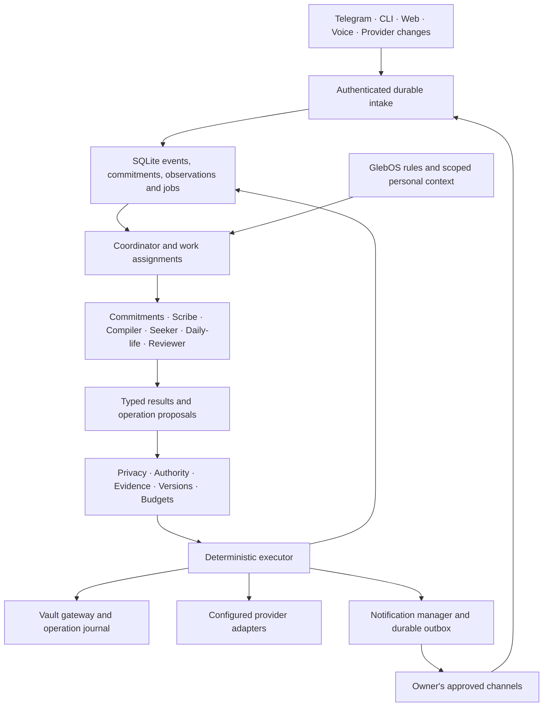

# Loop vNext — a persistent personal support team

**Version:** 1.2 · **Specification date:** 2026-09-05 · **Status:** target design,
not an implementation-complete claim.

Loop turns conversations and changing circumstances into durable commitments,
useful knowledge, and timely help. A small team of specialist agents shares
GlebOS as its knowledge and policy system. A reliable runtime owns task state,
wake-ups, permissions, and delivery.

The service stays available continuously. Agents work when there is a reason:
a message, deadline, new evidence, changing context, or an activated review.
The product should feel like a coordinated team that remembers what it promised
and knows when to leave the user alone.

## 1. How to use this specification

This document and the seven contracts below jointly define the target system.
An implementing LLM MUST read all eight before designing storage or writing
runtime behavior. They are sufficient to reconstruct the target without the
old conversation or the current source code.

| Read order | Document | Defines |
|---|---|---|
| 1 | This document | Product, architectural decisions, workflows, build sequence |
| 2 | [GlebOS contract](specification/vault.md) | Actual vault layout, compile rules, provenance, memory |
| 3 | [Runtime contract](specification/runtime.md) | Team coordination, schemas, jobs, time, permissions, recovery |
| 4 | [Interfaces and operation](specification/interfaces.md) | CLI/bot/API, connectors, configuration, deployment, migration |
| 5 | [Capability extension contract](specification/capabilities/README.md) | Shared manifest, discovery, invocation, lifecycle and starter template |
| 6 | [Weather capability](specification/capabilities/weather.md) | Local-source preference, multiple forecasts, evidence, warnings and preparation |
| 7 | [Travel itinerary capability](specification/capabilities/travel.md) | Personalized trip research, comparison, feasibility and monitoring |
| 8 | [Acceptance contract](specification/acceptance.md) | Concrete scenarios and release criteria |

MUST/MUST NOT are required. SHOULD allows a documented tradeoff; MAY is optional.
All command/API/schema examples in these documents describe the target unless
explicitly labelled observed. Defaults are implementation starting points, not
claims about the user's established habits.

Precedence within this package: cross-cutting invariants in this document;
the relevant detailed contract for its domain; examples. A conflict must be fixed
in the specification before dependent code is accepted. Runtime vault policy
precedence is separately defined in the vault contract.

The [previous Phase 4 specification](archive/SPECIFICATION-phase-4-2026-09-05.md)
is archived unchanged for history. Its claimed phase completion is not evidence
that this target is implemented. Existing README/onboarding examples can describe
legacy behavior; this package governs vNext.

### Reconstruction instructions for an LLM

1. Produce an implementation checklist mapping every acceptance scenario to
   modules, migrations, interfaces, and tests. Preserve these contracts.
2. Build a minimal synthetic GlebOS fixture from the schemas here. Do not require
   access to Gleb's personal notes or credentials for development.
3. Implement deterministic persistence, execution gates, clocks, and fake adapters
   first. Add model-based planning behind typed interfaces afterward.
4. Follow the delivery sequence in §10. Each stage must demonstrate real results,
   not only class scaffolds or a model saying the action succeeded.
5. Generate a dependency lockfile, migrations, setup instructions, and isolated
   tests. Verify install, startup, restart recovery, and a fresh-vault workflow.
6. Keep a capability/status matrix: implemented and tested, configured, degraded,
   unsupported. Do not mark an unconfigured connector as a working integration.
7. Report any deviation explicitly. Never fill gaps with invented personal facts,
   live credentials, assumed permissions, or silent vault restructuring.

No model/framework is the specification. Equivalent implementations are acceptable
only if schemas, observable behavior, invariants, and conformance tests hold.

## 2. What the user should experience

### R1 — Capture any task without choosing an app or taxonomy

“Remind me tomorrow at 9 to call the repair shop.”

Loop saves a task and a durable reminder, then confirms the actual local date
and time. After a restart it still sends once. Done cancels future reminders;
snooze changes the occurrence. “Investigate a better way to manage insurance”
also becomes a task even if it has no date and no available execution connector.

A task may be a chore, research objective, project, question to resolve, recurring
responsibility, preparation, or waiting-for obligation. The runtime lifecycle is
stable; its description/context and plan can be open-ended. Splitting a large goal
into subtasks is a reviewable plan, not an automatic claim of progress.

### R2 — Preserve spontaneous knowledge in the existing vault

“Remember: the supplier said production takes six weeks.”

Scribe captures the user's exact words in 0-raw/inbox and registers the source.
Compiler reads it, checks relevant existing knowledge, and proposes/commits sourced
wiki changes under the vault's rules. It may connect supplier/entity, lead-time
concept, topic, and relevant project; it must not invent extra concepts to satisfy
a graph shape. A genuinely isolated fragment stays captured and awaiting context.

The acknowledgement distinguishes captured from compiled and includes the path.
A user statement remains attributed as such. Compiling it does not prove the
supplier's assertion. Contradictions are preserved and exposed.

### R3 — Answer now and retain research when requested

“What affects this material's acoustic performance?” followed by
“Remember the two findings about thickness and installation.”

Seeker first checks compiled knowledge, then performs authorized research when
needed. It records which pages were fetched and read, returns cited findings,
and retains selected source excerpts/full captures with origin and retrieval time.
The follow-up resolves “the two findings” to concrete cited claims in that session;
if ambiguous, it asks which ones. Scribe → Compiler handles permanent retention.

Do not store the model's prose as independent evidence. A requested article or
other deliverable is drafted from compiled wiki material with a source chain.

### R4 — Help before a situation becomes inconvenient

“Every weekday before I leave at 8, tell me the weather and what to wear.”

Loop saves an activated routine, asks for the location only if missing, and makes
the next wake-up visible. At the configured pre-departure time it checks a fresh
forecast bundle from multiple suitable sources, preferring local meteorological
authorities, applies the user's stated preferences, and delivers a concise practical
message: a rain window, useful layer, or missing data. Exact advice thresholds
and timing live in editable vault policy.

Sources keep their publisher, model origin, issue time and coverage. If forecasts
disagree, Loop explains the difference; if local data is unavailable, it labels
the fallback. Official warnings remain separately attributable. The
[weather.local contract](specification/capabilities/weather.md) governs this behavior.

“Warn me only if I need rain gear” changes delivery conditions. “I'm staying home
today” creates an expiring override. A calendar gap cannot prove the user stayed
home. The system never invents a location sensor or an established departure habit.

### R5 — Improve through explicit feedback and observed patterns

Repeated snoozes can justify a suggestion to move a routine. A preference record
keeps evidence, scope, date, and whether the user stated or confirmed it.
Hypotheses are separate and expire; silence is not consent or evidence of dislike.
The user can inspect, correct, pause, or forget learned information.

Learning initially changes retrieval context, ranking, templates, and proposed
routine parameters. It does not require model fine-tuning, self-modifying code,
hidden personality inference, or automatic widening of permissions.

### R6 — Specialists coordinate useful work

For “Help me prepare for tomorrow's trip”, Coordinator can assign itinerary/task
review to Commitments, existing notes to Seeker, and forecast checks to Daily-life.
Independent reads run concurrently. One plan merges results, one notification
manager delivers the useful preparation list, and Compiler only stores enduring
facts when capture is requested or an active policy authorizes it.

The team can report what it is doing, which evidence it used, what it needs, and
what happens next. There are no separate competing inboxes or unbounded conversations
between agents. An unsupported booking/purchase action remains a clear pending task.

### R7 — Find a travel itinerary that fits the user

“Find a relaxed five-day northern Italy itinerary in October from Berlin, under
€1,200 for one person, with architecture and local food. Prefer trains.”

Daily-life saves the brief, clarifies dates or cost scope when needed, and asks
Seeker to research current options. It compares up to three distinct itineraries,
checks transport times, opening hours, transfer buffers and budget, and explains
the recommended option. Day-by-day plans include downtime, costs, sources, and
unverified assumptions. Destination discovery and flexible dates are supported.

“Less moving around” revises the same trip. “Keep this plan updated” activates
bounded checks for disruptions, closures, costs and relevant weather. A selected
plan remains intact while alternatives are proposed. Saving it to GlebOS creates
an operational project plan; reusable discoveries follow the knowledge pipeline.
Planning does not imply booking or paying. The complete contract is
[travel.itinerary](specification/capabilities/travel.md).

## 3. Assessment of the current approach

The inspected code provides useful pieces: local/cloud routing, autonomy gates,
SQLite objects, task commands, Telegram intake, specialist logic, vault indexing,
web UI, and provider adapters. Keep working components behind clear contracts.

It does not yet provide the durable coordinated system described here.

| Area | Observed baseline, 2026-09-05 | Target change |
|---|---|---|
| Main runtime | Orchestrator.ask exists; handle and run_forever raise NotImplementedError | One supervised async service with durable intake/work/outbox |
| Telegram | /task, /tasks, /done, questions and voice handlers exist | Same application services as CLI/API; persistent callbacks/reminders |
| Tasks | Persistent records and specialist logic | Open-ended commitments with independent durable triggers and waiting states |
| Scheduling | APScheduler jobs and synchronous wrappers exist | DB authority, leases, persisted occurrences, restart/catch-up semantics |
| Vault | Generic indexing/formatting assumptions | Exact GlebOS v2 gateway, ledger, Compiler workflow, conflict protection |
| LLM privacy | Router and local-only metadata exist | Labels propagate through all derived state and cannot be downgraded by false |
| Actions | Autonomy levels and audit exist | Authority for exact payload, executor outcomes, recoverable external effects |
| Providers | Gmail/Outlook/calendar transport and parser code present | Verify real configured readiness; independent cursors and error isolation |
| Knowledge/learning | Chroma, conversations and preferences exist | Lexical fallback, provenance, explicit versus inferred memory, feedback |
| Deployment | Python >=3.12, uv setup work, bot container entrypoint | Locked build and loop run owns intake + scheduler + recovery |

This is a code/spec inspection, not proof of live credentials or end-to-end
provider operation. Some older README descriptions still call transports stubs;
inspect actual adapter code and tests instead of treating that summary as current.

The architectural shift is from a collection of specialist commands to a
**commitment-driven service with a bounded agent team**. Models interpret, plan,
research and synthesize. Code guarantees persistence, timing, scope and delivery
state. Flexible intelligence and reliable execution require different mechanisms.

## 4. GlebOS is the operating context

The inspected GlebOS root explicitly defines a v2 source → wiki → output system.
PARA influences actionability and project context; Zettelkasten influences atomic
concepts and meaningful links. Creating four new PARA folders would violate the
vault's present structure.

```text
GlebOS/
  CLAUDE.md
  0-raw/                  immutable sources + _ledger.md
  1-wiki/                 concepts, entities, topics, index, open questions
  2-projects/<slug>/      scoped CLAUDE.md, process and output context
  3-output/               deliverables grounded in wiki
  4-journal/              daily, meetings, briefs, weekly
  _ctx/                   governing rules, agents, prompts, templates
  _mem/                   profile, goals, people, state
  _archive/               preserved superseded content
```

The [vault contract](specification/vault.md) records observed paths, dated counts,
nine compile rules, actual command distinctions, and conflicts with old templates.
It also specifies the proposed _ctx/loop and _mem/loop additions; these were not
created in the live vault by writing this specification.

Canonical ownership:

| Information | Source of truth | Other representation |
|---|---|---|
| Original captured evidence | Immutable raw files + source ledger | SQLite capture journal and searchable derivative |
| Compiled knowledge and links | Wiki Markdown/frontmatter | Disposable lexical/vector index |
| Project purpose/status, profile/goals/relationships | Existing vault documents | Versioned read cache |
| Personal behavior, permissions within ceilings, routines | Validated _ctx/loop policy files | SQLite active revision |
| Explicit/confirmed learned preferences | _mem/loop records, preserving canonical profile | SQLite query cache |
| Tentative behavioral patterns | Labelled _mem/loop hypotheses | Evidence references/expiry state |
| Live tasks, trigger occurrences, execution and delivery | SQLite | Optional vault/dashboard projections |
| Trip briefs, itinerary revisions, selected options and monitoring | SQLite trips + immutable artifacts | Explicitly saved project itinerary projection |
| Transient context (forecast, “home today”) | Labelled expiring observations in SQLite | Optional journal summary |
| Model/tool credentials and deployment ceilings | Private deployment settings | Redacted status only |

All personal rules are inspectable in the vault. Runtime safety/integrity checks,
adapter schemas, and deployment limits are enforced in code. A Markdown sentence
cannot grant arbitrary code execution or make an unsafe path valid.

A future task journal is a projection with stable loop_task_id metadata. Do not
silently establish bidirectional task sync by parsing arbitrary checkboxes.
Importing meeting/daily actions requires explicit ownership and stable source
identity; re-import cannot duplicate a task. The user can keep writing notes
normally without every unchecked box becoming a commitment.

## 5. Architecture and invariants



Required invariants:

- **I1 Durable promises:** acknowledge only committed state; scheduled requires a
  persisted trigger; executed requires a verified effect.
- **I2 Grounded knowledge:** immutable raw sources, actual reads, explicit
  provenance, human ownership, contradictions preserved, output from wiki.
- **I3 Privacy closure:** derived objects inherit the strictest model label and
  destination scope; no implicit downgrade, including history and agent hand-offs.
- **I4 Scoped action:** exact user requests and active routines provide authority;
  higher-impact or expanded actions need the applicable additional authority.
- **I5 Single ownership:** versioned mutations, leases, one responsible role per
  step, one shared source of truth, no free-form cross-agent side effects.
- **I6 Bounded work:** each root has budgets, dependencies, deadlines, cancellation,
  and bounded repair; idle service performs no inference.
- **I7 Truthful degradation:** unknown/unavailable is distinct from empty/false;
  external send uncertainty and partial vault commits remain visible.
- **I8 Appropriate attention:** all proactive candidates pass shared suppression,
  deduplication, timeliness and destination checks.
- **I9 Inspectability:** why, status, source, policy revision, next wake and override
  are available without revealing secrets or requiring chain-of-thought storage.
- **I10 Reconstructability:** a clean install plus synthetic vault/fake connectors
  passes acceptance without access to personal data or live paid services.

### Recommended implementation boundaries

Use the existing Python package layout to ease migration; equivalent module names
are acceptable in a fresh build.

```text
core/
  models/          typed domain objects, events, plans, tool results
  capabilities/    pack registry, schemas, discovery and generic invocation
  memory.py        repositories and transaction boundaries
  migrations/      versioned SQLite upgrades
  orchestrator.py  coordinator; sole specialist wiring point
  team.py          work assignments, dependencies, budgets
  policy.py        authoritative rule loading, validation, revisions
  privacy.py       label propagation and destination enforcement
  autonomy.py      action authority, ceilings, bound approvals
  llm_router.py    only model egress point
  scheduler.py     durable triggers, occurrences, clock/reconciliation
  executor.py      leases, idempotency, operation outcomes
  notifications.py candidate selection, quiet hours, outbox policy
  vault_gateway.py read receipts, confined writes, ledger and recovery
  retrieval.py     labelled exact/FTS/link/vector search
  context.py       expiring observations and relevant event subscriptions
  learning.py      explicit feedback and evidence-based hypotheses
  health.py        truthful readiness, progress, metrics
specialists/       role logic over injected core ports
integrations/      provider transport and pure normalization
delivery/          channel formatting and transport receipts
cli/               Typer application-service clients
web/               FastAPI, Jinja2, HTMX; no implicit scheduler startup
config/            deployment Settings and safe examples
tests/             synthetic vaults, fake clocks/models/transports
```

core depends on domain ports, not concrete integrations or higher layers;
integrations/delivery know nothing about specialists. The composition root wires
concrete adapters. If retaining core/orchestrator.py as the existing wiring point,
isolate imports there rather than spreading cross-layer construction.
LLM calls use one router; optional SDKs load lazily. Read-only commands must work
without a model, Chroma, or every provider configured.

SQLite + local files suffice for the first single-owner deployment. Temporal,
distributed workers, separate message brokers, and a graph database are optional
future choices when scale demands them, not prerequisites. Graph relationships
can initially be typed references and wiki links. A multi-agent framework may
implement bounded planning, but its in-memory state must not replace the durable
runtime or its executor. This follows the useful distinction between predictable
workflows and model-directed agents; the specific architecture here is a design
choice. [Anthropic's agent engineering guide](https://www.anthropic.com/engineering/building-effective-agents).

## 6. How proactivity works

Proactivity evaluates commitments against relevant changes instead of periodically
asking a model to “do something useful”.

1. **Observe:** authenticated statements, configured provider updates, task changes,
   vault changes, scheduled reviews, and explicit feedback become events.
2. **Maintain context:** record typed observations with provenance and expiry.
   Facts can be true, false, or unknown. “Home today” expires; a forecast goes stale.
3. **Select affected work:** deterministic subscriptions use project/entity IDs,
   time windows, source IDs, or declared context keys. Search may propose additional
   relevance but cannot silently expand permissions.
4. **Assess:** deterministic conditions handle common reminders/weather. A bounded
   specialist can assess a novel situation against the active task's objective.
5. **Propose or act:** execute within authority; otherwise create a concrete scoped
   proposal. Unsupported tasks remain tracked with an explanation.
6. **Decide attention:** merge, suppress, defer, or send through Notification Manager.
7. **Learn:** record explicit feedback and resulting outcome; propose adaptation
   only when evidence supports it.

Example: a meeting moves earlier. Calendar records the new version, invalidates
old reminders, and emits a change. Commitments updates the approved preparation
schedule. Daily-life can reevaluate an already authorized departure routine with
a fresh forecast. One message explains the useful change. It does not contact
attendees, change the user's departure habit permanently, or run unrelated agents.

A weekly review may identify a blocked project and propose a next action by
reading its actual goal and open commitments. It cannot infer progress from a
file timestamp or manufacture a goal update. The user's attention is a managed
resource, not an unlimited destination for agent output.

## 7. Configuration and extension philosophy

Personal behavior is declarative in the vault, validated and versioned before
activation. Deterministic invariants and adapter limits remain code. Deployment
contains credentials, paths, model endpoints and ceilings. The full settings table
and migration mapping are in [interfaces §7](specification/interfaces.md#7-configuration-deployment-versus-behavioral-rules).

A new routine can be authored in natural language and compiled into a typed
proposal referencing existing capabilities. A new domain generally needs a
routine and relevant knowledge, not another always-running agent. A new external
action needs a tested adapter with schemas, availability, permission scope,
idempotency and error semantics.

Every pack uses the [same extension contract](specification/capabilities/README.md)
and [starter template](specification/capabilities/template/README.md): manifest,
instructions, input/output schemas and example cases; an adapter is needed only
for a new external tool. Registry discovery and generic CLI/API/bot invocation
MUST allow a new capability without editing core routing, persistence, scheduler
or channel handlers. Simple capabilities use existing typed artifacts.

[weather.local](specification/capabilities/weather.md) and
[travel.itinerary](specification/capabilities/travel.md) are the first domain packs.
They share validation, dependency resolution, version pinning, execution gates,
budgets, persistence and lifecycle. Personal source/routine preferences live in
the vault; installed instructions/adapters and credentials remain separate.

Add event subscriptions and richer planning incrementally. Do not depend on
self-written runtime code, unrestricted shell access, model-created credentials,
or learned policies that alter themselves invisibly. The desired flexibility is
in tasks, context, composition, and rules that the user can inspect.

## 8. Privacy, control, and product boundaries

The default GlebOS and owner conversation context is local-only. Local models
serve planning, retrieval, summaries, compilation and voice. Cloud inference is
optional, explicitly enabled, budgeted, and limited to approved input scope.
If a local model fails, private work waits; deterministic reminders still operate.

The owner can ask for an action once without repetitive confirmation. “Save this”
authorizes the described capture; “tell me every weekday” authorizes that scoped
recurrence once missing required parameters are resolved. Sending an email to
someone else, publishing, booking, spending, or changing remote commitments needs
its own explicit scope; a general desire for a proactive team is not blanket
authorization for all external actions.

Initial release includes Telegram, CLI, local web UI, local voice, GlebOS,
calendar/mail reading and drafts, optional scoped Wrike sync, weather, and
source-grounded research and travel itinerary planning. Teams is an optional adapter. No purchase/booking,
medical decision, financial trading, or device-control capability is implicit
in accepting a task about that topic.

The service is single-owner, local-first, asynchronous. Multi-tenancy, autonomous
self-replication, continuous location surveillance, unrestricted background
browsing, and model training are outside this version. User-approved connectors
can extend context later without changing core task semantics.

## 9. Reliability and quality targets

Under a healthy local DB and awake host:
- Persist deterministic task/capture intake within 2 seconds at p95 in the
  reference test environment; model inference is not part of this acknowledgement.
- Claim due reminder jobs within 10 seconds at p95; measure delivery latency
  separately because provider/network time is outside Loop's control.
- Zero duplicate internal firings under replay/restart tests.
- Zero cloud egress for labelled local-only inputs in conformance tests.
- Zero acknowledged vault captures lacking both verified file and ledger row.
- Zero model calls in a simulated idle 24-hour period with no enabled routines.
- All uncertain/partial effects recover or appear as actionable status.

These are acceptance targets, not measured current performance or internet SLA.
Record hardware/OS, fixture sizes, worker limits and test clocks with benchmark
results. Measure missed reminders, usefulness feedback and notification dismissal
rates without turning nonresponse into a preference. Exact external delivery
cannot always be guaranteed; see the runtime's unknown-send policy.

## 10. Delivery sequence and definition of done

### Stage A — Durable commitments

Implement schema/migrations, application services, deterministic commands,
event intake, task lifecycle, triggers, leases, outbox, identity, and loop run.
Use fake adapters first, then Telegram. Deliver task → restart → reminder →
done/snooze end to end before multi-agent planning.

### Stage B — GlebOS fidelity

Implement read-only onboarding map/policy conflicts, builtin VaultGateway,
capture journal/ledger, lexical search, read receipts, Compiler validations,
human ownership, contradictions and recovery. Certify any Scriptorium adapter
against the same contract. Demonstrate capture → compile → cited retrieval
on a synthetic vault and then an explicitly selected real vault.

### Stage C — Coordinated intelligence

Add typed multi-intent plans, bounded work assignments, shared evidence,
parallel independent reads, local routing, deterministic execution validation,
cancellation and budget accounting. Demonstrate a request producing both a task
and a knowledge capture with independently truthful statuses. Implement generic
pack discovery, scaffold/validate/test/enable, invocation and versioned persistence;
demonstrate adding unrelated packs without editing core or interface handlers.

### Stage D — Proactive daily support

Add independently healthy calendar/mail/weather adapters, expiring context,
routine authoring/activation, condition evaluation, attention policy and why.
Implement weather.local with suitable local authority sources, independent/correlated
comparison, warning lifecycle and truthful fallback. Demonstrate a weather routine
and calendar change with stale-data and quiet-hour tests. Enable only explicitly
selected schedules. Include weather WF01–WF24 and extension EX01–EX14 checks.

### Stage E — Learning and full operation

Add explicit preferences/hypotheses, feedback-driven timing proposals, weekly
review, memory inspection/forgetting, research → compile → output, optional Wrike/
Teams, complete dashboard, locked packaging, backup/restore and populated-data
migration. Add the travel itinerary pack: sourced alternatives, feasibility checks,
revision/selection, explicit monitoring and vault projection. Validate
outage/collision/replay cases across interfaces, including travel TR01–TR24.

Stages define safe implementation order, not permission to omit later requirements.
The full target is complete only when [acceptance](specification/acceptance.md)
passes and each optional feature truthfully reports configured or unavailable.
A delivery can explicitly declare a smaller completed stage; it must not claim
the whole personal team works based only on stubs or passing mocked happy paths.

## 11. Design provenance

This specification was grounded in the actual GlebOS root instructions, profile
structure, governing rules, role documents, prompts, command procedures, ledger,
wiki samples, project manifests, and the located Scriptorium code. Personal profile
contents are intentionally not copied into the repository.

The live vault's prepared daily compiler schedule is documented as unregistered;
this specification does not activate it. Its older templates and differing
inactivity thresholds are explicit policy conflicts, not silently rewritten facts.
See the dated observations and authoritative paths in [the vault contract](specification/vault.md).

External references explain selected mechanisms; they do not replace normative
requirements or imply a dependency on a proprietary agent framework. Rebuilding
Loop requires this specification package and the selected owner's vault policy,
not access to this conversation.
