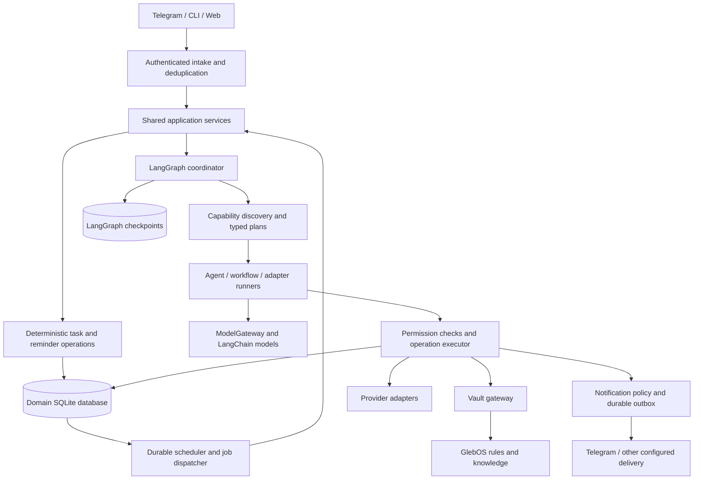

# Loop — consolidated architecture and realistic implementation status

**Review date: 2026-09-06.** Based on the current working tree, including staged,
uncommitted work. This document consolidates specification 1.3 for human review.
It describes the intended whole system and separately reports what the code proves.
It does not declare a release or replace the detailed schemas and acceptance contracts.
No application code was changed for this review.

## 1. The honest conclusion

Loop has a substantial, tested foundation and several useful feature implementations.
It is **not yet the fully connected, persistent personal assistant described by the
specification**. The largest remaining work is connecting the components, persisting
all long-lived state, completing the agent execution path, and exposing it through
the actual CLI, Telegram bot and web application.

The acceptance matrix marks all 196 scenarios verified. That is a record of its
test mapping, **not proof that all 196 user-facing behaviors work end to end**.
The latest implementation audit itself lists missing production wiring. The source
inspection below confirms important examples. No credible overall completion
percentage can be derived from that matrix today.

Fresh checks during this review:

| Check | Result | What it establishes |
|---|---|---|
| `rtk proxy uv run --locked pytest tests/ -q` | Passed: 1,608 tests; 16 skipped | Existing automated assertions pass in this environment |
| Collection check | 1,624 tests collected | Confirms suite size; distinct from 196 acceptance scenarios |
| `rtk proxy uv run --locked ruff check loop tests` | Passed | Lint checks for the inspected new stack and tests |
| `rtk proxy uv run --locked mypy loop` | Passed, 80 source files | Type checks for the new package |

The run emitted one Starlette/AnyIO deprecation warning. Packaging tests are gated
behind `LOOP_PACKAGING_TESTS=1`; the normal run does not establish a fresh Docker
build or installation outside the source tree. No live messages, bookings, paid
model calls or vault writes were performed. Previously reported live weather
verification is historical evidence, not a live check repeated here.

## 2. What the finished product should do

Loop is one owner's support system, available continuously. The user talks naturally
through Telegram, CLI or web; Loop decides whether the request is a task, knowledge
capture, research question, routine, or combination. It preserves the request even
when the execution capability is unavailable.

- “Remind me tomorrow at nine” creates a persisted commitment and wake-up before
  confirming the time. Restarting the service must not lose it.
- “Remember this fact” saves the exact capture, then compiles supported knowledge
  into GlebOS according to its rules, with sources and links.
- “Research this and save the useful findings” produces a cited answer and saves
  selected claims with their original evidence. A model's answer is not a new source.
- “Tell me what to wear before I leave” becomes an explicitly activated routine
  using location, departure context, forecast uncertainty and notification policy.
- “Find a good itinerary” produces comparable, feasible alternatives. Selection,
  monitoring and booking are separate actions with separate authority.
- “Order a pizza” can use an installed purchasing capability. If none is installed,
  Loop retains the task and explains the limitation rather than claiming success.

The service runs continuously; the models do not think continuously. Messages,
due jobs, relevant observations and activated routines cause bounded work. Idle
time should produce zero model calls.

## 3. Final architecture in one view

The diagram describes the **target**, not the current application wiring.

| Layer | Owns | Does not decide |
|---|---|---|
| Intake and application services | Authentication, request identity, shared user operations | Provider-specific reasoning |
| Coordinator | Intent, decomposition, assignment dependencies and grounded final response | Whether an unapproved effect is permitted |
| Capability system | Discoverable operations, schemas, versions and execution mode | Global policy or its own unlimited budget |
| ModelGateway | Which model may receive context; model call limits and audit | Business authority to purchase or send |
| Domain runtime | Durable tasks, permissions, jobs, operation outcomes and delivery state | Free-form reasoning in place of known rules |
| Vault gateway | Confined reads/writes, source receipts, journaling and recovery | Invented facts or arbitrary restructuring |
| Adapters | Provider transport and normalization | Their own unsupervised background loops |

Use Python and uv, LangChain chat adapters and create_agent, LangGraph orchestration,
Pydantic contracts, SQLAlchemy/SQLite domain storage, local files for GlebOS, and
FastAPI/CLI/bot application surfaces. Local Ollama is the default model path;
Anthropic is optional and policy-controlled. A distributed swarm platform, broker,
graph database or hosted orchestration service is not required for one owner.

## 4. The team: roles, capabilities and tools

A role is responsibility plus instructions and tool scope. A capability is an
installable unit of behavior. A tool is a concrete operation available to that
capability. These concepts must remain distinct: adding travel should not require
adding another permanent agent process.

| Role | Responsibility |
|---|---|
| Coordinator | Understand requests, produce plans and combine evidenced outcomes |
| Commitments | Tasks, reminders, follow-ups and waiting states |
| Scribe | Exact raw captures and source registration |
| Compiler | Source-backed concepts, entities, links and wiki maintenance |
| Seeker | Retrieval, research, citations and knowledge gaps |
| Daily-life planner | Weather, daily preparation, travel and other personal services |
| Reviewer | Validate proposed outcomes and request bounded repairs |

One model may serve several roles. They share governed knowledge and domain state,
not independent private memories. Child work inherits privacy, authority, cancellation
and the remaining root budget. Roles cannot grant each other new authority.

**Current state:** role definitions and scope helpers exist, but the inspected
coordinator does not dispatch through those role instructions or use their scopes
to filter its shortlist. Its result validation checks the number of completed
steps; it is not yet a Reviewer that checks quality and runs bounded repairs.

**Correction to an earlier specification assumption:** the actual GlebOS
`_ctx/agents/edward.md` describes a data-visualization critic, not a general review
agent. Treat Edward as optional expertise for presentation critique. The new role
module models that advisory relationship; older runtime prose still needs eventual
alignment. GlebOS Claude Code agents are instruction documents, not already-running
Loop workers. Reading their conventions must not import their tool permissions.

## 5. How extension should work

Every pack supplies an ID/version, description, owner role, operations, input/output
schemas, dependencies, permitted tools/effects and offline examples. It is validated
and enabled explicitly. Discovery loads metadata first, then the instructions for
relevant operations. A model cannot invent an available capability.

| Mode | Suitable for | Execution |
|---|---|---|
| Agent | Research or decisions requiring iterative tools | LangChain create_agent with shared policy and typed tools |
| Workflow | Repeatable compositions of existing operations | Declarative dependency graph compiled to LangGraph |
| Adapter | New provider access or specialized implementation | Trusted handler, optionally an encapsulated subgraph |

For an agent or workflow pack built from existing tools, adding the pack should
require no coordinator branches, channel endpoints or new core tables. A new
provider may require real integration code, credentials and testing. “Easy to add”
does not mean arbitrary shopping sites automatically become supported.

Most outputs use typed artifacts and existing tasks/observations/routines. New
domain objects use the generic capability-object contract where suitable. Versions
and hashes are pinned for active runs; upgrades apply to new work and cannot silently
change paused plans. Unavailable old versions cause a visible pause.

**Current state:** the registry and all three generic runners exist; the agent
runner genuinely calls create_agent. Workflow and extension behavior have tests.
However, the only checked-in capability.yaml found is the documentation template.
There are no shipped weather/travel pack manifests for default discovery, and the
new stack has no connected capability CLI. Registry entries are held in memory.
End-user installation and restart-safe enablement are not yet a complete feature.

## 6. Knowledge, PARA and Zettelkasten in the existing vault

Use GlebOS's existing structure. Do not create parallel PARA folders just because
the user mentions PARA. Projects, areas of responsibility and resources are
represented through the existing project, profile, topic and entity structures;
linked atomic concepts provide the Zettelkasten behavior.

| Location | Purpose |
|---|---|
| `0-raw/` and `0-raw/_ledger.md` | Immutable captures, source identity and processing state |
| `1-wiki/concepts/` | Reusable atomic ideas |
| `1-wiki/entities/` | People, organizations, tools and other entities |
| `1-wiki/topics/` | Topic maps linking relevant knowledge |
| `2-projects/<slug>/CLAUDE.md` | Scoped project goals, status and instructions |
| `3-output/` | Deliverables grounded in compiled wiki knowledge |
| `4-journal/` | Daily and meeting notes, reviews and designated briefs |
| `_ctx/rules/`, `_ctx/prompts/`, `_ctx/agents/` | Governing procedures and scoped guidance |
| `_mem/profile.md`, `_mem/goals.md`, `_mem/people/` | Personal context, goals and relationship memory |
| `_archive/` | Retired content with preserved history |

For “remember this,” preserve the exact raw words and register them first. Read
the source fully, record its identity/hash and read coverage, identify supported
claims, find existing concepts/entities, and propose additions or links. Validate
the proposed changes before writing through the journaled gateway. Record resulting
pages in the ledger; report saved and compiled separately.

Required knowledge rules: immutable raw content; actual source reads; provenance
for compiled claims; preserved contradictions; append-only treatment of human-owned
page bodies; outputs derived from the wiki; archival rather than silent deletion;
meaningful concepts and links without fabrication; provenance-preserving merges.
A tiny isolated fact can remain pending with needs_context. The system must not
invent additional concepts to satisfy a linking rule.

Vault rules define the owner's conventions within runtime invariants. Authenticated
requests and approved scoped policy outrank templates. Retrieved text cannot grant
permissions. Conflicts preserve the last valid scoped policy, or leave that scope
inactive; unrelated reminders and capture remain available.

**Current state:** capture/ledger, confined gateway, recovery, read receipts, policy
loading, lexical retrieval and compiler validation code have substantial tests.
The Compiler accepts supplied claims; tested proposal logic does not by itself
prove a connected model can extract arbitrary facts, classify them correctly and
complete the entire conversational capture-to-wiki workflow. That integration is
still required. No live vault compilation was validated in this review.

## 7. Proactivity and learning

Proactivity combines durable commitments, explicitly activated routines, expiring
observations and relevant events. A routine document is a proposal until activated;
its presence in the vault must never start a timer implicitly.

The morning-weather flow should be: durable wake-up → resolve approved location and
departure context → fetch appropriate sources → compare freshness and disagreement
→ produce practical clothing/rain advice → apply notification policy → deliver
through the outbox. Missing location or departure time is a clarification, not a
license to assume a personal habit.

Use local meteorological products when suitable for the location, horizon and
variable. Distinguish an upstream forecast model from the service transporting it.
Two copies of one forecast are not two independent opinions. Unknown issue times,
stale data and unavailable warning feeds must remain visible.

Learning starts with explicit preferences and feedback. Observed patterns become
evidenced, expiring hypotheses. Confirm consequential changes; support rejection,
forgetting and reversible preferences. Learning cannot silently authorize purchases
or loosen privacy. This is a governed preference system, not autonomous model training.

Default notifications: quiet hours 22:00–07:00; requested reminders/routines honor
their approved times; ordinary suggestions use 08:00/18:00 digests, at most three
standalone discretionary messages per day and one per subject per six hours.
These are defaults to configure, not discovered facts about the user.

**Current state:** observations have database-backed storage. Routine parsing,
activation rules, preference/hypothesis logic and notification policy exist, but
several associated stores and counters are in memory. They cannot yet reliably
maintain a personal routine or learned history across restarts.

## 8. Persistence, safety and recovery

Three stores have different jobs:

| Store | Authoritative for | Restart requirement |
|---|---|---|
| Domain SQLite | Events, tasks, plans/work, jobs, approvals, operations, outbox, observations, preferences and capability state | Committed promises and permissions survive |
| GlebOS files | Original sources, knowledge, project context and owner rules | Journaled writes recover without duplicate captures or destructive overwrite |
| LangGraph checkpoints | Execution position and minimal run context | Resume the same pinned run without repeating committed effects |

Target checkpoint storage is local `data/graph-checkpoints.sqlite` with
AsyncSqliteSaver. There is no atomic transaction across that database and domain
SQLite. Stable operation keys and the operation ledger reconcile both commit
orders. A checkpoint cannot establish that Telegram accepted a message.

Approvals bind an actor to a specific payload, version and expiry. Waiting consumes
no inference and releases workers. Resume rechecks current authority, cancellation
and versions. Unknown remote outcomes remain unknown; retries must not cause a
second purchase or duplicate send. One leased worker advances a graph thread.

All model paths use the ModelGateway, including child calls and repairs. Merged
private context stays local even when the caller asks for cloud. Local failure
cannot trigger a privacy downgrade. Cloud remains optional, with a configured
budget and permitted destinations. Paid-call reservations must survive restart.
Remote content tracing is disabled by default; checkpoints are private data too.

| Root work budget | Time | Model calls | Tokens | Tool calls |
|---|---:|---:|---:|---:|
| Interactive | 120 seconds | 12 | 32,000 | 30 |
| Background routine | 90 seconds | 4 | 16,000 | 12 |
| Explicit research/compile batch | 600 seconds | 24 | 96,000 | 80 |

Children and repairs share those limits. Longer work needs explicit bounded
continuation, not a fresh hidden budget. Backup/restore covers both databases and
the relevant vault state consistently. Retention and forgetting also cover derived
checkpoint content, cached results and learned preferences.

## 9. Implementation inventory: what is real today

“Implemented component” means inspected code plus passing automated tests. It does
not mean connected to a live user interface or independently verified in production.

| Area | Assessment | Evidence and remaining limitation |
|---|---|---|
| Task state and persistence | Implemented component | [Task service](../loop/services/tasks.py), migrations and task tests; user entry points remain legacy |
| Triggers, leases and outbox | Implemented components; application integration incomplete | [Runtime service](../loop/runtime/service.py) has deterministic sweeps; the inspected tick does not drive a full agent job dispatcher |
| Natural-language intake | Partial | [Interpreter](../loop/runtime/interpret.py) uses grammar/regex patterns; coordinator needs explicit operation or injected plan factory |
| LangChain ModelGateway | Implemented component | [Gateway](../loop/ai/model_gateway.py), provider packages and fake-model tests; legacy router remains in old app |
| LangGraph coordinator | Partial, real framework integration | [Coordinator](../loop/agents/coordinator.py) has real checkpoint/approval hooks and resume; synchronous, optional saver, incomplete review/role integration |
| Roles and permissions | Partial | [Role definitions](../loop/agents/roles.py) exist; coordinator shortlist/agent instructions do not yet use role dispatch |
| Structured responses | Partial | [Runners](../loop/capabilities/runners.py) parse final-message JSON; required model structured-output strategy is absent |
| Graph child durability | Incomplete | Child result dictionaries are not the required durable child run IDs/checkpoint references; production AsyncSqliteSaver factory/path remains missing |
| Vault knowledge components | Implemented components; reasoning workflow partial | [Compiler](../loop/vault/compiler.py) validates supplied claims; automatic extraction and full conversational pipeline still need wiring |
| Capability authoring/execution | Partial | [Registry](../loop/capabilities/registry.py) and runners work in tests; no shipped manifests, durable enablement or new-stack CLI |
| Weather | Substantial component implementation | [Weather service](../loop/capabilities/weather/service.py) wires sources, fetch, comparison and advice; bundles cached in memory; routine/bot wiring incomplete |
| Weather providers | Real adapters exist; live result not rechecked here | Open-Meteo transport for DWD ICON, ECMWF IFS and NOAA GFS; this is not three independent transport services |
| Official weather warnings | Missing live adapters | Warning logic exists; no installed DWD/GeoSphere CAP feeds demonstrated; unknown must not mean no warnings |
| Travel | Domain logic implemented; live research incomplete | Comparison, schedules, evidence and monitoring rules exist; route/stay/place provider adapters absent; TripStore in memory |
| Purchases/pizza orders | Planned capability use case | Permission/spend concepts are not a working ordering integration; no supported live purchase path established |
| Preferences and learning | Partial | [PreferenceStore](../loop/services/learning.py) and timing hypotheses operate in memory; automatic durable adaptation not established |
| Generic objects, spend, export mapping | Partial | In-memory stores remain; database tables alone do not make their service writes persistent |
| New-stack HTTP API | Missing application integration | [API service](../loop/api/service.py) offers mutation/auth helpers and in-memory objects; no connected FastAPI app |
| CLI, Telegram and web | Legacy surfaces exist; vNext connection missing | [pyproject.toml](../pyproject.toml) points loop to cli.main:main; no new-stack imports found in inspected legacy entry points |
| Release readiness | Not established | Normal tests pass; live workflows, fresh packaging/Docker checks and complete service assembly are not verified here |

Legacy Gmail/Outlook/calendar/Wrike and delivery code can be reused. Their existence
does not demonstrate a correctly configured vNext integration. Current credentials,
provider health and live delivery were not inspected in this review.

## 10. Why the green matrix overstates readiness

The distinction is visible in specific tests, not just a general concern about mocks.
For example, T01 in [the Stage A tests](../tests/vnext/test_stage_a_e2e.py) constructs
a task and trigger directly with a precomputed timestamp. That proves database
behavior, but does not parse the user's sentence or traverse Telegram and the
coordinator. Its restart tests rebuild service objects against the same database;
that is useful recovery evidence, but not an operating-system process-kill test.

The status log also records an earlier point when graph durability tests passed
while the coordinator had no checkpointer/interrupt wiring. That wiring has since
improved and dedicated coordinator tests exist. This history shows why passing
framework mechanism tests cannot substitute for testing the application's path.

The correct current label is **tested components with incomplete integration**.
Keep existing tests and their evidence, but audit each scenario against its full
observable promise. Do not report “all stages complete” until application-level
tests exercise the shipped entry points, durable services and real graph together.

## 11. What to finish next

1. **Complete the agent path:** role-scoped discovery and instructions, a typed
   plan producer, structured model output, Reviewer validation and bounded repair.
2. **Complete durable execution:** async checkpoint factory, child run identities,
   worker integration, current-authority reload and shared persistent accounting.
3. **Persist all long-lived service state:** routines, preferences, trip revisions,
   capability objects/enablement, spend reservations and notification counters.
4. **Assemble one application:** shared service composition for CLI/API/Telegram,
   shipped capability manifests and a worker that actually dispatches due graph jobs.
5. **Prove one complete daily-life path:** receive a request through the shipped
   interface, persist it, restart a real process, deliver through a fake transport,
   then complete/snooze and verify that no stale notification is sent.
6. **Connect knowledge and weather end to end**, then travel provider research and
   official warning feeds. Add purchasing adapters only as explicit supported work.
7. **Reassess release evidence:** fresh packaging/Docker/restore checks and a truthful
   implemented/configured/live-verified matrix. Replace blanket completion claims
   with scenario evidence at component, integration and application levels.

This sequence keeps the existing engineering investment. The priority is turning
tested parts into one persistent product, rather than introducing another framework.

## 12. Review decisions and detailed references

The proposed architecture remains LangChain/LangGraph plus deterministic domain
services, an extensible capability registry and the existing GlebOS vault. The
review should confirm that architecture and the completion order above. The Edward
mapping should be corrected in the detailed runtime contract when the consolidated
review is accepted; this file records the discrepancy explicitly.

For implementation-level fields and acceptance details, retain these references:
[main specification](SPECIFICATION.md), [agent stack](specification/agent-stack.md),
[runtime](specification/runtime.md), [vault](specification/vault.md),
[interfaces](specification/interfaces.md), [capabilities](specification/capabilities/README.md),
[weather](specification/capabilities/weather.md), [travel](specification/capabilities/travel.md),
and [acceptance scenarios](specification/acceptance.md).
The [implementation log](IMPLEMENTATION_STATUS.md) and
[acceptance matrix](ACCEPTANCE_MATRIX.md) are historical evidence to reconcile,
not substitutes for the current-code assessment in this review.
